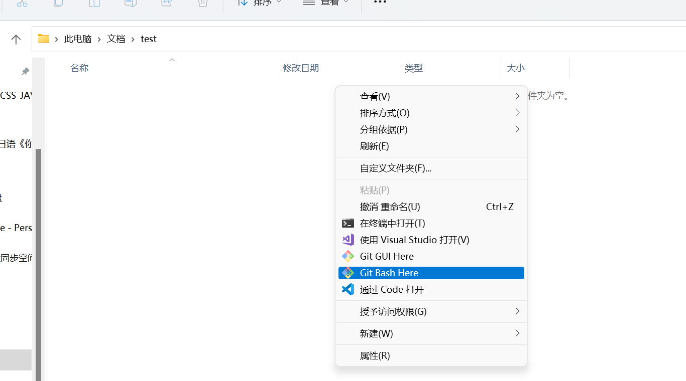
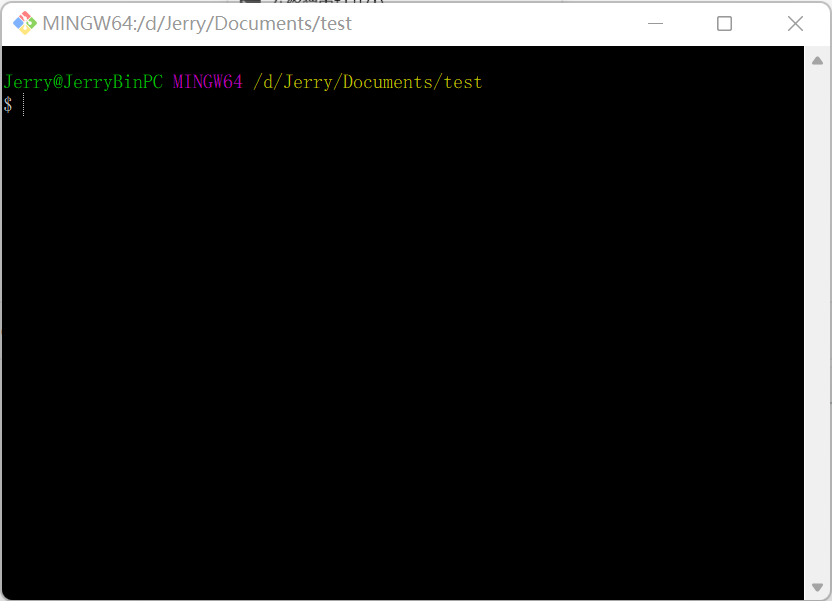
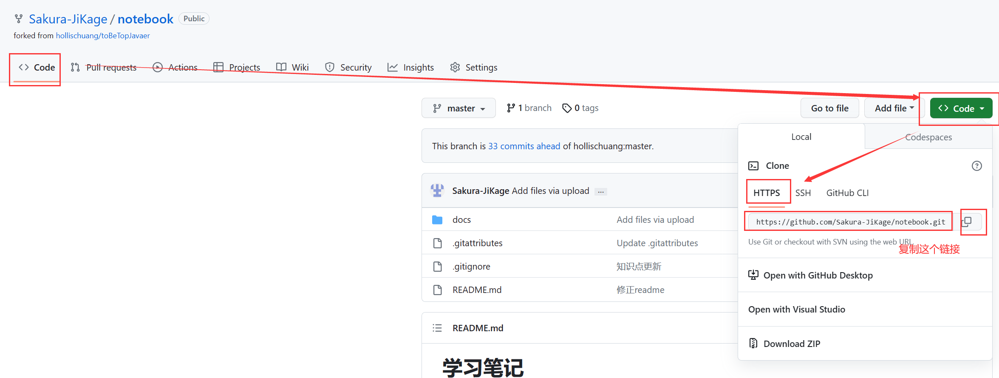
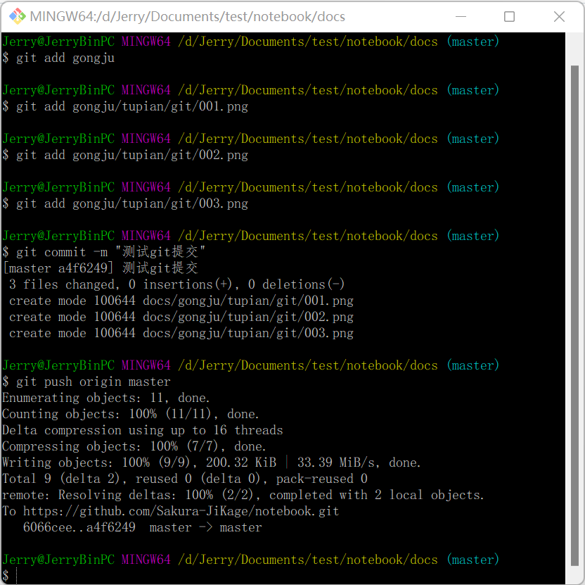
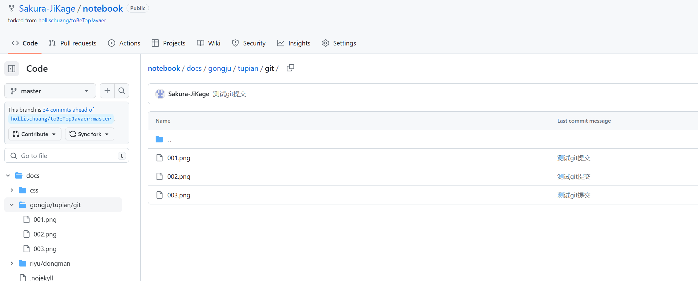

# 1.git 使用方法备忘文档

## 1.1安装git工具

[下载地址 https://github.com/git-for-windows/git/releases/download/v2.40.1.windows.1/Git-2.40.1-64-bit.exe](https://github.com/git-for-windows/git/releases/download/v2.40.1.windows.1/Git-2.40.1-64-bit.exe)

安装时一直下一步即可

## 1.2github取得到本地

1 本地硬盘新建文件夹

2 右键选择git bash



显示下面图片的界面



找到下面图片中的链接，复制后，再执行git clone 命令



git clone命令如下：

```
git clone https://github.com/Sakura-JiKage/notebook.git
```

## 1.3github更新到本地

因为我的github只有我自己使用，所以如果**github内容变更**后，与本地不一致了，此时我回把**本地内容删除，重新执行第二步**，保持本地和github一致后，再修改本地内容。


## 1.4登录github

设置github用户

```
git config --global user.name "xxx"
git config --global user.password "xxx"
git config --global user.email "xxx"
```

查看用户名信息

```
git config --global -l --show-origin
git config user.name
git config user.email
git config user.password
```

git用户信息存储在```C:/Users/[用户名]/.gitconfig```文件中中。

## 1.5提交本地内容到github

与svn不同的是，github的提交是提交到本地git库，而上传到github是提交后，执行推送（push）。

```
git add [文件名]	//添加到暂存区
git commit -m "提交注释"	//提交到本地库

//由于首次提交时已经关联了远程仓库，这里直接推送就好了
git push origin master	//将项目推送到远程仓库(master:分支名)
```



再次查看github，发现内容提交成功




## 1.6修改上一次commit的注释

如果刚刚执行了[git add .]，并且执行了[git commit -m "旧的注释"]，还没有push，这时候想更新注释，可以执行下面的命令。就可以修改注释了。

```
$ git commit --amend -m "新的注释"
```


# 1.Github流畅访问手顺

## 1.安装“watt toolkit”软件

在微软应用商店搜索“watt toolkit”，并安装这个软件。


## 2.打开软件，加速Github

打开软件“watt toolkit”软件，选择网络加速图标，勾选Github，选择一键加速。然后就能流畅访问Github(https://github.com)网站了。


## 3.解决443端口占用问题

### 创建“关闭端口443”规则

如果完成上面第2步后，发现提示443端口占用问题，按照这个手顺关掉443端口即可。


3-1.在桌面环境下输入win+r键，调用出下面这个窗口，输入"control"，点击确定


选择下面图片中的防火墙图标


选择”高级设置“。


在弹出的下面的窗体中，依次点击“入站规则”→“新建规则”。


在弹出的窗口中，选择“端口”，点击“下一页”。


选择“特定本地端口”，并输入"443"。至于TCP/UDP，我没有修改，默认是TCP。点击“下一页”。


选择“阻止连接”，点击“下一页”。


默认是全选的，直接点击“下一页”。


输入名称“关闭端口443”，方便下次找到规则，万一需要删除呢。点击“完成”。


### 关闭服务

如果经过上面操作，仍旧没有好用，还是不能启动“Watt Toolkit”软件进行加速。那么就可以按照报错提示去解决。报错说“加速服务启动失败，443端口被 vmware-hostd(7316)占用。请关掉占用443端口的程序或者尝试实用系统代理模式”。那我们就可以关闭“vmware-hostd”，我打开了”任务管理器“，找了“启动”Tab页、“详细信息”Tab页，最后在“服务”Tab页找到了目标，关闭它。


再次执行步骤2，发现可以加速了。

## 3.解决Git工具不能上传本地文件到Github的问题

经过了上面第1步和第2步，可以正常浏览Github网站了，但还不能通过git工具上传文件到Github。当我尝试上传文件时，报错了(SSL certificate problem: unable to get local issuer certificate)，这时在git工具的窗口下输入命令：`git config --global http.sslverify false`，然后就能正常上传了。


