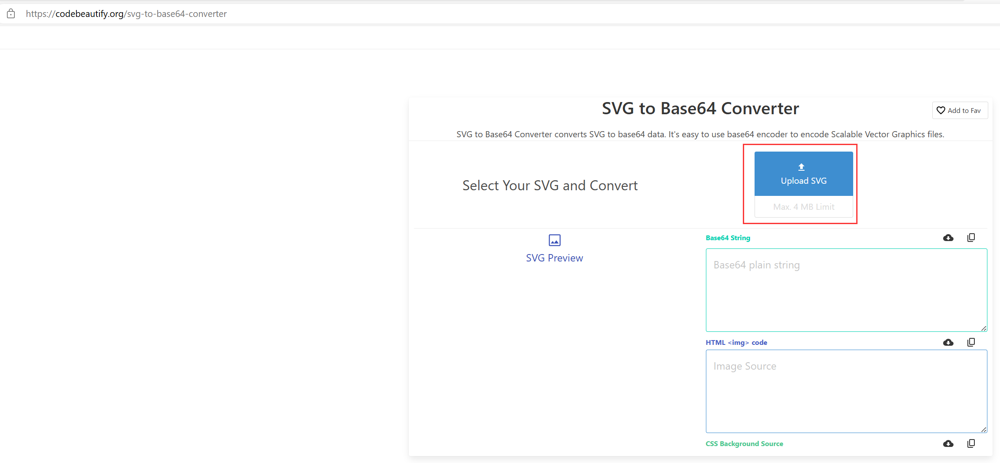

### 第1步 访问网站

 [https://codebeautify.org/svg-to-base64-converter](https://codebeautify.org/svg-to-base64-converter)

### 第2步 上传svg文件

选择“Upload SVG”按钮，上传本地的svg格式的文件。

上传完毕后，无需任何操作，即可自动生成下图中的base64代码，以及在html和css中调用base64代码显示图片的时候的代码。

