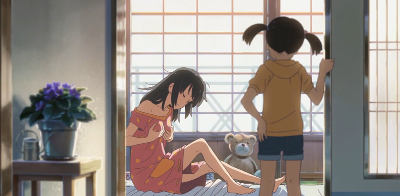
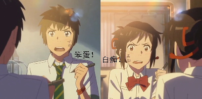
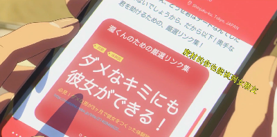
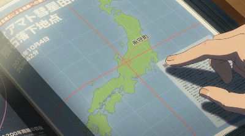
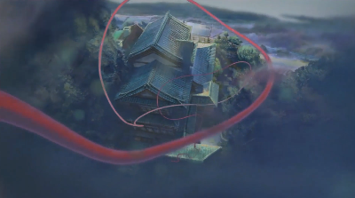

<!DOCTYPE html>
<html>
<head>
<meta charset="utf-8">
</head>
<body>
<div>
    <a class="xuanfu xuanfubutton" style="color:#fff" href="https://sakura-jikage.github.io/notebook/#/外语/日语/试题">动漫学日语</a>
</div>
</body>
</html>

# 《你的名字》

## 001 前言


<p><ruby>
   【宮水　三葉】：<rp>(</rp><rt></rt><rp>)</rp>
   朝<rp>(</rp><rt>あさ</rt><rp>)</rp>
   、<rp>(</rp><rt></rt><rp>)</rp>
   目<rp>(</rp><rt>め</rt><rp>)</rp>
   が<rp>(</rp><rt></rt><rp>)</rp>
   醒<rp>(</rp><rt>さ</rt><rp>)</rp>
   めると<rp>(</rp><rt></rt><rp>)</rp>
   <font color="red" size="2">早上醒来的时候</font>
</ruby></p>

>&emsp;&emsp;[目（め）]：名词，意思是：1.眼睛。
>
>****
>
>&emsp;&emsp;[醒める（さめる）]：自动词，二类动词，意思是，1.醒过来。
>
>

<p><ruby>
   【宮水　三葉】：なぜか<rp>(</rp><rt></rt><rp>)</rp>
   泣<rp>(</rp><rt>な</rt><rp>)</rp>
   いてる<rp>(</rp><rt></rt><rp>)</rp>
   <font color="red" size="2">不知为什么自己在哭</font>
</ruby></p>

>&emsp;&emsp;[泣く（なく）]：自动词，一类动词，变成ている形：泣いている。意思是：1.哭，哭泣。
>
>&emsp;&emsp;动词て形+いる：表示动作正在进行，状态的持续。口语中有时会省略「い」，即「动词て形+る」。
>
>&emsp;&emsp;&#9654;&emsp;<ruby>泣<rp>(</rp><rt>な</rt><rp>)</rp>いても<rp>(</rp><rt></rt><rp>)</rp>笑<rp>(</rp><rt>わら</rt><rp>)</rp>ってもあと<rp>(</rp><rt></rt><rp>)</rp>３<rp>(</rp><rt>さん</rt><rp>)</rp>日<rp>(</rp><rt>にち</rt><rp>)</rp>しかない</ruby>。`哭也罢，笑也罢，不管怎样只剩三天了。`
>
>****
>
>&emsp;&emsp;[なぜ]：副词。意思是：1.为什么。
>
>&emsp;&emsp;&#9654;&emsp;なぜ<ruby>来<rp>(</rp><rt>こ</rt><rp>)</rp></ruby>ないの。`为什么不来呢？`
>
>&emsp;&emsp;&#9654;&emsp;なぜ<ruby>諦<rp>(</rp><rt>あきら</rt><rp>)</rp></ruby>めるの。`为什么要放弃呢？`
>
>****
>
>&emsp;&emsp;[何故か（なぜか）]：副词。意思是：1.不知为何
>
>&emsp;&emsp;&#9654;&emsp;<ruby>何故<rp>(</rp><rt>なぜ</rt><rp>)</rp>か<rp>(</rp><rt></rt><rp>)</rp>心<rp>(</rp><rt>こころ</rt><rp>)</rp>が<rp>(</rp><rt></rt><rp>)</rp>騒<rp>(</rp><rt>さわ</rt><rp>)</rp>ぐ</ruby>。`不知怎么心里不平静。`
>
>

<p><ruby>
   【宮水　三葉】：そういうことが<rp>(</rp><rt></rt><rp>)</rp>
   時々<rp>(</rp><rt>ときどき</rt><rp>)</rp>
   ある<rp>(</rp><rt></rt><rp>)</rp>
   <font color="red" size="2">这样的事时不时就会发生</font>
</ruby></p>

>&emsp;&emsp;[時々（ときどき）]：副词。意思是：1.时常，时时，有时。
>
>****
>
>&emsp;&emsp;[そういう]：连体词。意思是：1.那样的，那种。
>
>&emsp;&emsp;&#9654;&emsp;そういうことをしてはいけない。`不能做那样的事。`
>
>&emsp;&emsp;&#9654;&emsp;そういうわけだったのか。`原来如此呀！`
>
>

<p><ruby>
   【立花　　瀧】：<rp>(</rp><rt></rt><rp>)</rp>
   見<rp>(</rp><rt>み</rt><rp>)</rp>
   ていたはずの<rp>(</rp><rt></rt><rp>)</rp>
   夢<rp>(</rp><rt>ゆめ</rt><rp>)</rp>
   は、いつも<rp>(</rp><rt></rt><rp>)</rp>
   思<rp>(</rp><rt>おも</rt><rp>)</rp>
   い<rp>(</rp><rt></rt><rp>)</rp>
   出<rp>(</rp><rt>だ</rt><rp>)</rp>
   せない<rp>(</rp><rt></rt><rp>)</rp>
   <font color="red" size="2">明明做过的梦，却总是想不起来</font>
</ruby></p>

>1 **見て**、「みて」、他动词/二类，意思是“看，观看”
>
>見た：```看了```，（看了，现在在不在看不知道）过去完成的事、差不过相当于过去时。
>見ている：```正在看```，（看了，并且还在看）过去到现在这段时间发生的事、差不多相当于现在进行时
>見ていた：```看了```，（看了，现在没在看）过去发生的事到你过去这段时间已经发生完了、差不多相当于过去完成时。
>
>夢を見る：做梦
>夢を見た：做了梦（现在在不在做梦不知道）
> 夢を見ている：正在做梦
> 夢を見ていた：做了梦（梦已经结束，现在没在做梦）
>
>た形：朝ご飯を食べました。已经吃过早饭了。
>ている：朝ご飯を食べている。正在吃早饭。
> ていた：朝ご飯を食べていた。已经吃完早饭了。
>
>
>
>2 **夢**、「ゆめ」、名词，意思是“梦”
>
>3 **た形和ていた的区别**
>(1) **时间段**
>「ていた」一定会跟一个时间段，而这个时间段经常因为前后文的存在而省略。
>比如对方晚上给你发一个「おやすみ」，你没回，第二天早上起来回复时应该说「ごめん、寝てた」，这里被省略的时间段是：「收到信息～回复信息」这中间的一段时间。
>（2）**是否持续**
>「ていた」表示现在已经不是这样了，而「た」却经常相反。简单例子：
>「忘れた」：还没想起来
>「忘れてた」：当时忘了但是现在想起来了
>
>4 **はず**、名词、意思是“应该，理应；会”，表推测。
>
>5 **いつも**、副词、意思是"经常，时常，总是，老是。"
>
>6 **思い出せない**、「おもいだせない」、原形是「おまいだす」，他动词/一类动词，意思是“记起，回忆起”
>
>7 **出す**、「だす」、他动词/一类，意思是“拿出，掏出，取出。使从里面到外面”，
>出す➡否定形，出さない```不拿出来```➡可能形，出せない```拿不出来```
>思い出す➡否定形，思いださない```没有想起```➡可能形，思い出せる➡可能形的否定，思い出せない```想不起来```
>
>

<p><ruby>
   【立花　　瀧】：ただ<rp>(</rp><rt></rt><rp>)</rp>
   <font color="red" size="2">只是</font>
</ruby></p>

<p><ruby>
   【宮水　三葉】：ただ<rp>(</rp><rt></rt><rp>)</rp>
   <font color="red" size="2">只是</font>
</ruby></p>

<p><ruby>
   【宮水　三葉】：<rp>(</rp><rt></rt><rp>)</rp>
   何<rp>(</rp><rt>なに</rt><rp>)</rp>
   かが<rp>(</rp><rt></rt><rp>)</rp>
   消<rp>(</rp><rt>き</rt><rp>)</rp>
   えてしまったという<rp>(</rp><rt></rt><rp>)</rp>
   感覚<rp>(</rp><rt>かんかく</rt><rp>)</rp>
   だけが<rp>(</rp><rt></rt><rp>)</rp>
   <font color="red" size="2">只是觉得有什么消失了</font>
</ruby></p>

>1 **何か**、「なにか」、副词、意思是“什么，某种，某些；不知为什么，总觉得”
>
>何か----表示不确定，这一类东西任意一个。
>何------只是表示“什么”，直接问的是内容，这一类东西具体是哪个。
>
>- 何かが変だ。总觉得不正常。
>- 何か饮みたいですか。------想喝点什么吗？（问题的重点是要不要喝，至于“喝什么”尚未定）
>何を饮みたいですか。------想喝什么？（问题的重点是想喝的是什么）
>- 今、何か音がしませんか。-----刚才是不是有什么声音？
>今のは何の音ですか。------刚才的是什么声音？
>
>2 **消えて**、「きえて」、原形是「消える　きえる」、自动词/二类，意思是“（光、火等）消失，消逝，熄灭。”
>
>- 雪が消える。 `雪化了。`
>
>消える➡て形，消えて
>
>
>
>3 **てしまった**
>
>(1) **します和しました**
>
>します：敬体结句。时态为一般现在。
>
>しました：敬体结句。时态为一般过去。但语气上比「します」更正式一些。
>
>(2) **しまった、てしまった、てしまいました**
>
>这三个与上两个不属于一类。是单独的一个语法变形。
>
>「しまった」不能直接接动词後面
>
>「てしまった」其原型是「てしまう」
>
>(3) **意识动词＋てしまった**
>
>表动作的终结、完成。
>
>- 12时30分に会议があるから、もうご饭を食べてしまった。`因为12点半有会议要参加，所以我现在就已经吃完饭了。`
>
>(4) **无意识动词+「~しまった」**
>
>表后悔、遗憾、悔恨的语气或心情。
>
>- 家から帰った途中、お财布を落としてしまった。`在从家里回来的路上，钱包丢失了。（悔恨）`
>
>(5) **しまった**
>
>这个结构应该是【サ変动词】+てしまう的变形，例如：失败してしまった
>
>(6) **てしまいました**
>
>这个结构是(1)的敬体结句，除了语气更和缓更正式之外，没有其他特别的不同。
>
>(7) **用法总结**
>
>意识动词＋～てしまう（~てしまった）：表动作完结。
>
>无意识动词＋～てしまう（~てしまった）：表悔恨、懊恼、遗憾语气。
>
>4 **という**
>
>其中「と」表示引用，「いう」就是「言う」，所以字面意思就是“说……”。但是实际使用的过程中，会有不同的释义。
>
>(1).**直接意义，“叫作……”“称作”。**
>
>- お名前はなんとおっしゃいますか。
>
>&emsp;&emsp;其中，「おっしゃいます」是「という」的敬语，这句话的含义同「お名前はなんと言いますか。」一样，都是“您的名字叫什么”的意思。
>
>&emsp;&emsp;**这种用法放在句尾时，可以表达传闻，而且是一种比较随意的用法，不会用到敬体「といいます」。翻译为“据说……”“听说……”“说是……”。**
>
>- 卒業後は帰国して日本語教師をしているという。`好像说是回国后去当日语老师了。`
>
>&emsp;&emsp;这种用法有时会被用来修饰名词，比如，「佐藤という人」（一个名为佐藤的人）。这种用法可以归纳为「AというB」，其中A是B的名字/内容，重点是B。
>
>- うちの会社には、仕事は六時までだという規則がある。`我们公司的规定是六点下班。`
>
>&emsp;&emsp;另外，**这个含义下还有一个比较书面的用法「AというA」，强调“所有的”“全部的”A。**
>
>- 道路という道路は車で溢れている。`（=すべての道路は車で溢れている。）所有的道路都堵满了车。`
>
>(2).**第二个我们来说一个考试常考，但是大家理解起来有点困难的 「というか/というか～というか」，口语中常说成「っていうか/っていうか～っているか」。**
>
>&emsp;&emsp;这个「というか」其实可以按照字面意思来理解，「という」是说，「か」是疑问，连起来就是“该说是……吗”，并列使用的「Aというか、Bというか」，就可以理解为“该说是A呢，还是B呢”，表达说话人也不知道该如何正确表述，后面常接总结性的表达。
>
>- そんなことを言うなんて、無神経というか、馬鹿というか、困った人だ。`竟然说出了那种话，该说他神经大条，还是笨蛋，真是个让人伤脑筋的人。`
>
>
>&emsp;&emsp;【拓展】想考N1或者目标是J-testB级以上的同学，再多记一个同意义的不同表达：
>
>&emsp;&emsp;「といおうか/といおうか～といおうか」。这个表达出现的频率虽然没有上面的高，但也会遇到。并且，这两种都可以用他们的敬体表达，也就是「といいますか/といいますか～といいますか」及「といいましょうか/といいましょうか～といいましょうか」。
>
>
>(3).**「という」的假定形「とというと/といえば/といったら」， 字面意思就是“如果说到……”“如果提到……”的意思。但是具体使用的过程中，这三个还是稍微有些不同。前面两个几乎是一样的意思，都表示“提起话题”，即字面意思。**
>
>- 和食と言うと、やはりお寿司ですね。`如果说起和食，还是要提起寿司啊。`
>
>&emsp;&emsp;此时的「というと」可以理解为「は」。
>
>- 佐藤さんといえば、どこは行ったのか、姿が見えません。`说到佐藤，不知道跑到哪里去了。`
>
>&emsp;&emsp;硬要说这两个有什么区别的话，「というと」有一个在对方说完后进行追问的用法，但「といえば」是没有的。
>
>&emsp;&emsp;而「といったら」，虽然中文意思与前面两个相同，但是语感上有「たら」独有的强烈语感，所以要搭配主观的感情，而这个感情可以是各种各样的。（试着感受下面两个句子的情绪）
>
>- そのときの悔しさといったら、もう口では表せません。`说起那个时候后悔的心情，已经到了用语言无法描述的地步。`
>
>- 行かないといったら絶対に行かない。`说不去就不去。`
>
>
>
>(4).**「ということだ/とのことだ」，很明显是放在句尾的，表示引用（翻译为“也就是说……”）或传闻（翻译为“听说……”）。**
>
>&emsp;&emsp;这里的“听说……”和「そうだ」的“听说……”似乎很像，但是「ということだ/とのことだ」更正式一些，大家可以在新闻和报纸里面见到它。
>
>- 彼は会社をやめて留学したということだ。`听说他辞掉工作去留学了。`
>
>- 社長は少し遅れるので、会議をはじめておいてくれとのことでした。`听社长说，他会迟点到，让我们先把会议开起来。`
>
>&emsp;&emsp;（这里とのことだ用来引用社长的命令）
>
>- 恩師から結婚式には出席できないとの返事を受け取った。`从恩师那里收到回复，说不能参加结婚典礼了。`
>
>- この先で事故があった。ということは、渋滞するということだ。`前面发生了事故，也就是说这里要堵车了。`
>
>(5). 「～というものは～というものだ」（前后部分只用一个也可以），用来表示常识、一般性的论述。**
>
>- 人間というものは、一人ではなんもできないという弱い存在なのだ。`人这种生物，就是一种弱小的存在，孤身一人是什么都做不了的。`
>
>- 有名な大学を卒業したからといって、それで幸せになれるというものでもない。`虽说毕业于名校，但也并非因此就会幸福。`
>
>&emsp;&emsp;（からといって是对前后因果关系的否认。）
>
>
>
>5 **感覚**、「かんかく」、名词、意思是“感觉“
>
>6 **だけ、のみ**
>
>(1) **使用的场合**
>
>「のみ」是最正式的（书面语）
>
>「だけ」用在文章和口语中都可以
>
>(2) **只有 限定**
>
>「のみ」就是英语的“only”。「それ一つだけ」仅那一个的意思比较强烈。
>
>「だけ」除了「それ一つだけ」的意味以外，还有「范囲を限定する」之意。
>
>比如：
>
>「好きなだけ取りなさい」（喜欢多少拿多少）就不说「好きなのみ取りなさい」
>
>(3) **だけでなく**
>
>有“～だけでなく、…”这种表达，“だけ”不可以替换成“のみ”。
>
>

<p><ruby>
   【宮水　三葉】：<rp>(</rp><rt></rt><rp>)</rp>
   目覚<rp>(</rp><rt>めさ</rt><rp>)</rp>
   めてからも<rp>(</rp><rt></rt><rp>)</rp>
   長<rp>(</rp><rt>なが</rt><rp>)</rp>
   く<rp>(</rp><rt></rt><rp>)</rp>
   残<rp>(</rp><rt>のこ</rt><rp>)</rp>
   る<rp>(</rp><rt></rt><rp>)</rp>
   <font color="red" size="2">这种感觉，即使在在醒来后也久久挥之不去</font>
</ruby></p>

<p><ruby>
   【立花　　滝】：ずっと<rp>(</rp><rt></rt><rp>)</rp>
   何<rp>(</rp><rt>なに</rt><rp>)</rp>
   かを、<rp>(</rp><rt></rt><rp>)</rp>
   誰<rp>(</rp><rt>だれ</rt><rp>)</rp>
   かを<rp>(</rp><rt></rt><rp>)</rp>
   探<rp>(</rp><rt>さが</rt><rp>)</rp>
   している<rp>(</rp><rt></rt><rp>)</rp>
   <font color="red" size="2">一直在寻找着什么，寻找着谁</font>
</ruby></p>

>- 部屋に　だれか　いますか。`房间里有人吗？`
>- 部屋に　だれが　いますか。`房间里有谁？`

<p><ruby>
   【宮水　三葉】：そういう<rp>(</rp><rt></rt><rp>)</rp>
   気持<rp>(</rp><rt>きも</rt><rp>)</rp>
   ちに<rp>(</rp><rt></rt><rp>)</rp>
   取<rp>(</rp><rt>と</rt><rp>)</rp>
   り<rp>(</rp><rt></rt><rp>)</rp>
   憑<rp>(</rp><rt>つ</rt><rp>)</rp>
   かれたのは、<rp>(</rp><rt></rt><rp>)</rp>
   <font color="red" size="2">我开始被这种感觉所困扰</font>
</ruby></p>

<p><ruby>
   【宮水　三葉】：<rp>(</rp><rt></rt><rp>)</rp>
   多分<rp>(</rp><rt>たぶん</rt><rp>)</rp>
   あの<rp>(</rp><rt></rt><rp>)</rp>
   日<rp>(</rp><rt>ひ</rt><rp>)</rp>
   から<rp>(</rp><rt></rt><rp>)</rp>
   <font color="red" size="2">大概是从那一天开始的</font>
</ruby></p>

<p><ruby>
   【立花　　瀧】：あの<rp>(</rp><rt></rt><rp>)</rp>
   日<rp>(</rp><rt>ひ</rt><rp>)</rp>
   、<rp>(</rp><rt></rt><rp>)</rp>
   星<rp>(</rp><rt>ほし</rt><rp>)</rp>
   が<rp>(</rp><rt></rt><rp>)</rp>
   降<rp>(</rp><rt>ふ</rt><rp>)</rp>
   った<rp>(</rp><rt></rt><rp>)</rp>
   日<rp>(</rp><rt>ひ</rt><rp>)</rp>
   <font color="red" size="2">那天，星辰划过天际</font>
</ruby></p>

<p><ruby>
   【立花　　瀧】：それはまるでー<rp>(</rp><rt></rt><rp>)</rp>
   <font color="red" size="2">那就像</font>
</ruby></p>

<p><ruby>
   【宮水　三葉】：まるでー<rp>(</rp><rt></rt><rp>)</rp>
   <font color="red" size="2">那就像是</font>
</ruby></p>

<p><ruby>
   【宮水　三葉】：<rp>(</rp><rt></rt><rp>)</rp>
   夢<rp>(</rp><rt>ゆめ</rt><rp>)</rp>
   の<rp>(</rp><rt></rt><rp>)</rp>
   景色<rp>(</rp><rt>けしき</rt><rp>)</rp>
   ように<rp>(</rp><rt></rt><rp>)</rp>
   <font color="red" size="2">梦中的景色一样</font>
</ruby></p>

<p><ruby>
   【宮水　三葉】：ただひたすらに<rp>(</rp><rt></rt><rp>)</rp>
   <font color="red" size="2">只是纯粹觉得</font>
</ruby></p>

<p><ruby>
   【宮水　三葉&立花　　瀧】：<rp>(</rp><rt></rt><rp>)</rp>
   美<rp>(</rp><rt>うつく</rt><rp>)</rp>
   しい<rp>(</rp><rt></rt><rp>)</rp>
   眺<rp>(</rp><rt>なが</rt><rp>)</rp>
   めだった<rp>(</rp><rt></rt><rp>)</rp>
   <font color="red" size="2">美到极致的风景</font>
</ruby></p>

>「眺め」：名词，1.眺望，瞭望。2.景色，风景，景致。
>
>- 春の眺め。 春天的景致。
>
>
>

## 002 起床

（第一天，立花泷和宫水三叶交换了身体）


（宫水三叶起床）

<p><ruby>
   【宮水　三葉】：（梦境里的呼唤）<rp>(</rp><rt></rt><rp>)</rp>
   瀧君<rp>(</rp><rt>たきくん</rt><rp>)</rp>
   <font color="red" size="2">龙君</font>
</ruby></p>

<p><ruby>
   【宮水　三葉】：（梦境里的呼唤）<rp>(</rp><rt></rt><rp>)</rp>
   瀧君<rp>(</rp><rt>たきくん</rt><rp>)</rp>
   <font color="red" size="2">龙君</font>
</ruby></p>

<p><ruby>
   【宮水　三葉】：（梦境里的呼唤）<rp>(</rp><rt></rt><rp>)</rp>
   覚<rp>(</rp><rt>おぼ</rt><rp>)</rp>
   えてない<rp>(</rp><rt></rt><rp>)</rp>
   <font color="red" size="2">你还记得我吗？</font>
</ruby></p>

<p><ruby>
   【宮水　三葉】：（梦境里的呼唤）<rp>(</rp><rt></rt><rp>)</rp>
  名前<rp>(</rp><rt>なまえ</rt><rp>)</rp>
   は<rp>(</rp><rt></rt><rp>)</rp>
   <font color="red" size="2">我的名字是</font>
</ruby></p>

<p><ruby>
   【宮水　三葉】：（梦境里的呼唤）<rp>(</rp><rt></rt><rp>)</rp>
  みつは<rp>(</rp><rt></rt><rp>)</rp>
   <font color="red" size="2">三叶</font>
</ruby></p>



<p><ruby>
   【宫水四叶】：（回归现实）お<rp>(</rp><rt></rt><rp>)</rp>
姉<rp>(</rp><rt>ねえ</rt><rp>)</rp>
ちゃん<rp>(</rp><rt></rt><rp>)</rp>
何<rp>(</rp><rt>なに</rt><rp>)</rp>
しとるの？<rp>(</rp><rt></rt><rp>)</rp>
   <font color="red" size="2">姐姐，你在干什么呢？</font>
</ruby></p>

<p><ruby>
   【宫水三叶（立花泷）】：いや、すげえ<rp>(</rp><rt></rt><rp>)</rp>
本物<rp>(</rp><rt>ほんもの</rt><rp>)</rp>
っぽいなあって<rp>(</rp><rt></rt><rp>)</rp>
   <font color="red" size="2">我在想这玩意还真够真的</font>
</ruby></p>

<p><ruby>
   【宫水三叶（立花泷）】：え？お<rp>(</rp><rt></rt><rp>)</rp>
姉<rp>(</rp><rt>ねえ</rt><rp>)</rp>
ちゃん？<rp>(</rp><rt></rt><rp>)</rp>
   <font color="red" size="2">哎？姐姐？</font>
</ruby></p>

<p><ruby>
   【宫水四叶】：<rp>(</rp><rt></rt><rp>)</rp>
何<rp>(</rp><rt>なに</rt><rp>)</rp>
寝<rp>(</rp><rt>ね</rt><rp>)</rp>
ぼけとるの？ご！は！ん！<rp>(</rp><rt></rt><rp>)</rp>
   <font color="red" size="2">说什么梦话？吃早饭啦！</font>
</ruby></p>

<p><ruby>
   【宫水四叶】：<rp>(</rp><rt></rt><rp>)</rp>
早<rp>(</rp><rt>はや</rt><rp>)</rp>
く<rp>(</rp><rt></rt><rp>)</rp>
来<rp>(</rp><rt>き</rt><rp>)</rp>
ない！<rp>(</rp><rt></rt><rp>)</rp>
   <font color="red" size="2">快点！</font>
</ruby></p>


<p><ruby>
   【宫水三叶（立花泷）】：え？<rp>(</rp><rt></rt><rp>)</rp>
   <font color="red" size="2">哎？</font>
</ruby></p>

<p><ruby>
   【宫水三叶（立花泷）】：えぇぇぇ！！！<rp>(</rp><rt></rt><rp>)</rp>
   <font color="red" size="2">哎？？！</font>
</ruby></p>

## 003 早餐

（第二天，宫水三叶的身体换回来了，这天早晨，起床准备吃早餐）


<p><ruby>
   【宫水四叶】：<rp>(</rp><rt></rt><rp>)</rp>
おばあちゃん、<rp>(</rp><rt></rt><rp>)</rp>
昨日<rp>(</rp><rt>きのう</rt><rp>)</rp>
の<rp>(</rp><rt></rt><rp>)</rp>
魚<rp>(</rp><rt>さかな</rt><rp>)</rp>
出<rp>(</rp><rt>だ</rt><rp>)</rp>
す？<rp>(</rp><rt></rt><rp>)</rp>
   <font color="red" size="2">外婆，昨天剩的鱼要端出来吗？</font>
</ruby></p>

<p><ruby>
   【宫水一叶】：<rp>(</rp><rt></rt><rp>)</rp>
あんたが<rp>(</rp><rt></rt><rp>)</rp>
食<rp>(</rp><rt>た</rt><rp>)</rp>
べや<rp>(</rp><rt></rt><rp>)</rp>
   <font color="red" size="2">你们吃吧。</font>
</ruby></p>

<p><ruby>
   【宫水三叶】：<rp>(</rp><rt></rt><rp>)</rp>
おはよう<rp>(</rp><rt></rt><rp>)</rp>
   <font color="red" size="2">早上好。</font>
</ruby></p>

<p><ruby>
   【宫水一叶】：<rp>(</rp><rt></rt><rp>)</rp>
おはよう<rp>(</rp><rt></rt><rp>)</rp>
   <font color="red" size="2">早上好。</font>
</ruby></p>

<p><ruby>
   【宫水四叶】：<rp>(</rp><rt></rt><rp>)</rp>
お<rp>(</rp><rt></rt><rp>)</rp>
姉<rp>(</rp><rt>ねえ</rt><rp>)</rp>
ちゃん、<rp>(</rp><rt></rt><rp>)</rp>
遅<rp>(</rp><rt>おそ</rt><rp>)</rp>
い<rp>(</rp><rt></rt><rp>)</rp>
   <font color="red" size="2">姐姐，你太慢了！</font>
</ruby></p>

<p><ruby>
   【宫水三叶】：<rp>(</rp><rt></rt><rp>)</rp>
明日<rp>(</rp><rt>あした</rt><rp>)</rp>
は<rp>(</rp><rt></rt><rp>)</rp>
私<rp>(</rp><rt>わたし</rt><rp>)</rp>
が<rp>(</rp><rt></rt><rp>)</rp>
作<rp>(</rp><rt>つく</rt><rp>)</rp>
るでね<rp>(</rp><rt></rt><rp>)</rp>
   <font color="red" size="2">明天早上我来做早饭好了吧</font>
</ruby></p>

（宫水三叶盛饭）

<p><ruby>
   【宫水三叶】：<rp>(</rp><rt></rt><rp>)</rp>
食<rp>(</rp><rt>た</rt><rp>)</rp>
べすぎかな<rp>(</rp><rt></rt><rp>)</rp>
   <font color="red" size="2">会不会太多了？</font>
</ruby></p>

<p><ruby>
   【宫水三叶】：<rp>(</rp><rt></rt><rp>)</rp>
まあいいか！<rp>(</rp><rt></rt><rp>)</rp>
   <font color="red" size="2">算了</font>
</ruby></p>

<p><ruby>
   【宫水一叶】：<rp>(</rp><rt></rt><rp>)</rp>
今日<rp>(</rp><rt>きょう</rt><rp>)</rp>
は<rp>(</rp><rt></rt><rp>)</rp>
普通<rp>(</rp><rt>ふつう</rt><rp>)</rp>
やな！<rp>(</rp><rt></rt><rp>)</rp>
   <font color="red" size="2">今天倒是很正常的啊</font>
</ruby></p>

<p><ruby>
   【宫水四叶】：<rp>(</rp><rt></rt><rp>)</rp>
昨日<rp>(</rp><rt>きのう</rt><rp>)</rp>
はヤバかったもんな<rp>(</rp><rt></rt><rp>)</rp>
   <font color="red" size="2">昨天真是太糟糕了</font>
</ruby></p>

<p><ruby>
   【宫水三叶】：<rp>(</rp><rt></rt><rp>)</rp>
え、ちょっと、<rp>(</rp><rt></rt><rp>)</rp>
何<rp>(</rp><rt>なに</rt><rp>)</rp>
   <font color="red" size="2">等等，你们在说什么啊？</font>
</ruby></p>

（广播响起）

<p><ruby>
   【广播站】：<rp>(</rp><rt></rt><rp>)</rp>
皆<rp>(</rp><rt>みな</rt><rp>)</rp>
さま、おはようございます<rp>(</rp><rt></rt><rp>)</rp>
   <font color="red" size="2">大家早上好</font>
</ruby></p>

<p><ruby>
   【广播站】：<rp>(</rp><rt></rt><rp>)</rp>
町役場<rp>(</rp><rt>まちやくば</rt><rp>)</rp>
から<rp>(</rp><rt></rt><rp>)</rp>
朝<rp>(</rp><rt>あさ</rt><rp>)</rp>
の<rp>(</rp><rt></rt><rp>)</rp>
知<rp>(</rp><rt>し</rt><rp>)</rp>
らせです。<rp>(</rp><rt></rt><rp>)</rp>
   <font color="red" size="2">这里是镇广播站，向您播报今早的要闻。</font>
</ruby></p>

<p><ruby>
   【广播站】：<rp>(</rp><rt></rt><rp>)</rp>
来月<rp>(</rp><rt>らいげつ</rt><rp>)</rp>
20日<rp>(</rp><rt>はつか</rt><rp>)</rp>
に<rp>(</rp><rt></rt><rp>)</rp>
行<rp>(</rp><rt>おこな</rt><rp>)</rp>
われる<rp>(</rp><rt></rt><rp>)</rp>
糸守町<rp>(</rp><rt>いともりまち</rt><rp>)</rp>
　<rp>(</rp><rt></rt><rp>)</rp>
町長<rp>(</rp><rt>ちょうちょう</rt><rp>)</rp>
　<rp>(</rp><rt></rt><rp>)</rp>
選挙<rp>(</rp><rt>せんきょ</rt><rp>)</rp>
について、<rp>(</rp><rt></rt><rp>)</rp>
町<rp>(</rp><rt>まち</rt><rp>)</rp>
の<rp>(</rp><rt></rt><rp>)</rp>
選挙...<rp>(</rp><rt>せんきょ</rt><rp>)</rp>
   <font color="red" size="2">下个月20日将举行系守镇镇长选举活动，镇选举...</font>
</ruby></p>

（外婆一把把广播的插头拔掉了）

<p><ruby>
   【电视播报】：<rp>(</rp><rt></rt><rp>)</rp>
1200<rp>(</rp><rt>せんにひゃく</rt><rp>)</rp>
年<rp>(</rp><rt>ねん</rt><rp>)</rp>
に<rp>(</rp><rt></rt><rp>)</rp>
一度<rp>(</rp><rt>いちど</rt><rp>)</rp>
という<rp>(</rp><rt></rt><rp>)</rp>
彗星<rp>(</rp><rt>すいせい</rt><rp>)</rp>
の<rp>(</rp><rt></rt><rp>)</rp>
来訪<rp>(</rp><rt>らいほう</rt><rp>)</rp>
がいよいよ<rp>(</rp><rt></rt><rp>)</rp>
一月<rp>(</rp><rt>ひとつき</rt><rp>)</rp>
後<rp>(</rp><rt>ご</rt><rp>)</rp>
に<rp>(</rp><rt></rt><rp>)</rp>
迫<rp>(</rp><rt>せま</rt><rp>)</rp>
っています<rp>(</rp><rt></rt><rp>)</rp>
   <font color="red" size="2">1200年一度的彗星，终于将在一个月后到来</font>
</ruby></p>

>(1) <strong><ruby>迫<rp>(</rp><rt>せま</rt><rp>)</rp></ruby>る</strong>
>
>1 **迫っています**、「せまっています」、原形是「迫る　せまる」
>
>自动词/一类、意思是”迫近；逼近；临近“
>
>他动词/一类、意思是”强迫；迫使”
>
>- 必要に迫られて。 `「ひつようにせまられて」迫于需要。`
>
>

<p><ruby>
   【电视播报】：<rp>(</rp><rt></rt><rp>)</rp>
彗星<rp>(</rp><rt>すいせい</rt><rp>)</rp>
は<rp>(</rp><rt></rt><rp>)</rp>
数日<rp>(</rp><rt>すうじつ</rt><rp>)</rp>
間<rp>(</rp><rt>かん</rt><rp>)</rp>
にわたって<rp>(</rp><rt></rt><rp>)</rp>
肉眼<rp>(</rp><rt>にくがん</rt><rp>)</rp>
でも<rp>(</rp><rt></rt><rp>)</rp>
観測<rp>(</rp><rt>かんそく</rt><rp>)</rp>
できると<rp>(</rp><rt></rt><rp>)</rp>
見<rp>(</rp><rt>み</rt><rp>)</rp>
られる<rp>(</rp><rt></rt><rp>)</rp>
通<rp>(</rp><rt>とお</rt><rp>)</rp>
り<rp>(</rp><rt></rt><rp>)</rp>
   <font color="red" size="2">彗星将在几天之内都能被肉眼观测到...</font>
</ruby></p>

<p><ruby>
   【宫水四叶】：<rp>(</rp><rt></rt><rp>)</rp>
いい<rp>(</rp><rt></rt><rp>)</rp>
加減<rp>(</rp><rt>かげん</rt><rp>)</rp>
、<rp>(</rp><rt></rt><rp>)</rp>
仲直<rp>(</rp><rt>なかなお</rt><rp>)</rp>
りしないよ<rp>(</rp><rt></rt><rp>)</rp>
   <font color="red" size="2">赶紧和他和好吧</font>
</ruby></p>

<p><ruby>
   【宫水三叶】：<rp>(</rp><rt></rt><rp>)</rp>
大人<rp>(</rp><rt>おとな</rt><rp>)</rp>
の<rp>(</rp><rt></rt><rp>)</rp>
問題<rp>(</rp><rt>もんだい</rt><rp>)</rp>
   <font color="red" size="2">那是大人们的问题</font>
</ruby></p>

<p><ruby>
   【电视播报】：<rp>(</rp><rt></rt><rp>)</rp>
世界<rp>(</rp><rt>せかい</rt><rp>)</rp>
中<rp>(</rp><rt>ちゅう</rt><rp>)</rp>
の<rp>(</rp><rt></rt><rp>)</rp>
研究<rp>(</rp><rt>けんきゅう</rt><rp>)</rp>
機関<rp>(</rp><rt>きかん</rt><rp>)</rp>
のための<rp>(</rp><rt></rt><rp>)</rp>
準備<rp>(</rp><rt>じゅんび</rt><rp>)</rp>
に<rp>(</rp><rt></rt><rp>)</rp>
追<rp>(</rp><rt>お</rt><rp>)</rp>
われています<rp>(</rp><rt></rt><rp>)</rp>
   <font color="red" size="2">...世界各地的研究机构都已经做好了观测准备</font>
</ruby></p>

## 004 上学


<p><ruby>
   【三叶和四叶】：<rp>(</rp><rt></rt><rp>)</rp>
行<rp>(</rp><rt>い</rt><rp>)</rp>
ってきます<rp>(</rp><rt></rt><rp>)</rp>
   <font color="red" size="2">我出门了</font>
</ruby></p>


<p><ruby>
   【宫水四叶】：<rp>(</rp><rt></rt><rp>)</rp>
それでお<rp>(</rp><rt></rt><rp>)</rp>
婆<rp>(</rp><rt>ばあ</rt><rp>)</rp>
ちゃんでな、お<rp>(</rp><rt></rt><rp>)</rp>
米屋<rp>(</rp><rt>こめや</rt><rp>)</rp>
さんのお<rp>(</rp><rt></rt><rp>)</rp>
兄<rp>(</rp><rt>にい</rt><rp>)</rp>
ちゃん<rp>(</rp><rt></rt><rp>)</rp>
   <font color="red" size="2">然后外婆说，卖米的哥哥</font>
</ruby></p>

<p><ruby>
   【宫水四叶】：<rp>(</rp><rt></rt><rp>)</rp>
しっかり<rp>(</rp><rt></rt><rp>)</rp>
勉強<rp>(</rp><rt>べんきょう</rt><rp>)</rp>
しといで<rp>(</rp><rt></rt><rp>)</rp>
   <font color="red" size="2">好好学习哦</font>
</ruby></p>


<p><ruby>
   【早耶香】：<rp>(</rp><rt></rt><rp>)</rp>
みつは<rp>(</rp><rt></rt><rp>)</rp>
   <font color="red" size="2">三叶</font>
</ruby></p>

<p><ruby>
   【宫水三叶】：<rp>(</rp><rt></rt><rp>)</rp>
おはよう、サヤチ、テッシ<rp>(</rp><rt></rt><rp>)</rp>
   <font color="red" size="2">早上好，早耶香，敕使</font>
</ruby></p>

<p><ruby>
   【早耶香】：<rp>(</rp><rt></rt><rp>)</rp>
おはよう<rp>(</rp><rt></rt><rp>)</rp>
   <font color="red" size="2">早上好</font>
</ruby></p>

<p><ruby>
   【敕使】：<rp>(</rp><rt></rt><rp>)</rp>
お<rp>(</rp><rt></rt><rp>)</rp>
前<rp>(</rp><rt>まえ</rt><rp>)</rp>
、<rp>(</rp><rt></rt><rp>)</rp>
早<rp>(</rp><rt>はや</rt><rp>)</rp>
く<rp>(</rp><rt></rt><rp>)</rp>
降<rp>(</rp><rt>お</rt><rp>)</rp>
りろ<rp>(</rp><rt></rt><rp>)</rp>
   <font color="red" size="2">你快下来</font>
</ruby></p>

<p><ruby>
   【早耶香】：<rp>(</rp><rt></rt><rp>)</rp>
いいにん、ケチ<rp>(</rp><rt></rt><rp>)</rp>
   <font color="red" size="2">为什么</font>
</ruby></p>

<p><ruby>
   【敕使】：<rp>(</rp><rt></rt><rp>)</rp>
重<rp>(</rp><rt>おも</rt><rp>)</rp>
いやさ<rp>(</rp><rt></rt><rp>)</rp>
   <font color="red" size="2">你太重了</font>
</ruby></p>

<p><ruby>
   【早耶香】：<rp>(</rp><rt></rt><rp>)</rp>
失礼<rp>(</rp><rt>しつれい</rt><rp>)</rp>
やな<rp>(</rp><rt></rt><rp>)</rp>
   <font color="red" size="2">真没礼貌</font>
</ruby></p>

<p><ruby>
   【宫水三叶】：<rp>(</rp><rt></rt><rp>)</rp>
あんたたち、<rp>(</rp><rt></rt><rp>)</rp>
仲良<rp>(</rp><rt>なかよ</rt><rp>)</rp>
いな<rp>(</rp><rt></rt><rp>)</rp>
   <font color="red" size="2">你们关系真好啊</font>
</ruby></p>

<p><ruby>
   【早耶香和敕使】：<rp>(</rp><rt></rt><rp>)</rp>
良<rp>(</rp><rt>よ</rt><rp>)</rp>
くないわ<rp>(</rp><rt></rt><rp>)</rp>
   <font color="red" size="2">一点也不好</font>
</ruby></p>

<p><ruby>
   【早耶香】：<rp>(</rp><rt></rt><rp>)</rp>
みつは、<rp>(</rp><rt></rt><rp>)</rp>
今日<rp>(</rp><rt>きょう</rt><rp>)</rp>
は<rp>(</rp><rt></rt><rp>)</rp>
髪<rp>(</rp><rt>かみ</rt><rp>)</rp>
ちゃんとしとるね<rp>(</rp><rt></rt><rp>)</rp>
   <font color="red" size="2">三叶你今天倒是扎好了头发呢</font>
</ruby></p>

<p><ruby>
   【宫水三叶】：<rp>(</rp><rt></rt><rp>)</rp>
え、<rp>(</rp><rt></rt><rp>)</rp>
何<rp>(</rp><rt>なに</rt><rp>)</rp>
   <font color="red" size="2">什么？</font>
</ruby></p>


<p><ruby>
   【敕使】：<rp>(</rp><rt></rt><rp>)</rp>
そうや、ちゃんとおばあちゃんにお<rp>(</rp><rt></rt><rp>)</rp>
祓<rp>(</rp><rt>はら</rt><rp>)</rp>
いしもらったんか<rp>(</rp><rt></rt><rp>)</rp>
   <font color="red" size="2">对啊！昨天让外婆给你驱邪了吗？</font>
</ruby></p>

>1 **祓い**、「はらい」、名词、意思是“祓除，驱除妖魔”
>
>

<p><ruby>
   【宮水　三葉】：<rp>(</rp><rt></rt><rp>)</rp>
お<rp>(</rp><rt></rt><rp>)</rp>
祓<rp>(</rp><rt>はら</rt><rp>)</rp>
い<rp>(</rp><rt></rt><rp>)</rp>
   <font color="red" size="2">驱邪？</font>
</ruby></p>

<p><ruby>
   【敕使】：<rp>(</rp><rt></rt><rp>)</rp>
アレや<rp>(</rp><rt></rt><rp>)</rp>
絶対<rp>(</rp><rt>ぜったい</rt><rp>)</rp>
狐<rp>(</rp><rt>きつね</rt><rp>)</rp>
憑<rp>(</rp><rt>つ</rt><rp>)</rp>
きやな！<rp>(</rp><rt></rt><rp>)</rp>
   <font color="red" size="2">你肯定是狐狸上身了</font>
</ruby></p>

>1 **憑く**、「つく」、自动词/一类、意思是“（妖狐魔鬼等）附体。“
>
>

<p><ruby>
   【早耶香】：<rp>(</rp><rt></rt><rp>)</rp>
なんでもオカルトにしんの！<rp>(</rp><rt></rt><rp>)</rp>
   <font color="red" size="2">你别什么都扯到鬼怪上面啦</font>
</ruby></p>

<p><ruby>
   【早耶香】：<rp>(</rp><rt></rt><rp>)</rp>
きっとみつははストレス<rp>(</rp><rt></rt><rp>)</rp>
溜<rp>(</rp><rt>た</rt><rp>)</rp>
まっとるの。なあ？<rp>(</rp><rt></rt><rp>)</rp>
   <font color="red" size="2">三叶肯定是压力太大了 对吧</font>
</ruby></p>

<p><ruby>
   【宫水三叶】：<rp>(</rp><rt></rt><rp>)</rp>
ちょ、ちょっと<rp>(</rp><rt></rt><rp>)</rp>
   <font color="red" size="2">等……等等</font>
</ruby></p >

<p><ruby>
   【宫水三叶】：<rp>(</rp><rt></rt><rp>)</rp>
なんの<rp>(</rp><rt></rt><rp>)</rp>
話<rp>(</rp><rt>はなし</rt><rp>)</rp>
   <font color="red" size="2">你们在说什么啊？</font>
</ruby></p >

<p><ruby>
   【敕使】：<rp>(</rp><rt></rt><rp>)</rp>
何<rp>(</rp><rt>なん</rt><rp>)</rp>
ってお<rp>(</rp><rt></rt><rp>)</rp>
前<rp>(</rp><rt>まえ</rt><rp>)</rp>
   <font color="red" size="2">你忘了吗？</font>
</ruby></p >

## 005 竞选


<p><ruby>
   【宫水俊树（三叶的父亲）】：<rp>(</rp><rt></rt><rp>)</rp>
そして<rp>(</rp><rt></rt><rp>)</rp>
何<rp>(</rp><rt>なんに</rt><rp>)</rp>
よりも<rp>(</rp><rt></rt><rp>)</rp>
   <font color="red" size="2">最重要的是</font>
</ruby></p >

<p><ruby>
   【宫水俊树】：<rp>(</rp><rt></rt><rp>)</rp>
集落<rp>(</rp><rt>しゅうらく</rt><rp>)</rp>
再生<rp>(</rp><rt>さいせい</rt><rp>)</rp>
事業<rp>(</rp><rt>じぎょう</rt><rp>)</rp>
の<rp>(</rp><rt></rt><rp>)</rp>
継続<rp>(</rp><rt>けいぞく</rt><rp>)</rp>
   <font color="red" size="2">为了我们镇的振兴事业</font>
</ruby></p >

<p><ruby>
   【宫水俊树】：<rp>(</rp><rt></rt><rp>)</rp>
そのための<rp>(</rp><rt></rt><rp>)</rp>
町<rp>(</rp><rt>まち</rt><rp>)</rp>
の<rp>(</rp><rt></rt><rp>)</rp>
財政<rp>(</rp><rt>ざいせい</rt><rp>)</rp>
健全<rp>(</rp><rt>けんぜん</rt><rp>)</rp>
が<rp>(</rp><rt></rt><rp>)</rp>
   <font color="red" size="2">必须要实现健全财政机制</font>
</ruby></p >

<p><ruby>
   【宫水俊树】：<rp>(</rp><rt></rt><rp>)</rp>
そらが<rp>(</rp><rt></rt><rp>)</rp>
実現<rp>(</rp><rt>じつげん</rt><rp>)</rp>
して<rp>(</rp><rt></rt><rp>)</rp>
初<rp>(</rp><rt>はじ</rt><rp>)</rp>
めて<rp>(</rp><rt></rt><rp>)</rp>
   <font color="red" size="2">只有这样</font>
</ruby></p >

<p><ruby>
   【宫水俊树】：<rp>(</rp><rt></rt><rp>)</rp>
安全<rp>(</rp><rt>あんぜん</rt><rp>)</rp>
安心<rp>(</rp><rt>あんしん</rt><rp>)</rp>
な<rp>(</rp><rt></rt><rp>)</rp>
町<rp>(</rp><rt>まち</rt><rp>)</rp>
づくりができるのです<rp>(</rp><rt></rt><rp>)</rp>
   <font color="red" size="2">才能创造一个安全、安心的小镇</font>
</ruby></p >

<p><ruby>
   【宫水俊树】：<rp>(</rp><rt></rt><rp>)</rp>
現職<rp>(</rp><rt>げんしょく</rt><rp>)</rp>
として<rp>(</rp><rt></rt><rp>)</rp>
   <font color="red" size="2">作为现役镇长</font>
</ruby></p >

<p><ruby>
   【路人1】：<rp>(</rp><rt></rt><rp>)</rp>
どうせ<rp>(</rp><rt></rt><rp>)</rp>
今期<rp>(</rp><rt>こんき</rt><rp>)</rp>
も<rp>(</rp><rt></rt><rp>)</rp>
宮水<rp>(</rp><rt>みやみず</rt><rp>)</rp>
さんで<rp>(</rp><rt></rt><rp>)</rp>
決<rp>(</rp><rt>き</rt><rp>)</rp>
まりやろう<rp>(</rp><rt></rt><rp>)</rp>
   <font color="red" size="2">反正这次也肯定是宫水当选吧</font>
</ruby></p >

<p><ruby>
   【路人2】：<rp>(</rp><rt></rt><rp>)</rp>
だいぶ<rp>(</rp><rt></rt><rp>)</rp>
前<rp>(</rp><rt>まえ</rt><rp>)</rp>
とるしな、ここだけの<rp>(</rp><rt></rt><rp>)</rp>
話<rp>(</rp><rt>はなし</rt><rp>)</rp>
   <font color="red" size="2">听说他已经在到处拉票了 也只是在这说说</font>
</ruby></p >


<p><ruby>
   【男同学】：<rp>(</rp><rt></rt><rp>)</rp>
おう、<rp>(</rp><rt></rt><rp>)</rp>
宮水<rp>(</rp><rt>みやみず</rt><rp>)</rp>
   <font color="red" size="2">哦、宫水啊</font>
</ruby></p >

<p><ruby>
   【宫水三叶】：<rp>(</rp><rt></rt><rp>)</rp>
おはよう<rp>(</rp><rt></rt><rp>)</rp>
   <font color="red" size="2">早上好</font>
</ruby></p >

<p><ruby>
   【男同学】：<rp>(</rp><rt></rt><rp>)</rp>
町長<rp>(</rp><rt>ちょうちょう</rt><rp>)</rp>
と<rp>(</rp><rt></rt><rp>)</rp>
土建屋<rp>(</rp><rt>どけんや</rt><rp>)</rp>
は、その<rp>(</rp><rt></rt><rp>)</rp>
子供<rp>(</rp><rt>こども</rt><rp>)</rp>
も<rp>(</rp><rt></rt><rp>)</rp>
仲<rp>(</rp><rt>なか</rt><rp>)</rp>
ええなあ<rp>(</rp><rt></rt><rp>)</rp>
   <font color="red" size="2">镇长和土木建筑公司社长 他们的孩子关系也很好呢</font>
</ruby></p >

<p><ruby>
   【女同学A（中分直发）/女同学B（单侧马尾）】：<rp>(</rp><rt></rt><rp>)</rp>
ふふ/やばい<rp>(</rp><rt></rt><rp>)</rp>
   <font color="red" size="2">真糟糕</font>
</ruby></p >


（这时镇长发现了路过的三叶）

<p><ruby>
   【宫水俊树】：<rp>(</rp><rt></rt><rp>)</rp>
みつは<rp>(</rp><rt></rt><rp>)</rp>
   <font color="red" size="2">三叶</font>
</ruby></p >

<p><ruby>
   【宫水俊树】：<rp>(</rp><rt></rt><rp>)</rp>
胸<rp>(</rp><rt>むね</rt><rp>)</rp>
を<rp>(</rp><rt></rt><rp>)</rp>
張って<rp>(</rp><rt>はって</rt><rp>)</rp>
歩<rp>(</rp><rt>ある</rt><rp>)</rp>
かんか<rp>(</rp><rt></rt><rp>)</rp>
   <font color="red" size="2">走路的时候抬头挺胸</font>
</ruby></p >

<p><ruby>
   【路人1】：<rp>(</rp><rt></rt><rp>)</rp>
身内<rp>(</rp><rt>みうち</rt><rp>)</rp>
にも<rp>(</rp><rt></rt><rp>)</rp>
厳<rp>(</rp><rt>きび</rt><rp>)</rp>
しいなあ<rp>(</rp><rt></rt><rp>)</rp>
   <font color="red" size="2">对家人也很严厉呢</font>
</ruby></p >

<p><ruby>
   【路人2】：<rp>(</rp><rt></rt><rp>)</rp>
さすが<rp>(</rp><rt></rt><rp>)</rp>
町長<rp>(</rp><rt>ちょうちょう</rt><rp>)</rp>
やわ<rp>(</rp><rt></rt><rp>)</rp>
   <font color="red" size="2">不愧是镇长</font>
</ruby></p >

<p><ruby>
   【女同学1】：<rp>(</rp><rt></rt><rp>)</rp>
恥<rp>(</rp><rt>は</rt><rp>)</rp>
ずかしい<rp>(</rp><rt></rt><rp>)</rp>
   <font color="red" size="2">真难堪</font>
</ruby></p >

<p><ruby>
   【女同学2】：<rp>(</rp><rt></rt><rp>)</rp>
ちょっとかわいそう<rp>(</rp><rt></rt><rp>)</rp>
   <font color="red" size="2">有点可怜</font>
</ruby></p >

<p><ruby>
   【早耶香】：<rp>(</rp><rt></rt><rp>)</rp>
みつは<rp>(</rp><rt></rt><rp>)</rp>
   <font color="red" size="2">三叶</font>
</ruby></p >

<p><ruby>
   【宫水三叶】：<rp>(</rp><rt></rt><rp>)</rp>
こんな<rp>(</rp><rt></rt><rp>)</rp>
時<rp>(</rp><rt></rt><rp>)</rp>
ばっかり<rp>(</rp><rt></rt><rp>)</rp>
   <font color="red" size="2">总是在这种时候</font>
</ruby></p >

## 006 课堂


（宫水三叶翻开笔记，里面写着：<ruby>お<rp>(</rp><rt></rt><rp>)</rp>
前<rp>(</rp><rt>まえ</rt><rp>)</rp>
は<rp>(</rp><rt></rt><rp>)</rp>
誰<rp>(</rp><rt>だれ</rt><rp>)</rp>
だ<rp>(</rp><rt></rt><rp>)</rp>
   <font color="red" size="2">你是谁？</font>
</ruby>）


<p><ruby>
   【雪野老师】：<rp>(</rp><rt></rt><rp>)</rp>
「<rp>(</rp><rt></rt><rp>)</rp>
誰<rp>(</rp><rt>た</rt><rp>)</rp>
そ<rp>(</rp><rt></rt><rp>)</rp>
彼<rp>(</rp><rt>かれ</rt><rp>)</rp>
」、それが「<rp>(</rp><rt></rt><rp>)</rp>
黄昏<rp>(</rp><rt>たそがれ</rt><rp>)</rp>
」の<rp>(</rp><rt></rt><rp>)</rp>
語源<rp>(</rp><rt>ごげん</rt><rp>)</rp>
ね<rp>(</rp><rt></rt><rp>)</rp>
   <font color="red" size="2">“他是谁” 就是“黄昏”的语源</font>
</ruby></p >

<p><ruby>
   【雪野老师】：<rp>(</rp><rt></rt><rp>)</rp>
「<rp>(</rp><rt></rt><rp>)</rp>
黄昏<rp>(</rp><rt>たそがれ</rt><rp>)</rp>
時<rp>(</rp><rt>どき</rt><rp>)</rp>
」は<rp>(</rp><rt></rt><rp>)</rp>
分<rp>(</rp><rt>わ</rt><rp>)</rp>
かるでしょう？<rp>(</rp><rt></rt><rp>)</rp>
   <font color="red" size="2">“黄昏之时”大家都知道吧</font>
</ruby></p >

>1 **時**、「どき」、接头/接尾、
>
>1、时节，季节。（時節。）
>
>- 梅雨時`梅雨季节`
>
>- 花見時`赏花的季节。`
>
>2、……的时间,……的时刻。（ 時刻）
>
>- 昼飯時`午饭时间。`
>
>3、时代。（時代。）
>
>- いま時の若い者`现代的青年。`
>
>

<p><ruby>
   【雪野老师】：<rp>(</rp><rt></rt><rp>)</rp>
夕方<rp>(</rp><rt>ゆうがた</rt><rp>)</rp>
、<rp>(</rp><rt></rt><rp>)</rp>
昼<rp>(</rp><rt>ひる</rt><rp>)</rp>
でも<rp>(</rp><rt></rt><rp>)</rp>
夜<rp>(</rp><rt>よる</rt><rp>)</rp>
でもない<rp>(</rp><rt></rt><rp>)</rp>
時間<rp>(</rp><rt>じかん</rt><rp>)</rp>
   <font color="red" size="2">傍晚 既不是白天也不是夜晚的那段时间</font>
</ruby></p >

<p><ruby>
   【雪野老师】：<rp>(</rp><rt></rt><rp>)</rp>
世界<rp>(</rp><rt>せかい</rt><rp>)</rp>
の<rp>(</rp><rt></rt><rp>)</rp>
輪郭<rp>(</rp><rt>りんかく</rt><rp>)</rp>
がばやげて<rp>(</rp><rt></rt><rp>)</rp>
   <font color="red" size="2">世界的轮廓开始模糊</font>
</ruby></p >

<p><ruby>
   【雪野老师】：<rp>(</rp><rt></rt><rp>)</rp>
人<rp>(</rp><rt>ひと</rt><rp>)</rp>
ならざるものに<rp>(</rp><rt></rt><rp>)</rp>
出会<rp>(</rp><rt>であ</rt><rp>)</rp>
うかもしれない<rp>(</rp><rt></rt><rp>)</rp>
時間<rp>(</rp><rt>じかん</rt><rp>)</rp>
   <font color="red" size="2">可能看到非人之物的时段</font>
</ruby></p >

<p><ruby>
   【雪野老师】：<rp>(</rp><rt></rt><rp>)</rp>
もっと<rp>(</rp><rt></rt><rp>)</rp>
古<rp>(</rp><rt>ふる</rt><rp>)</rp>
くは、「<rp>(</rp><rt></rt><rp>)</rp>
彼<rp>(</rp><rt>かれ</rt><rp>)</rp>
誰<rp>(</rp><rt>た</rt><rp>)</rp>
そ<rp>(</rp><rt></rt><rp>)</rp>
時<rp>(</rp><rt>どき</rt><rp>)</rp>
」とか<rp>(</rp><rt></rt><rp>)</rp>
   <font color="red" size="2">更久以前还被叫做“谁那是”</font>
</ruby></p >

<p><ruby>
   【雪野老师】：<rp>(</rp><rt></rt><rp>)</rp>
「<rp>(</rp><rt></rt><rp>)</rp>
彼<rp>(</rp><rt>か</rt><rp>)</rp>
は<rp>(</rp><rt>わ</rt><rp>)</rp>
誰<rp>(</rp><rt>たれ</rt><rp>)</rp>
時<rp>(</rp><rt>どき</rt><rp>)</rp>
」も<rp>(</rp><rt></rt><rp>)</rp>
言<rp>(</rp><rt>い</rt><rp>)</rp>
ったそうです<rp>(</rp><rt></rt><rp>)</rp>
   <font color="red" size="2">或者“那是谁”</font>
</ruby></p >

<p><ruby>
   【某学生提问】：<rp>(</rp><rt></rt><rp>)</rp>
質問<rp>(</rp><rt>しつもん</rt><rp>)</rp>
！「カタワレ<rp>(</rp><rt></rt><rp>)</rp>
時<rp>(</rp><rt>どき</rt><rp>)</rp>
」やなくて？<rp>(</rp><rt></rt><rp>)</rp>
   <font color="red" size="2">请问！不是叫“谁他是”吗？</font>
</ruby></p >

<p><ruby>
   【雪野老师】：<rp>(</rp><rt></rt><rp>)</rp>
「<rp>(</rp><rt></rt><rp>)</rp>
カタワレ<rp>(</rp><rt></rt><rp>)</rp>
時<rp>(</rp><rt></rt><rp>)</rp>
」？それはこの<rp>(</rp><rt></rt><rp>)</rp>
辺<rp>(</rp><rt>あた</rt><rp>)</rp>
りの<rp>(</rp><rt></rt><rp>)</rp>
方言<rp>(</rp><rt>ほうげん</rt><rp>)</rp>
じゃない？<rp>(</rp><rt></rt><rp>)</rp>
   <font color="red" size="2">“谁他是”？应该是这里的方言吧</font>
</ruby></p >

<p><ruby>
   【雪野老师】：<rp>(</rp><rt></rt><rp>)</rp>
糸守<rp>(</rp><rt>いともり</rt><rp>)</rp>
のお<rp>(</rp><rt></rt><rp>)</rp>
年寄<rp>(</rp><rt>としよ</rt><rp>)</rp>
りには<rp>(</rp><rt></rt><rp>)</rp>
前<rp>(</rp><rt>まえ</rt><rp>)</rp>
言葉<rp>(</rp><rt>ことば</rt><rp>)</rp>
が<rp>(</rp><rt></rt><rp>)</rp>
残<rp>(</rp><rt>のこ</rt><rp>)</rp>
っていると<rp>(</rp><rt></rt><rp>)</rp>
聞<rp>(</rp><rt></rt><rp>)</rp>
くし<rp>(</rp><rt></rt><rp>)</rp>
   <font color="red" size="2">我听说系守镇的老人们似乎还会使用一些古语</font>
</ruby></p >

<p><ruby>
   【学生A】：<rp>(</rp><rt></rt><rp>)</rp>
ど<rp>(</rp><rt></rt><rp>)</rp>
田舎<rp>(</rp><rt>いなか</rt><rp>)</rp>
だもんな<rp>(</rp><rt></rt><rp>)</rp>
   <font color="red" size="2">穷乡下嘛</font>
</ruby></p >

（大家一阵欢笑，只有三叶还在盯着笔记本上的“你是谁？”疑惑不解）


<p><ruby>
   【雪野老师】：<rp>(</rp><rt></rt><rp>)</rp>
じゃ、<rp>(</rp><rt></rt><rp>)</rp>
次<rp>(</rp><rt>つぎ</rt><rp>)</rp>
、<rp>(</rp><rt></rt><rp>)</rp>
宮水<rp>(</rp><rt>みやみず</rt><rp>)</rp>
さん<rp>(</rp><rt></rt><rp>)</rp>
   <font color="red" size="2">那么下一个 宫水同学</font>
</ruby></p >

<p><ruby>
   【宫水三叶】：<rp>(</rp><rt></rt><rp>)</rp>
あ、はい<rp>(</rp><rt></rt><rp>)</rp>
   <font color="red" size="2">是</font>
</ruby></p >

<p><ruby>
   【雪野老师】：<rp>(</rp><rt></rt><rp>)</rp>
あら、<rp>(</rp><rt></rt><rp>)</rp>
今日<rp>(</rp><rt>きょう</rt><rp>)</rp>
は<rp>(</rp><rt></rt><rp>)</rp>
自分<rp>(</rp><rt>じぶん</rt><rp>)</rp>
の<rp>(</rp><rt></rt><rp>)</rp>
名前<rp>(</rp><rt>なまえ</rt><rp>)</rp>
を<rp>(</rp><rt></rt><rp>)</rp>
覚<rp>(</rp><rt>おぼ</rt><rp>)</rp>
えているよね<rp>(</rp><rt></rt><rp>)</rp>
   <font color="red" size="2">哎呀 看来今天倒是记得自己的名字呢</font>
</ruby></p >

（大家又是一阵欢笑）

## 007 午休


<p><ruby>
   【早耶香】：<rp>(</rp><rt></rt><rp>)</rp>
覚<rp>(</rp><rt>おぼ</rt><rp>)</rp>
えとらんの？<rp>(</rp><rt></rt><rp>)</rp>
   <font color="red" size="2">你不记得了吗？</font>
</ruby></p >

（三叶“嗯”了一声）

<p><ruby>
   【早耶香】：<rp>(</rp><rt></rt><rp>)</rp>
あんただって<rp>(</rp><rt></rt><rp>)</rp>
昨日<rp>(</rp><rt>きのう</rt><rp>)</rp>
は<rp>(</rp><rt></rt><rp>)</rp>
自分<rp>(</rp><rt>じぶん</rt><rp>)</rp>
の<rp>(</rp><rt></rt><rp>)</rp>
机<rp>(</rp><rt>つくえ</rt><rp>)</rp>
もロッカーも<rp>(</rp><rt></rt><rp>)</rp>
忘<rp>(</rp><rt></rt><rp>)</rp>
れたって<rp>(</rp><rt></rt><rp>)</rp>
言<rp>(</rp><rt></rt><rp>)</rp>
って<rp>(</rp><rt></rt><rp>)</rp>
   <font color="red" size="2">你昨天可是连自己的桌子和鞋柜都不记得在哪了哦</font>
</ruby></p >

<p><ruby>
   【早耶香】：<rp>(</rp><rt></rt><rp>)</rp>
髪<rp>(</rp><rt>かみ</rt><rp>)</rp>
は<rp>(</rp><rt></rt><rp>)</rp>
寝癖<rp>(</rp><rt>ねぐせ</rt><rp>)</rp>
着<rp>(</rp><rt>つ</rt><rp>)</rp>
いたし、りぼんはしとらんかったし<rp>(</rp><rt></rt><rp>)</rp>
   <font color="red" size="2">头发也乱七八糟的 连发带都没绑</font>
</ruby></p >

<p><ruby>
   【宫水三叶】：<rp>(</rp><rt></rt><rp>)</rp>
へえ！？<rp>(</rp><rt></rt><rp>)</rp>
嘘<rp>(</rp><rt>うそ</rt><rp>)</rp>
、<rp>(</rp><rt></rt><rp>)</rp>
本当<rp>(</rp><rt>ほんとう</rt><rp>)</rp>
！？<rp>(</rp><rt></rt><rp>)</rp>
   <font color="red" size="2">哎？？不会吧！真的吗？</font>
</ruby></p >

<p><ruby>
   【早耶香】：<rp>(</rp><rt></rt><rp>)</rp>
なんか<rp>(</rp><rt></rt><rp>)</rp>
記憶<rp>(</rp><rt>きおく</rt><rp>)</rp>
喪失<rp>(</rp><rt>そうしつ</rt><rp>)</rp>
みたいやったよ<rp>(</rp><rt></rt><rp>)</rp>
   <font color="red" size="2">看起来像失忆了一样呢</font>
</ruby></p >

<p><ruby>
   【宫水三叶】：<rp>(</rp><rt></rt><rp>)</rp>
そういえば、ずっと<rp>(</rp><rt></rt><rp>)</rp>
変<rp>(</rp><rt></rt><rp>)</rp>
な<rp>(</rp><rt></rt><rp>)</rp>
夢<rp>(</rp><rt>ゆめ</rt><rp>)</rp>
をみとったような<rp>(</rp><rt></rt><rp>)</rp>
気<rp>(</rp><rt>き</rt><rp>)</rp>
がするんやけど<rp>(</rp><rt></rt><rp>)</rp>
   <font color="red" size="2">说起来 我感觉我一直在做一个奇怪的梦</font>
</ruby></p >

<p><ruby>
   【宫水三叶】：<rp>(</rp><rt></rt><rp>)</rp>
なんか、<rp>(</rp><rt></rt><rp>)</rp>
別<rp>(</rp><rt>べつ</rt><rp>)</rp>
の<rp>(</rp><rt></rt><rp>)</rp>
人<rp>(</rp><rt>ひと</rt><rp>)</rp>
の<rp>(</rp><rt></rt><rp>)</rp>
人生<rp>(</rp><rt>じんせい</rt><rp>)</rp>
の、<rp>(</rp><rt></rt><rp>)</rp>
夢<rp>(</rp><rt>ゆめ</rt><rp>)</rp>
？<rp>(</rp><rt></rt><rp>)</rp>
   <font color="red" size="2">好像是变成另外一个人的梦？</font>
</ruby></p >

<p><ruby>
   【宫水三叶】：<rp>(</rp><rt></rt><rp>)</rp>
よく<rp>(</rp><rt></rt><rp>)</rp>
覚<rp>(</rp><rt>おぼ</rt><rp>)</rp>
えとらんなあ<rp>(</rp><rt></rt><rp>)</rp>
   <font color="red" size="2">记不太清楚了</font>
</ruby></p >


<p><ruby>
   【敕使】：<rp>(</rp><rt></rt><rp>)</rp>
分<rp>(</rp><rt>わ</rt><rp>)</rp>
かった<rp>(</rp><rt></rt><rp>)</rp>
   <font color="red" size="2">我知道了</font>
</ruby></p >

<p><ruby>
   【敕使】：<rp>(</rp><rt></rt><rp>)</rp>
それって<rp>(</rp><rt></rt><rp>)</rp>
   <font color="red" size="2">那就是……</font>
</ruby></p >

<p><ruby>
   【敕使】：<rp>(</rp><rt></rt><rp>)</rp>
前世<rp>(</rp><rt>ぜんせい</rt><rp>)</rp>
の<rp>(</rp><rt></rt><rp>)</rp>
記憶<rp>(</rp><rt>きおく</rt><rp>)</rp>
！<rp>(</rp><rt></rt><rp>)</rp>
   <font color="red" size="2">前世的记忆！</font>
</ruby></p >

<p><ruby>
   【敕使】：<rp>(</rp><rt></rt><rp>)</rp>
もしくはエブェレットの<rp>(</rp><rt>ぜんせい</rt><rp>)</rp>
の<rp>(</rp><rt></rt><rp>)</rp>
解釈<rp>(</rp><rt>かいしゃく</rt><rp>)</rp>
に<rp>(</rp><rt></rt><rp>)</rp>
基<rp>(</rp><rt>もと</rt><rp>)</rp>
づくマルチバースに<rp>(</rp><rt></rt><rp>)</rp>
無<rp>(</rp><rt>む</rt><rp>)</rp>
意<rp>(</rp><rt>い</rt><rp>)</rp>
識<rp>(</rp><rt>しき</rt><rp>)</rp>
が<rp>(</rp><rt></rt><rp>)</rp>
接続<rp>(</rp><rt>せつぞく</rt><rp>)</rp>
したっちゅう<rp>(</rp><rt></rt><rp>)</rp>
   <font color="red" size="2">或是根据埃弗雷特多世界诠释 你无意间连接上了另一重宇宙</font>
</ruby></p >

<p><ruby>
   【早耶香】：<rp>(</rp><rt></rt><rp>)</rp>
あんたは<rp>(</rp><rt></rt><rp>)</rp>
黙<rp>(</rp><rt>だま</rt><rp>)</rp>
っとって<rp>(</rp><rt></rt><rp>)</rp>
   <font color="red" size="2">你闭嘴啦！</font>
</ruby></p >

<p><ruby>
   【宫水三叶】：<rp>(</rp><rt></rt><rp>)</rp>
あー、テッシ、もしかしてあんたがわたしのノートにー<rp>(</rp><rt></rt><rp>)</rp>
   <font color="red" size="2">啊！敕使 该不会是你在我的本子上……？</font>
</ruby></p >

（敕使：嗯？）

<p><ruby>
   【宫水三叶】：<rp>(</rp><rt></rt><rp>)</rp>
何<rp>(</rp><rt>なん</rt><rp>)</rp>
でもない<rp>(</rp><rt></rt><rp>)</rp>
   <font color="red" size="2">没什么</font>
</ruby></p >

<p><ruby>
   【早耶香】：<rp>(</rp><rt></rt><rp>)</rp>
でもみつは、<rp>(</rp><rt></rt><rp>)</rp>
昨日<rp>(</rp><rt>きのう</rt><rp>)</rp>
はマジでしょっと<rp>(</rp><rt></rt><rp>)</rp>
変<rp>(</rp><rt>へん</rt><rp>)</rp>
やったよ<rp>(</rp><rt></rt><rp>)</rp>
   <font color="red" size="2">不过三叶 昨天你真的好奇怪哟</font>
</ruby></p >

<p><ruby>
   【早耶香】：<rp>(</rp><rt></rt><rp>)</rp>
あんか<rp>(</rp><rt></rt><rp>)</rp>
体調<rp>(</rp><rt>たいちょう</rt><rp>)</rp>
悪<rp>(</rp><rt>わる</rt><rp>)</rp>
いやない？<rp>(</rp><rt></rt><rp>)</rp>
   <font color="red" size="2">是不是身体不舒服啊？</font>
</ruby></p >


<p><ruby>
   【宫水三叶】：<rp>(</rp><rt></rt><rp>)</rp>
ん....おかしいなあ、<rp>(</rp><rt></rt><rp>)</rp>
元気<rp>(</rp><rt>げんき</rt><rp>)</rp>
やけどなあ<rp>(</rp><rt></rt><rp>)</rp>
   <font color="red" size="2">好奇怪啊 我感觉没什么问题啊</font>
</ruby></p >

<p><ruby>
   【早耶香】：<rp>(</rp><rt></rt><rp>)</rp>
ストレスとかやない？ほら、<rp>(</rp><rt></rt><rp>)</rp>
例<rp>(</rp><rt>れい</rt><rp>)</rp>
の<rp>(</rp><rt></rt><rp>)</rp>
儀式<rp>(</rp><rt>ぎしき</rt><rp>)</rp>
ももう<rp>(</rp><rt></rt><rp>)</rp>
直<rp>(</rp><rt>す</rt><rp>)</rp>
ぐやろう<rp>(</rp><rt></rt><rp>)</rp>
   <font color="red" size="2">是不是压力太大了？你看 那个仪式快要来了吧</font>
</ruby></p >

<p><ruby>
   【宫水三叶】：<rp>(</rp><rt></rt><rp>)</rp>
ああ、<rp>(</rp><rt></rt><rp>)</rp>
言<rp>(</rp><rt>い</rt><rp>)</rp>
わんといで！<rp>(</rp><rt></rt><rp>)</rp>
   <font color="red" size="2">啊啊 不要提这个！</font>
</ruby></p >

<p><ruby>
   【宫水三叶】：<rp>(</rp><rt></rt><rp>)</rp>
もうワラシはこんな<rp>(</rp><rt></rt><rp>)</rp>
町<rp>(</rp><rt>まち</rt><rp>)</rp>
嫌<rp>(</rp><rt>いや</rt><rp>)</rp>
やあ<rp>(</rp><rt></rt><rp>)</rp>
   <font color="red" size="2">我真是受够这个镇子了</font>
</ruby></p >

## 008 放学

<p><ruby>
   【宫水三叶】：<rp>(</rp><rt></rt><rp>)</rp>
狭<rp>(</rp><rt>せま</rt><rp>)</rp>
すぎるし<rp>(</rp><rt></rt><rp>)</rp>
濃<rp>(</rp><rt>のう</rt><rp>)</rp>
いすぎるし、<rp>(</rp><rt></rt><rp>)</rp>
早速<rp>(</rp><rt>さっそく</rt><rp>)</rp>
卒業<rp>(</rp><rt>そつぎょう</rt><rp>)</rp>
して<rp>(</rp><rt></rt><rp>)</rp>
早<rp>(</rp><rt>はや</rt><rp>)</rp>
く<rp>(</rp><rt></rt><rp>)</rp>
東京<rp>(</rp><rt>とうきょう</rt><rp>)</rp>
行<rp>(</rp><rt>い</rt><rp>)</rp>
きたいわ<rp>(</rp><rt></rt><rp>)</rp>
   <font color="red" size="2">又小又挤得 好想赶快毕业去东京</font>
</ruby></p >

<p><ruby>
   【早耶香】：<rp>(</rp><rt></rt><rp>)</rp>
まあ、なあ。<rp>(</rp><rt></rt><rp>)</rp>
本当<rp>(</rp><rt>ほんとう</rt><rp>)</rp>
に<rp>(</rp><rt></rt><rp>)</rp>
何<rp>(</rp><rt>なに</rt><rp>)</rp>
もないもんな、この<rp>(</rp><rt></rt><rp>)</rp>
町<rp>(</rp><rt>まち</rt><rp>)</rp>
   <font color="red" size="2">也是啊 这里真的是什么都没有啊</font>
</ruby></p >


<p><ruby>
   【早耶香】：<rp>(</rp><rt></rt><rp>)</rp>
電車<rp>(</rp><rt>でんしゃ</rt><rp>)</rp>
なんか<rp>(</rp><rt></rt><rp>)</rp>
２<rp>(</rp><rt>に</rt><rp>)</rp>
時間<rp>(</rp><rt>じかん</rt><rp>)</rp>
に<rp>(</rp><rt></rt><rp>)</rp>
１<rp>(</rp><rt>いち</rt><rp>)</rp>
本<rp>(</rp><rt>ほん</rt><rp>)</rp>
やし<rp>(</rp><rt></rt><rp>)</rp>
   <font color="red" size="2">电车2小时只有一趟</font>
</ruby></p >


<p><ruby>
   【宫水三叶】：<rp>(</rp><rt></rt><rp>)</rp>
コンビニは<rp>(</rp><rt></rt><rp>)</rp>
９<rp>(</rp><rt>く</rt><rp>)</rp>
時<rp>(</rp><rt>じ</rt><rp>)</rp>
に<rp>(</rp><rt></rt><rp>)</rp>
閉<rp>(</rp><rt>し</rt><rp>)</rp>
まるし<rp>(</rp><rt></rt><rp>)</rp>
   <font color="red" size="2">便利店9点就关门了</font>
</ruby></p >

<p><ruby>
   【早耶香】：<rp>(</rp><rt></rt><rp>)</rp>
本屋<rp>(</rp><rt>ほんや</rt><rp>)</rp>
ないし、<rp>(</rp><rt></rt><rp>)</rp>
歯医者<rp>(</rp><rt>はいしゃ</rt><rp>)</rp>
ないしなあ<rp>(</rp><rt></rt><rp>)</rp>
   <font color="red" size="2">没有书店 也没有牙医</font>
</ruby></p >


<p><ruby>
   【宫水三叶】：<rp>(</rp><rt></rt><rp>)</rp>
そのくせスナックは<rp>(</rp><rt></rt><rp>)</rp>
二軒<rp>(</rp><rt>にけん</rt><rp>)</rp>
もあるし<rp>(</rp><rt></rt><rp>)</rp>
   <font color="red" size="2">酒吧倒是有两家</font>
</ruby></p >

<p><ruby>
   【早耶香】：<rp>(</rp><rt></rt><rp>)</rp>
雇用<rp>(</rp><rt>こよう</rt><rp>)</rp>
はないし<rp>(</rp><rt></rt><rp>)</rp>
   <font color="red" size="2">没有兼职</font>
</ruby></p >

<p><ruby>
   【宫水三叶】：<rp>(</rp><rt></rt><rp>)</rp>
嫁<rp>(</rp><rt>よめ</rt><rp>)</rp>
は<rp>(</rp><rt></rt><rp>)</rp>
来<rp>(</rp><rt>こ</rt><rp>)</rp>
ないし<rp>(</rp><rt></rt><rp>)</rp>
   <font color="red" size="2">没人愿意嫁过来</font>
</ruby></p >

<p><ruby>
   【早耶香】：<rp>(</rp><rt></rt><rp>)</rp>
日照<rp>(</rp><rt>にっしょう</rt><rp>)</rp>
時間<rp>(</rp><rt>じかん</rt><rp>)</rp>
は<rp>(</rp><rt></rt><rp>)</rp>
短<rp>(</rp><rt>みじか</rt><rp>)</rp>
いし<rp>(</rp><rt></rt><rp>)</rp>
   <font color="red" size="2">日照时间又短</font>
</ruby></p >


<p><ruby>
   【敕使】：<rp>(</rp><rt></rt><rp>)</rp>
ん…！お<rp>(</rp><rt></rt><rp>)</rp>
前<rp>(</rp><rt>まえ</rt><rp>)</rp>
らなあ！<rp>(</rp><rt></rt><rp>)</rp>
   <font color="red" size="2">我说你们</font>
</ruby></p >

<p><ruby>
   【宫水三叶和早耶香】：<rp>(</rp><rt></rt><rp>)</rp>
何<rp>(</rp><rt></rt><rp>)</rp>
よ<rp>(</rp><rt></rt><rp>)</rp>
   <font color="red" size="2">怎么了</font>
</ruby></p >

<p><ruby>
   【敕使】：<rp>(</rp><rt></rt><rp>)</rp>
そんあことより<rp>(</rp><rt></rt><rp>)</rp>
   <font color="red" size="2">别说这些了</font>
</ruby></p >

<p><ruby>
   【敕使】：<rp>(</rp><rt></rt><rp>)</rp>
カフェにでも<rp>(</rp><rt></rt><rp>)</rp>
寄<rp>(</rp><rt>よ</rt><rp>)</rp>
ってかんか<rp>(</rp><rt></rt><rp>)</rp>
   <font color="red" size="2">不如去咖啡馆吧</font>
</ruby></p >

<p><ruby>
   【宫水三叶和早耶香】：<rp>(</rp><rt></rt><rp>)</rp>
へえ、あるの？/へえ、カフェ？<rp>(</rp><rt></rt><rp>)</rp>
   <font color="red" size="2">咖啡馆？真的吗？</font>
</ruby></p >

<p><ruby>
   【宫水三叶和早耶香】：<rp>(</rp><rt></rt><rp>)</rp>
どこ！？<rp>(</rp><rt></rt><rp>)</rp>
   <font color="red" size="2">在哪里啊？</font>
</ruby></p >

## 009 将来


 <p><ruby>
   【路过的大妈】：<rp>(</rp><rt></rt><rp>)</rp>
こんにちは<rp>(</rp><rt></rt><rp>)</rp>
   <font color="red" size="2">你好</font>
</ruby></p >

<p><ruby>
   【早耶香】：<rp>(</rp><rt></rt><rp>)</rp>
こんにちは<rp>(</rp><rt></rt><rp>)</rp>
   <font color="red" size="2">你好</font>
</ruby></p >

<p><ruby>
   【早耶香】：<rp>(</rp><rt></rt><rp>)</rp>
何<rp>(</rp><rt>なに</rt><rp>)</rp>
がカフェやさあ<rp>(</rp><rt></rt><rp>)</rp>
   <font color="red" size="2">这算哪门子咖啡馆？</font>
</ruby></p >

<p><ruby>
   【敕使】：<rp>(</rp><rt></rt><rp>)</rp>
こんな<rp>(</rp><rt></rt><rp>)</rp>
町<rp>(</rp><rt>まち</rt><rp>)</rp>
に、そんなあるか<rp>(</rp><rt></rt><rp>)</rp>
   <font color="red" size="2">镇子上怎么可能有</font>
</ruby></p >

<p><ruby>
   【早耶香】：<rp>(</rp><rt></rt><rp>)</rp>
みつは、<rp>(</rp><rt></rt><rp>)</rp>
帰<rp>(</rp><rt>かえ</rt><rp>)</rp>
っちゃったやよ<rp>(</rp><rt></rt><rp>)</rp>
   <font color="red" size="2">三叶都回去了</font>
</ruby></p >

<p><ruby>
   【早耶香】：<rp>(</rp><rt></rt><rp>)</rp>
あの<rp>(</rp><rt></rt><rp>)</rp>
子<rp>(</rp><rt>こ</rt><rp>)</rp>
も<rp>(</rp><rt></rt><rp>)</rp>
本当<rp>(</rp><rt>ほんとう</rt><rp>)</rp>
大変<rp>(</rp><rt>たいへん</rt><rp>)</rp>
やよねえ<rp>(</rp><rt></rt><rp>)</rp>
   <font color="red" size="2">她也真是不容易</font>
</ruby></p >

<p><ruby>
   【敕使】：<rp>(</rp><rt></rt><rp>)</rp>
まあ、みつはは<rp>(</rp><rt></rt><rp>)</rp>
主役<rp>(</rp><rt>しゅやく</rt><rp>)</rp>
やからなあ<rp>(</rp><rt></rt><rp>)</rp>
   <font color="red" size="2">毕竟她是主角啊</font>
</ruby></p >

<p><ruby>
   【早耶香】：<rp>(</rp><rt></rt><rp>)</rp>
せやなあ<rp>(</rp><rt></rt><rp>)</rp>
   <font color="red" size="2">是啊</font>
</ruby></p >


（敕使开始和旁边的小狗狗玩闹了起来）

<p><ruby>
   【早耶香】：<rp>(</rp><rt></rt><rp>)</rp>
ねえ、テッシ<rp>(</rp><rt></rt><rp>)</rp>
   <font color="red" size="2">我说敕使</font>
</ruby></p >

（敕使：嗯？）

<p><ruby>
   【早耶香】：<rp>(</rp><rt></rt><rp>)</rp>
高校<rp>(</rp><rt>こうこう</rt><rp>)</rp>
卒業<rp>(</rp><rt>そつぎょう</rt><rp>)</rp>
したら、どうするの？<rp>(</rp><rt></rt><rp>)</rp>
   <font color="red" size="2">高中毕业后你有什么打算？</font>
</ruby></p >

<p><ruby>
   【敕使】：<rp>(</rp><rt></rt><rp>)</rp>
何<rp>(</rp><rt>なに</rt><rp>)</rp>
やさあ、<rp>(</rp><rt></rt><rp>)</rp>
急<rp>(</rp><rt>きゅう</rt><rp>)</rp>
に、<rp>(</rp><rt></rt><rp>)</rp>
将来<rp>(</rp><rt>しょうらい</rt><rp>)</rp>
とかの<rp>(</rp><rt></rt><rp>)</rp>
話<rp>(</rp><rt>はなし</rt><rp>)</rp>
   <font color="red" size="2">怎么突然问起这个？你想跟我商讨未来吗？</font>
</ruby></p >

（早耶香：嗯）

<p><ruby>
   【敕使】：<rp>(</rp><rt></rt><rp>)</rp>
別<rp>(</rp><rt>べつ</rt><rp>)</rp>
に<rp>(</rp><rt></rt><rp>)</rp>
   <font color="red" size="2">也没什么</font>
</ruby></p >

<p><ruby>
   【敕使】：<rp>(</rp><rt></rt><rp>)</rp>
普通<rp>(</rp><rt>ふつう</rt><rp>)</rp>
にずっとこの<rp>(</rp><rt></rt><rp>)</rp>
町<rp>(</rp><rt>まち</rt><rp>)</rp>
で<rp>(</rp><rt></rt><rp>)</rp>
暮<rp>(</rp><rt>ぐ</rt><rp>)</rp>
らして<rp>(</rp><rt></rt><rp>)</rp>
行<rp>(</rp><rt>い</rt><rp>)</rp>
くんやと<rp>(</rp><rt></rt><rp>)</rp>
思<rp>(</rp><rt>おも</rt><rp>)</rp>
うよ、<rp>(</rp><rt></rt><rp>)</rp>
俺<rp>(</rp><rt>おれ</rt><rp>)</rp>
は<rp>(</rp><rt></rt><rp>)</rp>
   <font color="red" size="2">就在这里 平凡的生活下去</font>
</ruby></p >


## 010 结绳


<p><ruby>
   【宫水四叶（妹妹）】：<rp>(</rp><rt></rt><rp>)</rp>
ん…<rp>(</rp><rt></rt><rp>)</rp>
私<rp>(</rp><rt>わたし</rt><rp>)</rp>
もそっちがいいわ<rp>(</rp><rt></rt><rp>)</rp>
   <font color="red" size="2">我也想做那个啦</font>
</ruby></p >

<p><ruby>
   【宫水一叶（外婆）】：<rp>(</rp><rt></rt><rp>)</rp>
よつはには、まだ<rp>(</rp><rt></rt><rp>)</rp>
早<rp>(</rp><rt>はや</rt><rp>)</rp>
いわ<rp>(</rp><rt></rt><rp>)</rp>
   <font color="red" size="2">四叶还太小了</font>
</ruby></p >

<p><ruby>
   【宫水一叶】：<rp>(</rp><rt></rt><rp>)</rp>
糸<rp>(</rp><rt>いと</rt><rp>)</rp>
の<rp>(</rp><rt></rt><rp>)</rp>
声<rp>(</rp><rt>こえ</rt><rp>)</rp>
を<rp>(</rp><rt></rt><rp>)</rp>
聞<rp>(</rp><rt>き</rt><rp>)</rp>
いてみない<rp>(</rp><rt></rt><rp>)</rp>
   <font color="red" size="2">要仔细倾听线的声音</font>
</ruby></p >

<p><ruby>
   【宫水一叶】：<rp>(</rp><rt></rt><rp>)</rp>
そうやってずっと<rp>(</rp><rt></rt><rp>)</rp>
糸<rp>(</rp><rt>いと</rt><rp>)</rp>
を<rp>(</rp><rt></rt><rp>)</rp>
巻<rp>(</rp><rt>ま</rt><rp>)</rp>
いとるとな、<rp>(</rp><rt></rt><rp>)</rp>
時期<rp>(</rp><rt>じき</rt><rp>)</rp>
に<rp>(</rp><rt></rt><rp>)</rp>
人<rp>(</rp><rt>ひと</rt><rp>)</rp>
と<rp>(</rp><rt></rt><rp>)</rp>
糸<rp>(</rp><rt>いと</rt><rp>)</rp>
との<rp>(</rp><rt></rt><rp>)</rp>
間<rp>(</rp><rt>ま</rt><rp>)</rp>
に<rp>(</rp><rt></rt><rp>)</rp>
感情<rp>(</rp><rt>かんじょう</rt><rp>)</rp>
が<rp>(</rp><rt></rt><rp>)</rp>
流<rp>(</rp><rt>なが</rt><rp>)</rp>
出<rp>(</rp><rt>だ</rt><rp>)</rp>
すで<rp>(</rp><rt></rt><rp>)</rp>
   <font color="red" size="2">只要一直缠线 人与线之间就会产生感情</font>
</ruby></p >

<p><ruby>
   【宫水四叶】：<rp>(</rp><rt></rt><rp>)</rp>
糸<rp>(</rp><rt>いと</rt><rp>)</rp>
は<rp>(</rp><rt></rt><rp>)</rp>
喋<rp>(</rp><rt>しゃべ</rt><rp>)</rp>
らんもん<rp>(</rp><rt></rt><rp>)</rp>
   <font color="red" size="2">线又不会说话</font>
</ruby></p >


<p><ruby>
   【宫水三叶】：<rp>(</rp><rt></rt><rp>)</rp>
集中<rp>(</rp><rt>しゅうちゅう</rt><rp>)</rp>
しろってことやよ<rp>(</rp><rt></rt><rp>)</rp>
   <font color="red" size="2">外婆的意思是让你专心啦</font>
</ruby></p >

<p><ruby>
   【宫水一叶】：<rp>(</rp><rt></rt><rp>)</rp>
わしらの<rp>(</rp><rt></rt><rp>)</rp>
組紐<rp>(</rp><rt>くみひも</rt><rp>)</rp>
にはなあ<rp>(</rp><rt></rt><rp>)</rp>
   <font color="red" size="2">我们编织的结绳--组纽啊</font>
</ruby></p >

<p><ruby>
   【宫水一叶】：<rp>(</rp><rt></rt><rp>)</rp>
糸守<rp>(</rp><rt>いともり</rt><rp>)</rp>
千年<rp>(</rp><rt>せんねん</rt><rp>)</rp>
の<rp>(</rp><rt></rt><rp>)</rp>
歴史<rp>(</rp><rt>れきし</rt><rp>)</rp>
が<rp>(</rp><rt></rt><rp>)</rp>
刻<rp>(</rp><rt>きざ</rt><rp>)</rp>
めてとる<rp>(</rp><rt></rt><rp>)</rp>
   <font color="red" size="2">可是有着系守镇千年的历史呢</font>
</ruby></p >

<p><ruby>
   【宫水一叶】：<rp>(</rp><rt></rt><rp>)</rp>
ええか<rp>(</rp><rt></rt><rp>)</rp>
   <font color="red" size="2">听好了</font>
</ruby></p >

<p><ruby>
   【宫水一叶】：<rp>(</rp><rt></rt><rp>)</rp>
遡<rp>(</rp><rt>さかのぼ</rt><rp>)</rp>
ること２００<rp>(</rp><rt></rt><rp>)</rp>
年<rp>(</rp><rt>ねん</rt><rp>)</rp>
前<rp>(</rp><rt>まえ</rt><rp>)</rp>
   <font color="red" size="2">距今200年前</font>
</ruby></p >

<p><ruby>
   【宫水三叶】：<rp>(</rp><rt></rt><rp>)</rp>
始<rp>(</rp><rt>はじ</rt><rp>)</rp>
まった<rp>(</rp><rt></rt><rp>)</rp>
   <font color="red" size="2">开始了</font>
</ruby></p >

<p><ruby>
   【宫水一叶】：<rp>(</rp><rt></rt><rp>)</rp>
草履<rp>(</rp><rt>ぞうり</rt><rp>)</rp>
屋<rp>(</rp><rt>や</rt><rp>)</rp>
の<rp>(</rp><rt></rt><rp>)</rp>
山崎<rp>(</rp><rt>やまさき</rt><rp>)</rp>
繭五郎<rp>(</rp><rt>まゆごろう</rt><rp>)</rp>
の<rp>(</rp><rt></rt><rp>)</rp>
風呂場<rp>(</rp><rt>ふろば</rt><rp>)</rp>
から<rp>(</rp><rt></rt><rp>)</rp>
火<rp>(</rp><rt>ひ</rt><rp>)</rp>
が<rp>(</rp><rt></rt><rp>)</rp>
出<rp>(</rp><rt>で</rt><rp>)</rp>
て<rp>(</rp><rt></rt><rp>)</rp>
   <font color="red" size="2">开草鞋的山崎关五郎家浴室着火了</font>
</ruby></p >

<p><ruby>
   【宫水一叶】：<rp>(</rp><rt></rt><rp>)</rp>
この<rp>(</rp><rt></rt><rp>)</rp>
辺<rp>(</rp><rt>へん</rt><rp>)</rp>
は<rp>(</rp><rt></rt><rp>)</rp>
丸<rp>(</rp><rt>まる</rt><rp>)</rp>
焼<rp>(</rp><rt>や</rt><rp>)</rp>
けなってまった<rp>(</rp><rt></rt><rp>)</rp>
   <font color="red" size="2">将这附近烧毁殆尽</font>
</ruby></p >

<p><ruby>
   【宫水一叶】：<rp>(</rp><rt></rt><rp>)</rp>
お<rp>(</rp><rt></rt><rp>)</rp>
宮<rp>(</rp><rt>みや</rt><rp>)</rp>
も<rp>(</rp><rt></rt><rp>)</rp>
古文<rp>(</rp><rt>こぶん</rt><rp>)</rp>
書<rp>(</rp><rt>しょ</rt><rp>)</rp>
も<rp>(</rp><rt></rt><rp>)</rp>
皆<rp>(</rp><rt>みな</rt><rp>)</rp>
焼<rp>(</rp><rt>や</rt><rp>)</rp>
け<rp>(</rp><rt></rt><rp>)</rp>
   <font color="red" size="2">神社和古籍付之一炬</font>
</ruby></p >

>1 **宮**、「みや」
>
>2 **古文**、「こぶん」
>
>3 **書**、「しょ」
>
>4 **皆**、「みな」
>
>5 **焼け**、「やけ」
>
>

<p><ruby>
   【宫水一叶】：<rp>(</rp><rt></rt><rp>)</rp>
これが<rp>(</rp><rt></rt><rp>)</rp>
俗<rp>(</rp><rt>ぞく</rt><rp>)</rp>
に<rp>(</rp><rt></rt><rp>)</rp>
言<rp>(</rp><rt>い</rt><rp>)</rp>
うー<rp>(</rp><rt></rt><rp>)</rp>
   <font color="red" size="2">这就是所谓的……</font>
</ruby></p >

>1 **俗**、「ぞく」
>
>2 **言う**、「いう」
>
>

<p><ruby>
   【宫水三叶】：<rp>(</rp><rt></rt><rp>)</rp>
「<rp>(</rp><rt></rt><rp>)</rp>
繭<rp>(</rp><rt>まゆ</rt><rp>)</rp>
五<rp>(</rp><rt>ご</rt><rp>)</rp>
郎<rp>(</rp><rt>ろう</rt><rp>)</rp>
の<rp>(</rp><rt></rt><rp>)</rp>
大<rp>(</rp><rt>だい</rt><rp>)</rp>
火<rp>(</rp><rt>か</rt><rp>)</rp>
」<rp>(</rp><rt></rt><rp>)</rp>
   <font color="red" size="2">关五郎大火</font>
</ruby></p >

>1 **繭**、「まゆ」
>
>2 **五郎**、「ごろう」
>
>3 **大火**、「だいか」
>
>

<p><ruby>
   【宫水四叶】：<rp>(</rp><rt></rt><rp>)</rp>
へえ！？<rp>(</rp><rt></rt><rp>)</rp>
名前<rp>(</rp><rt>なまえ</rt><rp>)</rp>
付<rp>(</rp><rt>つ</rt><rp>)</rp>
いとるの？<rp>(</rp><rt></rt><rp>)</rp>
   <font color="red" size="2">哎？给火灾起名字！</font>
</ruby></p >

>1 **名前**、「なまえ」
>
>2 **付**、「つ」、【自动词・五段/一类】、[付く（つく）]是[付いて]的原形形式、得到名称和评价。
>
>


<p><ruby>
   【宫水四叶】：<rp>(</rp><rt></rt><rp>)</rp>
繭<rp>(</rp><rt>まゆ</rt><rp>)</rp>
五<rp>(</rp><rt>ご</rt><rp>)</rp>
郎<rp>(</rp><rt>ろう</rt><rp>)</rp>
さん、かわいそう<rp>(</rp><rt></rt><rp>)</rp>
   <font color="red" size="2">关五郎先生好可怜</font>
</ruby></p >

>1 **繭**、「まゆ」
>
>2 **五郎**、「ごろう」
>
>


【宫水一叶】：おかけで、祭りの意味もわからんくなってまって`结果我们祭典的内涵也无从得知了`

【宫水一叶】：残ったのは形だけ`流传下来的只有形式`

【宫水一叶】：せやけど、文字は消えても、伝統は消しちゃんいかん`但即使文字消失了 传统也不能消失`

【宫水一叶】：それはわしら宮水神社、大切なお役目`这就是我们宫水神社的重要使命`

【宫水一叶】：せやのに、あのバカ息子は！`但是那个蠢货女婿……`

【宫水一叶】：神職を捨て、家を出て行くだけじゃ飽き足らんと`不仅舍弃自己的神职 离开这个家`

【宫水一叶】：政治とはどうもならん…`还搞什么政治`


## 011 酒桌


（宫水俊树：三叶的爸爸）

【宫水俊树】：社長、ほら、もう一杯`社长，来，再喝一杯`

【宫水俊树】：今回も社長にはお世話になるで`这回多亏了社长`

【敕使的爸爸】：任せとってください`放心 交给我`


【敕使的爸爸】：風入と坂上あたりの票は間違いなうですわ`风入和坂上那边的票肯定是你的`

（旁边的人在互相闲聊）

【酒桌旁边的人1】：お前、あの子とどう`你跟那妹子怎么样了？`

【酒桌旁边的人2】：そんな簡単にいかん`哪儿有那么容易啊`


（一边单独一桌的敕使，边看着大人门的酒桌，边说）

【敕使】：腐敗の匂いがするなあ`腐败的味道啊`

（敕使的妈妈端过来一盘菜）

【敕使的妈妈】：何言っとるの`说什么呢`


【敕使的爸爸】：おい、もう2、3本つけてくれ`喂 再拿几瓶酒来`

【敕使的妈妈】：はい、はい`好好`

【敕使的爸爸】：克彦、週末は現場手伝い`克彦，周末来现场帮忙`

【敕使的爸爸】：発破使うでな、勉強や`要使用炸药，学着点`

【敕使】：ん…`嗯`

【敕使的爸爸】：返事は！！`太小声啦！`

【敕使】：はっ！`知道啦！`


（敕使望向远方正在表演的三叶的位置）

【敕使】：堪らんな、お互い`我们都很难熬啊`

## 012 表演


【台下男观众】：<ruby>あらやよつはちゃんか、<rp>(</rp><rt></rt><rp>)</rp>大<rp>(</rp><rt>おお</rt><rp>)</rp>きくなったなあ</ruby>`那不是四叶吗？长大了呢！`

【台下女观众】：<ruby>二人<rp>(</rp><rt>ふたり</rt><rp>)</rp>ともお<rp>(</rp><rt></rt><rp>)</rp>母<rp>(</rp><rt>かあ</rt><rp>)</rp>さんにの<rp>(</rp><rt></rt><rp>)</rp>別嬪<rp>(</rp><rt>べっぴん</rt><rp>)</rp>さんやない</ruby>`她们两个都很像她妈妈呢`

>&emsp;&emsp;[別嬪（べっぴん）]：名词，意思是：1.特别美貌的女人，美人。
>
>

【敕使】：よう`哟`

【早耶香】：よう`哟`


【敕使】：<ruby>世<rp>(</rp><rt>せ</rt><rp>)</rp>界<rp>(</rp><rt>かい</rt><rp>)</rp>最<rp>(</rp><rt>さい</rt><rp>)</rp>古<rp>(</rp><rt>こ</rt><rp>)</rp>の<rp>(</rp><rt></rt><rp>)</rp>酒<rp>(</rp><rt>さけ</rt><rp>)</rp>やなで</ruby>`听说是世界上最古老的酒`

【敕使】：<ruby>米<rp>(</rp><rt>こめ</rt><rp>)</rp>を<rp>(</rp><rt></rt><rp>)</rp>噛<rp>(</rp><rt>か</rt><rp>)</rp>んで、<rp>(</rp><rt></rt><rp>)</rp>吐<rp>(</rp><rt>は</rt><rp>)</rp>き<rp>(</rp><rt></rt><rp>)</rp>出<rp>(</rp><rt>だ</rt><rp>)</rp>して<rp>(</rp><rt></rt><rp>)</rp>放<rp>(</rp><rt>ほう</rt><rp>)</rp>置<rp>(</rp><rt>ち</rt><rp>)</rp>しとくなけりゃ</ruby>`把米放进嘴里嚼，然后吐出来`

>&emsp;&emsp;[噛む（かむ）]：他动词，一类，变成て形是：噛んで。意思是：1.咬；咀嚼；咬合；冲刷。
>
>&emsp;&emsp;1.咀嚼
>
>&emsp;&emsp;&#9658;&emsp;よく噛んで食べる。`仔细嚼着吃。`
>
>&#13;
>
>&emsp;&emsp;[吐き出す（はきだす）]：他动词，一类，变成て形是：吐き出して。意思是：1.吐出；呕吐。2.冒出；涌出；喷出。3.拿出，退出。4.倾吐出来。
>
>&emsp;&emsp;1.吐出，导出来，全部说出来。
>
>&emsp;&emsp;&#9654;&emsp;全部の金を吐き出させる。`让（他）拿出一部分钱。`
>
>&#13;
>
>&emsp;&emsp;[放置（ほうち）]：名词，他动词，三类动词，意思是：1.放置，搁置，置之不理。
>
>&emsp;&emsp;&#9654;&emsp;長い間放置されていた廃物を利用する。`利用长期置之不顾的废物。`
>
>

【敕使】：<ruby>自<rp>(</rp><rt>し</rt><rp>)</rp>然<rp>(</rp><rt>ぜん</rt><rp>)</rp>発<rp>(</rp><rt>はっ</rt><rp>)</rp>酵<rp>(</rp><rt>こう</rt><rp>)</rp>してアルコールになるやさあ</ruby>`让它自然发酵变成酒精`

【早耶香】：<ruby>口<rp>(</rp><rt>くち</rt><rp>)</rp>噛<rp>(</rp><rt>か</rt><rp>)</rp>み<rp>(</rp><rt></rt><rp>)</rp>酒<rp>(</rp><rt>さけ</rt><rp>)</rp></ruby>`口嚼酒`

【早耶香】：<ruby>神様<rp>(</rp><rt>かみさま</rt><rp>)</rp>は<rp>(</rp><rt></rt><rp>)</rp>嬉<rp>(</rp><rt>うれ</rt><rp>)</rp>しいんかなあ、あんなあ<rp>(</rp><rt></rt><rp>)</rp>酒<rp>(</rp><rt>さけ</rt><rp>)</rp>もらって</ruby>`神明真的会喜欢吗？这种酒`

【敕使】：<ruby>そうりゃ<rp>(</rp><rt></rt><rp>)</rp>嬉<rp>(</rp><rt>うれ</rt><rp>)</rp>しいやろう</ruby>`当然会喜欢了`

【台下观众男同学】：<ruby>ほれ、<rp>(</rp><rt></rt><rp>)</rp>見<rp>(</rp><rt>み</rt><rp>)</rp>てみ、<rp>(</rp><rt></rt><rp>)</rp>宮水<rp>(</rp><rt>みやみず</rt><rp>)</rp>や</ruby>`你们快看，是宫水`


【女同学B】：<ruby>え！<rp>(</rp><rt></rt><rp>)</rp>私<rp>(</rp><rt>わたし</rt><rp>)</rp>、<rp>(</rp><rt></rt><rp>)</rp>絶対<rp>(</rp><rt>ぜったい</rt><rp>)</rp>無<rp>(</rp><rt>む</rt><rp>)</rp>理<rp>(</rp><rt>り</rt><rp>)</rp></ruby>`哎！我绝对做不了`

【女同学A】：<ruby>よく<rp>(</rp><rt></rt><rp>)</rp>人<rp>(</rp><rt>ひと</rt><rp>)</rp>前<rp>(</rp><rt>まえ</rt><rp>)</rp>でやり<rp>(</rp><rt></rt><rp>)</rp>得るような</ruby>`真亏她好意思在人前做啊`

>&emsp;&emsp;[得る（える）]：他动词，二类动词，意思是：1.得到，取得。2.理解。3.能，能够。4.只好，只得。
>
>&emsp;&emsp;1.得到，到手
>
>&emsp;&emsp;&#9654;&emsp;本から得た知識。`从书本获得的知识。`
>
>&emsp;&emsp;2.领会，理解
>
>&emsp;&emsp;&#9654;&emsp;この意を得ない。`不解其意。`
>
>

【女同学B】：<ruby>信<rp>(</rp><rt>しん</rt><rp>)</rp>じられんわ</ruby>`简直难以置信`

## 013 巫女


【宫水四叶】：<ruby>お<rp>(</rp><rt></rt><rp>)</rp>姉<rp>(</rp><rt>ねえ</rt><rp>)</rp>ちゃん、<rp>(</rp><rt></rt><rp>)</rp>元<rp>(</rp><rt>げん</rt><rp>)</rp>気<rp>(</rp><rt>き</rt><rp>)</rp>出<rp>(</rp><rt>だ</rt><rp>)</rp>しなよ</ruby>`姐姐 振作点啦`

【宫水四叶】：<ruby>いいにん、<rp>(</rp><rt></rt><rp>)</rp>学校<rp>(</rp><rt>がっこう</rt><rp>)</rp>の<rp>(</rp><rt></rt><rp>)</rp>人<rp>(</rp><rt>ひと</rt><rp>)</rp>に<rp>(</rp><rt></rt><rp>)</rp>見<rp>(</rp><rt>み</rt><rp>)</rp>られたくらい</ruby>`有什么嘛 不过是被同学看到而已`

【宫水三叶】：<ruby>思<rp>(</rp><rt>し</rt><rp>)</rp>春<rp>(</rp><rt>しゅん</rt><rp>)</rp>期<rp>(</rp><rt>き</rt><rp>)</rp>前<rp>(</rp><rt>まえ</rt><rp>)</rp>のお<rp>(</rp><rt></rt><rp>)</rp>子<rp>(</rp><rt>こ</rt><rp>)</rp>様<rp>(</rp><rt>さま</rt><rp>)</rp>は<rp>(</rp><rt></rt><rp>)</rp>気<rp>(</rp><rt>き</rt><rp>)</rp>楽<rp>(</rp><rt>らく</rt><rp>)</rp>でええよな</ruby>`青春期之前的小孩子真好啊 无忧无虑`

> &emsp;&emsp;[気楽（きらく）]，ナ形容词，意思是：1.舒畅，安乐，轻松。2.无挂虑，无忧无虑。
>
> &emsp;&emsp;&#9654;&emsp;気楽に暮す。`安闲度日。`
>
> &emsp;&emsp;&#9654;&emsp;気楽な仕事。`舒适的工作。`
>
> 


【宫水四叶】：<ruby>そうや！いっそ<rp>(</rp><rt></rt><rp>)</rp>口<rp>(</rp><rt>くち</rt><rp>)</rp>噛<rp>(</rp><rt>か</rt><rp>)</rp>み<rp>(</rp><rt></rt><rp>)</rp>酒<rp>(</rp><rt>さけ</rt><rp>)</rp>を<rp>(</rp><rt></rt><rp>)</rp>一杯<rp>(</rp><rt>いっぱい</rt><rp>)</rp>作<rp>(</rp><rt>つく</rt><rp>)</rp>ってさ、<rp>(</rp><rt></rt><rp>)</rp>東<rp>(</rp><rt>とう</rt><rp>)</rp>京<rp>(</rp><rt>きょう</rt><rp>)</rp>に<rp>(</rp><rt></rt><rp>)</rp>行<rp>(</rp><rt>い</rt><rp>)</rp>きの<rp>(</rp><rt></rt><rp>)</rp>資<rp>(</rp><rt>し</rt><rp>)</rp>金<rp>(</rp><rt>きん</rt><rp>)</rp>にしたら</ruby>`对了 干脆做多一些口嚼酒 卖掉作为去东京的资金怎么样`

>&emsp;&emsp;[資金（しきん）]：名词，意思是：1.资金，资本。
>
>

【宫水三叶】：<ruby>あんたって、すごい<rp>(</rp><rt></rt><rp>)</rp>発想<rp>(</rp><rt>はっそう</rt><rp>)</rp>するなあ</ruby>`你真能想啊`

>&emsp;&emsp;[発想（はっそう）]：名词，自动词/他动词，三类动词，意思是：1.想出，注意。2.表达，表现。
>
>&emsp;&emsp;&#9654;&emsp;いい発想だ。`好主意。`
>
>

【宫水四叶】：<ruby>生写真<rp>(</rp><rt>なましゃしん</rt><rp>)</rp>とメーキング<rp>(</rp><rt></rt><rp>)</rp>動<rp>(</rp><rt>どう</rt><rp>)</rp>画<rp>(</rp><rt>が</rt><rp>)</rp>とかつけてさ</ruby>`拍些照 制作流程视频`

>&emsp;&emsp;[生写真（なましゃしん）]：网络用语，指未经过任何修改、处理的人物照片。
>
>&#13;
>
>&emsp;&emsp;[動画（どうが）]：名词，意思是：动画，视频。
>
>

【宫水四叶】：<ruby>「<rp>(</rp><rt></rt><rp>)</rp>巫女<rp>(</rp><rt>みこ</rt><rp>)</rp>の<rp>(</rp><rt></rt><rp>)</rp>口<rp>(</rp><rt>くち</rt><rp>)</rp>噛<rp>(</rp><rt>か</rt><rp>)</rp>み<rp>(</rp><rt></rt><rp>)</rp>酒<rp>(</rp><rt>さけ</rt><rp>)</rp>」って<rp>(</rp><rt></rt><rp>)</rp>名<rp>(</rp><rt>な</rt><rp>)</rp>前<rp>(</rp><rt>まえ</rt><rp>)</rp>とかつけてさ</ruby>`冠上“巫女口嚼酒”的名头`

【宫水四叶】：<ruby>きっと<rp>(</rp><rt></rt><rp>)</rp>売<rp>(</rp><rt>う</rt><rp>)</rp>れるわ</ruby>`肯定能大卖`


【宫水三叶】：<ruby>ダメ！<rp>(</rp><rt></rt><rp>)</rp>酒<rp>(</rp><rt>しゅ</rt><rp>)</rp>税<rp>(</rp><rt>ぜい</rt><rp>)</rp>法<rp>(</rp><rt>ほう</rt><rp>)</rp>違<rp>(</rp><rt>い</rt><rp>)</rp>反<rp>(</rp><rt>はん</rt><rp>)</rp>！</ruby>`不行，违反酒税法啦！`

【宫水四叶】：<ruby>え？そういう<rp>(</rp><rt></rt><rp>)</rp>問題<rp>(</rp><rt>もんだい</rt><rp>)</rp>なの？</ruby>`重点是这个吗？`


【宫水三叶】：<ruby>もうこんな<rp>(</rp><rt></rt><rp>)</rp>町<rp>(</rp><rt>まち</rt><rp>)</rp>嫌<rp>(</rp><rt>いや</rt><rp>)</rp>や</ruby>！`我受够这个镇子了！`

【宫水三叶】：<ruby>こんな<rp>(</rp><rt></rt><rp>)</rp>人生嫌<rp>(</rp><rt>じんせいいや</rt><rp>)</rp>や！</ruby>`受够这种生活了！`

【宫水三叶】：<ruby>来<rp>(</rp><rt>らい</rt><rp>)</rp>世<rp>(</rp><rt>せ</rt><rp>)</rp>は、<rp>(</rp><rt></rt><rp>)</rp>東<rp>(</rp><rt>とう</rt><rp>)</rp>京<rp>(</rp><rt>きょう</rt><rp>)</rp>のイケメン<rp>(</rp><rt></rt><rp>)</rp>男<rp>(</rp><rt>だん</rt><rp>)</rp>子<rp>(</rp><rt>し</rt><rp>)</rp>にしてください</ruby>！！`来世让我做个东京的帅哥吧！`

【宫水四叶】：<ruby>阿<rp>(</rp><rt>あ</rt><rp>)</rp>呆<rp>(</rp><rt>ほう</rt><rp>)</rp>な<rp>(</rp><rt></rt><rp>)</rp>人<rp>(</rp><rt>ひと</rt><rp>)</rp>やな</ruby>`好傻啊`

>&emsp;&emsp;[阿呆（あほう）]：意思是：愚，蠢，傻子，傻瓜。骂人的词。
>
>&emsp;&emsp;&#9654;&emsp;あいつは阿呆だ。`那个人是个傻瓜。`
>
>


## 014 交换


(从床上向地板上摸手机，没摸到，摔到了地板上)

【立花泷（宫水三叶）】：痛い！`好疼`

【立花泷（宫水三叶）】：あ、いった、た、た`疼疼疼`

（从床上掉下来的立花龙，面对着陌生的房间，充满了疑惑）

【立花泷（宫水三叶）】：どこ？`这是哪？`


【立花泷（宫水三叶）】：何や、ある！？`这好像有什么`

（站在洗手台前，摸着自己的贴着纱布受伤的左脸）

【立花泷（宫水三叶）】：痛い！`好疼`

【立花龙的爸爸】：瀧！起きたか？`龙，你起来了吗`

【立花龙的爸爸】：お前、今日は飯当番だっただろう、寝坊じゃがって`今天轮到你做早饭吧 还睡懒觉`

【立花泷（宫水三叶）】：す、すみません`对不起`

【立花龙的爸爸】：俺先に出るからなあ`我先出门了`

【立花龙的爸爸】：味噌汁、飲んじゃていてくれ`味增汤 你全部喝完`

【立花泷（宫水三叶）】：ん`嗯`

【立花龙的爸爸】：遅刻でも、学校はちゃんと行けよ

【立花龙的爸爸】：じゃなあ`走了`

【立花泷（宫水三叶）】：いってらっしゃい`您慢走`

【立花泷（宫水三叶）】：変な夢`奇怪的梦`

---


（这时手机响了一下，是APP LINE来了一条消息）

【LINE - 藤井司的消息】：ツカサ：もしかしてまだ家か？走って来い！！`司：你不会还在家吧？赶紧过来！`

【立花泷（宫水三叶）】：え、なになに、司？誰？`哎，什么啊？司？谁啊？`

（立花龙看完手机后，准备穿上校服去学校，突然觉得想去厕所）

【立花泷（宫水三叶）】：トイレ行きたい`想去厕所`

（立花龙上完厕所，出了门，感叹到）

【立花泷（宫水三叶）】：はあ…リアルすぎ`真实过头了`


（这时站在走廊，看到远处东京都繁华的城市建设后，惊住了）

【立花泷（宫水三叶）】：東京や`是东京啊`

## 015 神宫


（学生们的聊天1）

【女学生1】：これ、どこで買ったの？`这个你是在哪里买的？`

【女学生2回复】：代官山の`代官山`

（学生们的聊天2）

【男学生】：次のライブは全宅さあ`下一场演出的暖场啊`

（学生们的聊天3）

【女学生】：ね、今日部活保ってさあ…`今天翘了社团活动去看电影吧（这里日语还有台词，只是声音小点，但视频没给，自己听不懂）`


（正式剧情）

【藤井司】：瀧！`泷!`

【藤井司】：まさか昼からとはね`居然这时候到`

【藤井司】：飯行こうぜ`去吃午饭了`

【藤井司】：メール、無視しゃがって`居然敢不回我短信`

【立花泷（宫水三叶）】：あ！司、君？`啊 司同学？`

【藤井司】：君付け？反省の表明？`名字后面加同学 这是在反省吗？`

【藤井司】：迷った！？`迷路了？`

【立花泷（宫水三叶）】：ん`嗯`


【藤井司】：お前さあ、どうやったら通学で道に迷えんだよ`你啊 是怎么做到在上学路上迷路的啊？`

【立花泷（宫水三叶）】：ああ、えっと、わたし`啊……这个……人家……`

【藤井司】：わたし`人家？`

【立花泷（宫水三叶）】：あ、わたくし！`本人！`

【立花泷（宫水三叶）】：ぼく`俺？`

【立花泷（宫水三叶）】：おれ？`我？`

【立花泷（宫水三叶）】：はあ――俺、楽しかったんやよ。なんか、毎日お祭りみたい、東京って`我玩得很开心啦 感觉东京每天都像过节似的`

【藤井司】：なんか、お前、なまってない？`总觉得你好像有方言口音啊？`

【立花泷（宫水三叶）】：え！？`哎？`

【高木真太】：瀧、弁当は？`泷 你的便当呢？`

【立花泷（宫水三叶）】：えぇぇ！？`哎？`

【藤井司】：まったく、寝ぼけてんのか`服了 睡迷糊了啊你`

【高木真太】：なんかあるか`你那里有什么吃的？`

【藤井司】：卵コロッケサンドにしようぜ`给你现做一个鸡蛋肉饼三明治吧`

【立花泷（宫水三叶）】：あ`啊……`

【立花泷（宫水三叶）】：ありがとう`谢谢`

【藤井司】：放課後、カフェ行かねえ`放学后去和咖啡吧`

【高木真太】：まあ、例の？いいね。瀧は？`之前的那个？好啊。泷来吗？`

【立花泷（宫水三叶）】：え、ええ！！えええ！！！`哎？哎？哎？`

【立花泷（宫水三叶）】：カフェ！？`咖啡！`

## 016 咖啡


【藤井司】：天井の木組みがいいね`天花板弄得不错啊`

【藤井司】：あ、手が掛かってなあ`细节做得挺好呢`

【高木真太】：瀧、決まった？`泷，点好了没？`

【立花泷（宫水三叶）】：え！？こ、このパンケーキ代で、俺はーヶ月で暮らせる`一个蛋糕的价格都够我吃一个月了`

【高木真太】：いつの時代の人だよ、お前は`你是哪个时代的人类啊`

【立花泷（宫水三叶）】：まあ、いいか！夢やし`不管了，反正是梦`


【立花泷（宫水三叶）】：あ、いい夢`这梦真美`

（这时候手机响了，泷拿起了手机）

【立花泷（宫水三叶）】：ええ！どうしよう？俺、バイト遅刻だって？``

【藤井司】：お前のシフトは今日か`今天是你的班？`

【高木真太】：早く行ったら`快去吧`

【立花泷（宫水三叶）】：あのう…`额，那个`

【立花泷（宫水三叶）】：俺のバイト先って、どこやっけ？`我打工的地方……在哪儿来着`

【藤井司】：蛤？（中文）

## 017 打工


（后厨女服务生流利的报着顾客的点单）

【女服务生】：6番、7番、10番様、オーダー待ちです`6号7号10号桌 等着上菜`

【厨师】：12番テーブル、瀧！`12号桌的好了！泷！`

【立花泷（宫水三叶）】：はい`好的`

【立花泷（宫水三叶）】：お待たせ致しました`让您久等了`

（泷在接受一个顾客点菜时一边记一边念叨）

【立花泷（宫水三叶）】：えっと、ズッキニとトマトとサラダと`呃 西葫芦和番茄和沙拉和`

（泷给另一个顾客送错了菜）

【顾客】：頼んでませんけど`我们没点这个啊？`

（画面又切换到后厨）

【厨师】：瀧、トリップは下請けだって言ったろう`泷！橄榄油不能放太多 我说过多少次了！/B站：泷 不是跟你说了松露没货了吗`

【厨师】：瀧、声が小さいよ！`泷，声音太小了`

【厨师】：瀧！

（泷端着双手端着两盘菜，从楼上走下来，抱怨道）

【立花泷（宫水三叶）】：ああ、この夢いつ覚めるやさあ！`这个梦什么时候才会醒啊？`

## 018 挑事


（电影中快节奏的音乐戛然而止，突然就静了下来）

【顾客】：ちょっと！ちょっと、お兄さん！`等一下，那边的小哥`

【立花泷（宫水三叶）】：あ、はい`啊 是`

【棕头男人】：ピザにさあ、楊枝が入ってたんけど`披萨上扎着根牙签啊`

【棕头男人】：これ、食っちゃったら、危ないよね`这个不小心吃下去可是很危险的`

【棕头男子】：俺は気ついたって良かったけどさ`还好我提前发现了`

【棕头男子】：どうすんの？`你说要怎么办？`

【立花泷（宫水三叶）】：え、えっと、あのう`呃 啊 这个……`

【立花泷（宫水三叶）】：でも、イタリヤの厨房で楊枝が入るなんてこと`可是 意大利餐厅的厨房里是没有牙签的。`

（棕头男子听到后生气的砸了下桌子，坐在他对面的黑色卡尺头男子，自始至终都在自顾自吃喝）

【棕头男子】：はあ！？`啊？`


（这时前辈出场来解围了）

【奥寺前辈】：お客様`这位客人`

【奥寺前辈】：どうかなさいましか`请问有什么事吗？`

（奥寺前辈悄悄告诉泷，这里交给她了）

【奥寺前辈】：ここはいいから`这边由我来吧`

【某男服务生】：（把泷拉到一旁）お前、今日はおかしいぞ`你今天好奇怪啊`

【奥寺前辈】：（深深鞠了一躬）大変失礼致しました！お代は結構ですので`非常抱歉 这次就给您免单了`

【棕头男子】：（男子获得了想要的结果，得意的回道）へえ、そう？`哎？是吗？`

【奥寺前辈】：お怪我はございませんでしたか`您没有受伤吧？`

（棕头男子，偷偷伸出了刀去割奥寺的裙子）

## 019 刀割

（餐厅终于打烊了，大家正在打扫着各个位置）

【立花泷（宫水三叶）】：（向着奥寺前辈的方向）あのう`那个`

【立花泷（宫水三叶）】：奥寺…さん`奥寺小姐`

【同事】：（轻轻锤了下泷的后脑勺）先輩だろう`要叫前辈`

【立花泷（宫水三叶）】：あ！奥寺、先輩。先はー`奥寺前辈 刚才`

【奥寺前辈】：今日は災難だったね`今天真是灾难啊`

【立花泷（宫水三叶）】：いいえ、あのう`啊不 那个`

【奥寺前辈】：あいつら絶対言いがかりだよ`那些家伙一定是故意找茬的`

【奥寺前辈】：マニュアル通り、ただにしてやったけどさ`按照规定 给他免费了`

【女服务生】：（路过的女服务生发现了裙子的问题）奥寺さん、そのスカート！`奥、奥寺姐，你的裙子`

【女服务生】：（发现问题的女服务生进一步靠近）大丈夫ですか`没事吧`

【男服务生】：（从远处闻讯赶来）おい、どうした？`怎么了？`

【女服务生】：（拎着被割到的裙子的缺口）切られてるみたい`好像被人割烂了`

【男服务生】：わ、ひどい`真过分呐`

【奥寺前辈】：あいつら！`那混蛋！`

【女服务生】：どうしましょう？顔、覚えてますか？`怎么办？记得他们的长相吗？`

【男服务生】：いいや`不记得`

## 020 裙子


【立花泷（宫水三叶）】：（拉起奥寺前辈的手，往工作人员的房间走）先輩、ちょっと…`前辈 过来一下`

【奥寺前辈】：おい、瀧！`喂 泷`


【立花泷（宫水三叶）】：（关上房间的门）スカート祓いてください！`请把裙子脱下来！`

【奥寺前辈】：え！？`哎！？`

【奥寺前辈】：あ、む、向こう向いてますから！`啊啊！我转过身去不会看的！`

（泷开始缝起了奥寺前辈的裙子）

【立花泷（宫水三叶）】：すぐに済みますから`马上就缝好了`

【立花泷（宫水三叶）】：出来ました！`完成了`

【奥寺前辈】：瀧君、すごい！`泷，好厉害啊`

【奥寺前辈】：前よりも可愛い！`比之前还要可爱`

【立花泷（宫水三叶）】：今日は、助けていただいて、ありがとうございました`谢谢您今天帮我解围`

【奥寺前辈】：本当はさ、今日、ちょっと心配だったのよ`说真的 我今天还有点担心来着`

【奥寺前辈】：瀧君弱いくせに、喧嘩っ早いから`泷明明那么弱 却老是跟别人打架`

【奥寺前辈】：今日の君のほうがいいよ`今天的你比较好啦`

【奥寺前辈】：女子力高いんだね　瀧君`女子力真高啊 泷`

## 021 下班

（下班后，实际还是三叶的泷，拿着泷的手机，翻看了起来）

手机显示的内容：


一本前　一本後`「いっぽんまえ　いっぽんご」上一页 下一页`

所要時間17分　￥165　乗換1回`「しょようじかん　じゅうななふん　えんひゃくろくじゅうご　のりかえいちかい」全程约17分钟 165日元 换乘一次`

２２：２０発　恵比寿`「にじゅうに　さんじゅうに　はつ　えびす」惠比寿 - 代代木 约7分钟`

７分　ＪＲ山手線外回り`「はちふん　ＪＲやまのてせん　そとまわり」JR山手外环线`

（３駅目）　渋谷・新宿方面`「さん駅目　しぶや　しんじゅく　ほうめん」涉谷、新宿方向`

２２：２７着　代々木`「にじゅうに　よんじゅう　ちゃく」`

２２：３１発`はつ`

６分　ＪＲ総武線`ろくふん　そうぶせん`

（３駅目）千葉行き`さんえきめ　せんよういき`

【立花泷（宫水三叶）】：よく出来た夢やな、我ながら`好真是的梦啊 我都有点佩服自己了`

【立花泷（宫水三叶）】：あ！この子、日記つけとる`啊 这个人还会记日记`

【立花泷（宫水三叶）】：マメやな`真是井井有条呢`

【立花泷（宫水三叶）】：（翻看着泷的手机相册）いいな、東京生活`东京的生活真好啊`

【立花泷（宫水三叶）】：（一下子翻到了奥寺前辈的照片）あ！あの人や！`啊！是她啊`

【立花泷（宫水三叶）】：片思いかな？ふふふ`在暗恋她吗`

（看到这里，突然从躺在床上，翻起了身子，用手机敲了一篇日记）

## 022 日记


お友達は優しい`朋友们都很温柔`

自分自身もちょっとイケメンだし。`我自己也算是个帅哥。`

レストランでのバイト経験は驚いたけど`虽然在餐厅打工的时候被吓到了`

映画の世界みたいでわくわくした！:satisfied: `但是在电影一样的世界里让我非常兴奋！`

私の失敗のおかげで`拜我的失败所赐`

超美女:heart:奥寺センパイと仲良くなれたしバイト帰り`和大美女奥寺前辈的关系反倒拉近了`

駅までの道を奥寺センパイと一緒に帰りました。:sparkles: `下班后还和她一起走到了车站呢`

私の女子力のおかげ:heart: `这都多亏了我的女生魅力啊`


（日记写完，突然想起来真正的泷在自己的笔记本上写的“お前は誰だ？”，于是在自己的手掌心写上了自己的名字 -- “みつは”`三叶`）

（到这里，夜深了，就睡了）

## 023 惊讶

（第二天早晨，真正的泷，看着手上的字）

【立花泷】：なんだ、これ？`这是什么啊？`


【立花泷】：な！な！なんだこれ！`这什么啊？`


【藤井司】：（东京高中的操场上）今日もカフェ行かねえ`今天也去喝咖啡吧`

【立花泷】：あ、悪い、俺、今日これからバイト。`啊 抱歉 我今天要去打工`

【高木真太】：行き先は分かるのか`知道怎么去吗？`

【立花泷】：はあ？はあ！`啊？啊！`

【立花泷】：司、もしかしてお前か`司 不会是你吧`

【立花泷】：俺の携帯勝手に`乱动我的手机`

【藤井司】：はあ？`嗯?`

【立花泷】：あ、やっぱいいや。じゃなあ`啊……算了没事儿……再见`

【藤井司】：あいつ、今日は普通だな`那家伙今天倒挺正常吗`

【高木真太】：昨日はなんか`他昨天`

【高木真太】：可愛かった`挺可爱的`

【藤井司】：はあ？`哈？`

## 024 奥寺


（意大利餐厅更衣室，泷换完衣服，从更衣室出来，顺手把门关上了，这时门前的同事站成一排看着他）

【立花泷】：な、なんっすか`怎么了`

【同事1】：テメ瀧、抜け掛けじゃがって`泷，你这家伙，竟然抢在我们前面`

【同事2】：昨日お前ら一緒に帰っただろう`昨天你们一起回去的吧`

【立花泷】：え、え、え、まさかマジで、奥寺先輩と？`该不会是真的吧？我跟奥寺前辈？`

【同事123】：あれからどうなった！？`后来怎么样了？`

【立花泷】：あ、あのう……よく覚えてないっすんよ、俺`那，那个……我不记得了`

【同事1】：巫山戯んなよ、コラ！`你在耍我们吗？`


【奥寺】：奥寺、入ります`奥寺前来报到`

【奥寺】：お疲れ様`大家辛苦了`

【大家】：チワッス！`你好`

【奥寺】：あ、今日もよろしくね`今天也请多关照哦`

【奥寺】：ねえ、瀧君`对吧，泷`

 ## 025 议论


【宫水四叶】：お姉ちゃん、今日はおっぱい触っとらんの？`姐姐，今天不摸自己的胸了啊`

【宫水四叶】：ご！は！ん！早く来なさい！`吃早饭啦！快点起来！`

【宫水三叶】：おっぱい！？`摸胸？`


【宫水三叶】：おはよう`早上好`

【宫水三叶】：なん、なんか、視線を感じるやけど`怎么好像都在看我？`

【早耶香】：昨日のあれは目立だったもんな`因为你昨天太引人注目了呀`

（宫水三叶一脸不相信的惊讶表情）

【宫水三叶】：はあ？`哈`

（又到了午休时间，宫水三叶和早耶香、敕使三人又聚集在操场一侧吃午餐。早耶香向宫水三叶讲述着，前一天9月12日星期四的美术教室里，宫水三叶身上发生的故事）


（画面翻转到了前一天）


【女同学B】：ポスター、見た？町長選の`如何如何 看到了吗？镇长竞选海报`

【男同学】：誰がやるなんて同じやよ、助生金をどう配るだけよ`谁当选都一样啦 还不是就看他怎么花竞选资金`

【女同学A】：生活しできる子もおるんやけど`嘘！某人的生活费就全指着这个呢`

（一阵悄悄的笑声,听到这一切的宫水三叶（立花泷），一脚踢翻了面前的桌子）

【宫水三叶（立花泷）】：彼って、私のことだよね`那是在说我 对吧`

【早耶香】：え、ん`啊。。嗯`

【早耶香】：ちょっ、みつは！`喂，三叶！`


（早耶香讲完，画面切回操场，宫水三叶听完惊讶不已）

【宫水三叶】：な…`这……`

【宫水三叶】：な…`这……`

【宫水三叶】：何よ、それ`这都是什么啊`

## 026 发现


（宫水三叶推门而入，又快速消失了，妹妹不是很确定进屋来的是不是姐姐）

【宫水四叶】：お姉ちゃん？`姐姐？`

（一冲而入的宫水三叶，什么都顾不上了，立马翻开自己的笔记本，笔记本上记满了立花泷的疑问，和他知道的信息）


【宫水三叶】：これって…これってもしかして`这是……该不会是……`


（另一边东京，同样惊讶的立花泷，也在翻找着，查看着自己的手机APP上的日记）

【立花泷】：これって、もしかして本当に`这该不会真的是……`

【宫水三叶】：私は夢の中であの男の子と―`我在梦里跟那个男生……`

【立花泷】：俺は夢の中であの女と―`我在梦里跟那个女生……`

【宫水三叶/立花泷】：入れ替わっとる？！`交换身体了？！`


【宫水三叶】：何か起こっているのか、だんだん分かってきた`我渐渐明白过来发生了什么`

【宫水三叶】：瀧くんは、東京に住む同い歳の高校生で`泷是生活在东京的与我年龄相仿的高中生`

【立花泷】：ど田舎暮らしのみつはとの入れ替わりは不定期で`我跟一个叫三叶的乡下女孩`

【立花泷】：週に二、三度、不意に訪れる`每周会有2到3次 互相交换身体`

【立花泷】：トリガーは眠ること、原因は不明`交换方式是做梦 原因不明`

【宫水三叶】：入れ替わっていた時の記憶は、目覚めると、だんだん不鮮明になってしまう`交换时的记忆在醒来后就会渐渐消退`


【立花泷】：それでも、俺たちは確かに入れ替わっている`但我们的确是交换过了`

【立花泷】：周囲の反応がそれを証明している、だから`周围人的反应足以证明这一点 所以`

【宫水三叶】：だから、私たちはお互いの生活を守るため、ルールを決めた`所以 我们为了不破坏彼此的生活定下了规则`

【宫水三叶】：入れ替わってしまっている時の注意点や、守るべき禁止事項`交换身体时的注意事项 必须遵守的和不得违反的`

## 027 禁止


【规则1】：お風呂ぜっっったい禁止:exclamation::exclamation::exclamation::exclamation::exclamation::exclamation::exclamation:`绝----对禁止洗澡！`

【规则2】：体は見ない！/触らない:grey_exclamation::grey_exclamation::bomb:`不要乱看身体！也不要乱摸！`

【规则3】：脚をひらくな！:heavy_exclamation_mark:`不要张着腿！`

【规则4】：男子に触るな！:anger:`不能碰男生！`

【规则5】：女子にも触るな！:rage:`女生更不行！`

等等……


【规则1】：無駄づかい禁止！:rage:`禁止浪费钱！`

【规则2】：訛り禁止！:angry:`禁止说方言！`

【规则3】：遅刻するな！:sparkles:`不准迟到！`

【规则4】：女言葉NG!:anger::anger:`不要用女性口气说话！`

【规则5】：奥寺先輩と馴れ馴れしくするな！`不要总去缠着奥寺前辈！`

【规则6】：司とべたべたするな！`不要老去粘着司！`

等等……

---

【立花泷】：それから、入れ替わった日のできことを携帯に残すこと`还有就是把交换身体时发生的事情记录在手机里`

【宫水三叶】：この謎現象をとにかくも乗り切るために`在解决这个神秘现象之前`

【宫水三叶】：協力し合うこと`我们定好要互相帮助`

## 028 乡下


## 029 交换

【宫水三叶】：それなのに`可是`

【立花泷】：それなのに`可是`


【宫水三叶】：あの男は！`那个男的！`

【立花泷】：あの女は！`那个女的！`

---


【早耶香】：男子の視線`男生都在盯着哎！`

【早耶香】：スカート注意！`注意一下裙子啊!`

【早耶香】：人生の基本でしょう？！`这是人类的基本常识吧！`

---

【立花泷】：人の金を無駄遣いにするな！`不要乱花别人的钱啊！`

【宫水三叶】：食べているのは君の体`吃的可是你自己的身体`

【宫水三叶】：私だってバイトしてるし`而且我也有在工作啊`

【立花泷】：組紐とか、これ無理だろう`编结绳这活儿我干不来的！`


【宫水三叶】：貴方バイト入れすぎ`你打的工也太多了`

【立花泷】：お前の無駄遣いのせいだろう！`还不是因为你花的多！`


---

【宫水三叶】：今日は帰り道に奥寺先輩とお茶`今天回家的路上跟奥寺前辈去喝茶了`

【宫水三叶】：君達の仲は順調だよ`你们两个发展的很顺利哟`

【立花泷】：テメみつは、俺の人間関係を変えるなよ！`三叶你这家伙！别乱搅合我的人际关系啊！`

【宫水三叶】：ちょっと、瀧くん！なんで女子に告白されてんの？`我说泷啊 为什么会有女生跟我告白啊？`


【立花泷】：お前、俺に人生を預けた方かモテるんじゃねぇ？`我觉得 你吧 你的人生给我过会更好些吧`

【宫水三叶】：自惚れんといでよね、彼女もおらんくせに`别自恋了！明明连女朋友都没有`

【立花泷】：お前だっていねえじゃねえか！`你也没有男朋友的好吗！`

【宫水三叶】：私は`人家……`

【立花泷】：俺は`我可……`

【立花泷/宫水三叶】：いないんじゃなくて作らないの！/いないんじゃなくて作らねえよ！`不是没有！只是不想谈而已`



## 030  神体

【宫水三叶（立花泷）】：あいつに悪いか`这样有点对不起她`


【宫水四叶】：本当に自分のおっぱい好きやな`你还真是喜欢自己的胸部啊`

【宫水四叶】：い！く！よ！早く準備しない！`该出发了！快做准备吧！`

【电视】：数日前から、肉眼でも見え始めたティアマト彗星`近日来已经可以用肉眼观测到迪亚马特彗星了`

【电视】：いつ、どこに見えるんでしょうか`那么到底何时在哪里观看呢`

【电视】：ディアマト彗星は、太陽を追うようにして、東から西の空に移動して見えています`提亚马特彗星跟随着太阳 自东向西移动`

【电视】：ですから日没直後...`因此在日落之后……`


【宫水四叶】：なんで制服きとんの？`你穿制服干什么？`

【宫水三叶（立花泷）】：え？`哎？`

---

【宫水四叶】おばあちゃん、なんでうちの御神体はこんなに遠いの`外婆 为什么我们的神体要在这么远的地方啊？`

【宫水一叶】：繭五郎のせいで、わしにも分からん`因为关五郎的关系 我也没办法知道了`

【宫水三叶（立花泷）】：誰だっけ？`谁来着？`

【宫水四叶】：えい、有名やよ`唉？很有名哟`


【宫水三叶（立花泷）】：ねえ、おばあちゃん`外婆上来吧`

【宫水四叶】：（看到姐姐背上外婆后，差点没站稳）ちょっ！お姉ちゃん…`喂喂 姐姐`


## 031 产灵

【宫水一叶】：みつは、よつは、「ムスビ」ってしとるか`三叶 四叶 你们知道“结(产灵)”么?`

【宫水三叶（立花泷）】：ムスビ？`结(产灵)？`

【宫水一叶】：土地の氏神様をな、古い言葉で「産霊」って呼ぶんやさ`这一带的土地神啊 在古语里就是叫做“结(产灵)”的`

【宫水一叶】：この言葉には、深い意味がある`这个词可是有很深的意义的`

【宫水一叶】：糸を繋げることもムスビ`连接绳线是“结(产灵)”`

【宫水一叶】：人を繋げるもムスビ`人与人之间的关系是“结(产灵)”`

【宫水一叶】：時間が流れることもムスビ`时间的流逝也叫做“结(产灵)”`

【宫水一叶】：全部、神様の力や`这都是神的力量啊`

【宫水一叶】：わしらの作る組紐もせやから、神様の技`我们所做的结绳（结绳）也是来自神的技术`

【宫水一叶】：時間の流れそのものを顕しとる`代表的正是流淌的时间本身`

【宫水一叶】：寄り集まって形を作り`聚集、成形`

【宫水一叶】：捻れて絡まって`扭曲、缠绕`

【宫水一叶】：時には戻って、途切れ、また繋がり`时而绕回、断开、再接上`

【宫水一叶】：それがムスビ、それが時間`这既是“结(产灵)” 也是时间`


【宫水一叶】：飲みない`喝吧`

【宫水三叶（立花泷）】：ありがとう`谢谢`

【宫水四叶】：次私も`喝完我也要喝`


【宫水一叶】：それもムスビ`这也是“结(产灵)”哦`

【宫水一叶】：水でも、米でも、酒でも`无论是水、米或者酒`

【宫水一叶】：人の体に入ったもんは魂と結びつくことも、またムスビ`进入人的身体与人的灵魂连接 就成为了新的结`

## 032 供奉


【宫水一叶】：だから、今日にご奉納は、神様と人間を繋ぐための大切なしきたりなんやよ`所以今天去供奉神 就是连接神与人的重要仪式`

【宫水四叶】：なあなあ、見えたよ`啊 快快 可以看到了`

【宫水三叶（立花泷）】：ここが、宮水神社の、御神体`这里就是宫水神社的神体`


【宫水一叶】：ここから先は、隠り世`再往前就是“隐世”了`

【宫水一叶】：あの世のことやわ`也就是那边的世界了`

【宫水四叶】：あの世や`那边的世界啊`

【宫水一叶】：此岸に戻るには`要想回到现世`

【宫水一叶】：あんたらの一等大切なもんを引き換えにせにゃいかんよ`必须留下你重要的东西作为交换`

【宫水一叶】：口噛み酒やさ`就是口嚼酒啊`

【宫水三叶（立花泷）】：口噛み酒`口嚼酒`

【宫水一叶】：御神体に、御供えするやさ`用它来供奉神体`

【宫水一叶】：それはあんたらの、半分やからなあ`那可是你们的半身啊`


【宫水三叶（立花泷）】：みつはの、半分`三叶的半身`


## 033 黄昏

（供奉完成，回家的路上）


【宫水四叶】：もうカタワレ時やなあ`已经是“黄昏之时”了`


【宫水三叶（立花泷）】：カタワレ時？`黄昏之时？`


【宫水四叶】：そうや、彗星見えるかな`对了，说不定能看到彗星呢`

【宫水三叶（立花泷）】：彗星？`彗星？`

【宫水一叶】：おうや`啊呀`


【宫水一叶】：みつは`三叶`

【宫水一叶】：あんた今、夢を見とるな`你现在是在做梦吧？`


## 034 约会

（画面闪回到东京立花泷的家里）


【立花泷】：涙`眼泪？`

【立花泷】：なんで？`为什么？`

（这时手机响了）


【手机】：もうすぐ着くよー、今日はよろしくね:heart:`我已经到了哦，今天请多关照`

【立花泷】：奥寺先輩？`奥寺前辈？`

【立花泷】：なんのこと？`她在说什么？`

【立花泷】：まさか、またみつはか！`该不会又是三叶她`


【立花泷】：デート！？`约会！`

【宫水三叶】：明日は、奥寺との東京デート`明天是和奥寺前辈的东京约会`

【宫水三叶】：駅前待ち合わせ、10時半！`10点半在车站前见`


（回到系守镇宫水三叶的家里）


【宫水三叶】：はずやだんのになあ`明明是我安排的`


【奥寺前辈】：たーきくん！`泷`

【奥寺前辈】：ごめん。待った？`抱歉 等很久了？`

【立花泷】：（紧张）あ、はい！いいや`是 啊不……`

【立花泷】：あ、あのう、えっと…`这个……那个……`


【立花泷】：今来たとこっす`我也是刚到`

【奥寺前辈】：良かった。行こうか`太好了 我们走吧`

【宫水三叶】：いいな`真好啊`


【宫水三叶】：いま頃二人は一緒か`这个时候两个人已经见面了吧`

【宫水三叶】：あれ？`咦`


【宫水三叶】：わたし`我……`

【宫水三叶】：なんで？`为什么？`

## 035 教程


【宫水三叶】：わたしが行きたいデートやけど`虽然是我很想去的约会`

【宫水三叶】：もし不本意にも瀧くんになっちゃったらとしたら`不过要是凑巧让泷赶上了`

【宫水三叶】：ありがたく楽しんでくること！`你就心怀感激的去吧`

【宫水三叶】：とはいえ、どうせ君はデートなんてしたことがないでしょうから`话虽这么说 反正你也从来没跟人约会过`


【立花泷】：会話が、全然続かねえ…`完全聊不下去了啊……`


【宫水三叶】：だから以下、奥手な君を助けるための、厳選リンク集！`所以听好了 我特意为你精挑细选了有关的窍门网站`

【立花泷】：え、マジか`真的假的`



【宫水三叶】：ダメなキミにも彼女ができる`废柴的你也能谈到女朋友`


【立花泷】：バカにしゃがって！`当我是傻瓜吗？`


【奥寺前辈】：瀧くんってさ`泷……我说`

【奥寺前辈】：今日は何だか別人みたいね`今天感觉好像换了个人似的`


## 036 恋爱

【立花泷】：あのう、先輩、腹減りませんか`那个……前辈 肚子饿不饿？`

【立花泷】：晩飯とか？`晚饭我们……`

【奥寺前辈】：今日は解散にしようか`今天就到这里吧`

【立花泷】：はい`好`

【奥寺前辈】：瀧君って、違ってたらごめんね`泷啊……要是我说错了别介意`

【立花泷】：はい`好`

【奥寺前辈】：君は昔、わたしのことがちょっと好きだったでしょう`你以前是喜欢过我的吧？`

【奥寺前辈】：そして今は、別に好きな子がいるでしょう`但是现在有了其他喜欢的人吧`

【立花泷】：（紧张，“咦”声不止）いませんよ`没有啦`

【奥寺前辈】：本当？`真的吗`

【立花泷】：（脸红了）いないっす、全然違います`没有的 才不是那样呢`

【奥寺前辈】：本当かな？`真的嘛？`

【奥寺前辈】：まあ、いいや、今日はありがとう、またバイトでね`算了 今天谢谢你 我们打工的地方见吧`

---


【立花泷】：（念着宫水三叶给写的内容）デートが終わる頃には　ちょーと―空に彗星が見えるね`约会结束的时候应该正好能看到彗星划过天际吧`

【立花泷】：何言ってんだ、こいつ`她在说什么啊`


## 037 浴衣


【宫水三叶】：何だ、テッシか`什么啊，是敕使啊`

【宫水三叶】：ううん、何と無くサボってまってだけ`没什么，只是偷下懒`

【宫水三叶】：元気やよ`我很好啊`

【宫水三叶】：え、お祭り？`啊？祭典？`

【宫水三叶】：あ、そうか、彗星...今日が一番明るく見えるんやっけ`是么 彗星。听说今天是最亮的一天`

【宫水三叶】：うん、分かった、後でね`嗯 知道了 一会儿见`


【早耶香】：あんたさ、みつはの浴衣、期待しとるやろう？`你一定超期待三叶穿浴衣的样子吧`

【敕使】：し、しとらんわ！`我……我菜没有呢！`

【敕使】：でか、考えもせんかでっば`我连想都没有想过`


【早耶香】：（嗯？）

【敕使】：あ、なんかあいつ、声、黒かったぜ？`听她的声音 好像没什么精神`

【早耶香】：あんたの電話が嫌やっだんやろう`是因为她不想接你的电话吧`

【敕使】：お前なあ！`你说什么呐`

【宫水三叶】：お待たせ`不好意思 我来晚了`

【早耶香】：まあ、来た...`啊-她来啦！`

【敕使】：遅いよ...`好慢啊！`

（两人同时震惊住了）

【早耶香】：ちょっと！どうしたの、みつは？`等一下 发生什么了 三叶？`

【敕使】：かっ！かっ！髪が！？`头……头……头发`


【宫水三叶】：やっぱ、変かな`果然还是挺怪的吧`

## 038 暂停


【敕使】：やっぱ男関係なんかなあ`果然是和男人有关吧？`

【敕使】：失恋とか？`失恋了？`

【早耶香】：男ってすぐ恋愛に結びつけるなあ`男孩子什么事儿都只能往恋爱上想啊`

【早耶香】：なんと無く切っただけやって言っとたんや`她只是想剪头发吧？`

【敕使】：そうか？何と無くはあんな帰来んやろう`可能吗？无缘无故的 剪那么短？`


【宫水三叶】：あ、なあなあ、見えるよ！


【敕使】：スゲー`厉害啊`


---


【手机运营商】：お掛けになった電話は、電波の届けかない場所にいらしゃるか、電源が入った...`你所拨打的电话不在服务区或是已关……`

【立花泷】：散々だったデートの結果は、次に入れ替わった時に伝えればいい`惨不忍睹的约会 下次交换身体时再跟她说吧`

【立花泷】：そう思った...でも...`我是这样打算的 但是……`

【立花泷】：何故か`不知为什么……`

【立花泷】：もう二度と、俺とみつはとのは入れ替わりは起きなかった`我和三叶之后再也没有互相交换过`

## 039 寻找

（不能交换身体后，一心想要再次见到三叶。于是开始画系守镇的景色，并把画作装到包里，出发寻找系守镇）


【立花泷】：なっ？なんで、こんなところにいるんすか`为……什么你们会在这里？`


【奥寺前辈】：司君に聞いて、来ちゃった`听司说了 就来了`


【立花泷】：司てめえ`司 你这家伙`

【立花泷】：俺が頼んだのは親へのアリバイとバイトのシフトだろう`我只是拜托你应付父母和代替我打工啊`

【藤井司】：バイトは高木くんに頼んだ`打工那边高木去帮忙了`

【高木】：（司坐在火车上用手机展示高木录制的视频里说的话）任せとけ！でも、飯奢れよ`就交给我吧！不过你要请我吃饭哦`

【立花泷】：どいつもこいつも`你们这些家伙`

【藤井司】：お前が心配で来たんだよ`我们是担心你才来的`

【立花泷】：はあ`哈？`

【藤井司】：放っておけないだろう！美人局とか出てきたらどうすんだ？`总不能放着你不管吧 万一被仙人跳了怎么办`

【立花泷】：美人局？`仙人跳？`


【奥寺前辈】：瀧君、メール友に会いに行くんだっけ？`泷 听说你是要去见网友？`

【立花泷】：いいや、メール友っているか、それは方便で`不是什么网友 这样说容易理解而已`

【藤井司】：ぶっちゃけ、出会い系か`你不会是上了交友网站`

【立花泷】：ちげぇよ！`才不是呢！`

【藤井司】：お前、最近やけに危なっかしいからな、離れて見ててやるから`你最近看起来越来越危险了 我们旁观者清`

【立花泷】：俺は小学生か！`当我是小学生吗！`

## 040 地址

【立花泷】：入れ替わりは途切れ`再也没有交换了`

【立花泷】：電話は通じず、メールも届かず`电话打不通 邮件也发不过去`

【立花泷】：だから、俺は直接、みつはに会いいくことにした`所以我打算直接去见三叶`

【立花泷】：あいつに会ってみたかった、でも...`我很想见她一面 不过……`


【奥寺前辈】：はあ！？詳しい場所はわからない？`蛤？你不知道详细地址吗？`

【奥寺前辈】：手掛かりは町の風景だけ？`线索只有小镇的风景么`

【立花泷】：はい`是啊`


【奥寺前辈】：その子と連絡も取れない`跟那边也联系不上？`

【奥寺前辈】：なんなのよ、それ！？`怎么回事啊`

【藤井司】：まったく、呆れた幹事だなあ`真是的 你这领队真不靠谱`

【立花泷】：幹事しゃねえ！`我才不是领队`

【奥寺前辈】：まあ、いいわ、一緒に探して上げるわよ`好了啦 我们一起帮你找吧`


【奥寺前辈】：きゃあ、可愛い！見て見て！`呀！好可爱！快看快看！`

【立花泷】：邪魔だな`真碍事`

【奥寺前辈】：あ、動いだ！`哎呀！动了动了！`


【立花泷】：やっぱ無理か`果然还是不行啊`

【奥寺前辈】：へえ！？私たちの努力はどうなるの？`哎？我们的努力就这么白费了吗`

【立花泷】：何もやってないじゃん`你们根本就没帮过忙吧`

## 041 拉面


【奥寺前辈】：高山ラーメン一つ、と`一份高山拉面`

【藤井司】：高山ラーメン一つ、と`一份高山拉面`


【立花泷】：じゃ、高山ラーメン一つ`啊 那我也要一份高山拉面`

【拉面店大婶】：はい、ラーメン三丁`好的 拉面三碗`

【拉面店大叔】：はいよ`知道了`

【立花泷】：今日中に東京に戻れるかな`今天之内能回到东京么`

【藤井司】：まあ、ギリギリかもんなあ、調べるか`勉勉强强吧 我帮你查查`

【立花泷】：サンキュー`谢谢`

【奥寺前辈】：瀧君、それでいいの？`泷 这样真的好么`

【立花泷】：なんか、全然見当違いなことをしてるような気がして`总觉得自己根本没找对方向`


【拉面店大婶】：おや、お兄ちゃん、それ、糸守やろう？`哎呀 小哥 那画的是系守吧？`

【拉面店大婶】：よいかた描けとるわ`画的真不错啊`

【拉面店大婶】：なあ、まんた？`对吧老公`


【拉面店大叔】：ああ、糸守やなあ`啊 是系守没错`

【拉面店大叔】：懐かしいなあ`真怀念啊`

【拉面店大婶】：（对着立花泷说，这个人指的是店长）この人糸守出身やで`这个人是系守镇的`

【立花泷】：糸守...`系守……`

【立花泷】：（好似刚刚想起来 那个地方叫系守镇）そうだ、糸守町！`对了！系守镇`

【立花泷】：そうです！この近くですよね？`就是它！是在这附近吧！`

【拉面店大婶】：あんた...`你……`

【拉面店大叔】：糸守ってのは！`系守……`

【藤井司】：糸守...`系守？`

【藤井司】：まさか！？`不会吧`

【奥寺前辈】：もしかして、あの彗星の！？`该不会是被那个彗星的……`

## 042 灾难

（拉面店大叔开车把三个人送到了系守镇原来的地方，不过这个地方已经被封锁了，没有人烟）


【奥寺前辈】：ねえ、本当にこの場所なの？`我说 真的是这个地方么？`

【藤井司】：まさか...だから、瀧の勘違いですよ`怎么会呢 一定是泷记错了`

【立花泷】：違う、間違いない`不对 就是这里没错`

【立花泷】：この学庭、周りの山、この高校だって`这个操场 周围的山 还有这所高中`

【立花泷】：はっきり覚えている！`我都记得一清二楚`

【藤井司】：そんなわけねえだろう`话虽这么说`

【藤井司】：三年前に何百人が死んだあの災害、滝だって覚えてるだろう`三年前那场死了几百人的灾难 泷你应该也记得吧`

【立花泷】：死んだ？`死了？`

【立花泷】：三年前に`三年前就……`

【立花泷】：死んだ？`死了？`

（闪回了一下彗星下落的画面）


【立花泷】：まさか！`怎么会`

【立花泷】：だって、あいつの書いたメモだってちゃんと！っ！`可是她给我留的信息还都……`

（立花泷打开手机，想要查看三叶给自己留的信息，结果手机上信息变成了乱码，又变得消失了）

【立花泷】：消えてく...`消失了`

## 043 历史

（回去的路上，开始了讲述着那段不堪回首的天灾的历史）


（飞弹市古川图书馆）

【藤井司】：1200年周期で太陽を回るディヤマト彗星が`围绕着太阳的迪亚马特彗星 1200年为一周期`


【藤井司】：地球に最接近したのは`最近一次靠近地球`

【藤井司】：三年前の10月`是三年前的10月`


【藤井司】：近地点でその核が砕けるのを、誰も予想できなかった`谁也没想到它会在近地点破碎`


【藤井司】：割れた彗星の一部が隕石となって、日本に落下`分离的彗星碎片成为陨石 坠落在日本`

【奥寺前辈】：その日は、ちょうど秋祭りの日だったみたい`那天正赶上镇里的秋日祭`

【藤井司】：落下地点は、ここ`坠落地点就在这里`




【藤井司】：8時42分、祭りで人が集まっている場所に、ちょうど落ちたんだ`8点42分 正好落在祭典人流最集中的地方`


【藤井司】：町の三分の一、五百人以上が亡くなって`镇上超过三分之一的人口--500多人遇难`

【藤井司】：今はもう、糸守には、誰も住んでいないそうだ`现在已经没有人住在系守了`


【立花泷】：勅使河原と`敕使河源`

【立花泷】：早耶香`早耶香`


【奥寺前辈】：この子なの！？`是她吗？`

【奥寺前辈】：絶対何かの間違いだよ！だってこの人、三年前になくなっているのよ！`一定是哪里搞错了 这个人三年前就已经去世了啊！`

【立花泷】：ついに二、三週間が前に`就在两三周之前`

【立花泷】：彗星が見えるねって、こいつは俺に言ったんです`她还跟我说可以看到彗星了`

【立花泷】：だから`所以`

【宫水一叶】：（外婆的声音突然从耳畔响了起来）あんた今`你现在`

【立花泷】：俺は...`我……`

【宫水一叶】：夢を見とるな？`是在做梦吧`

【立花泷】：俺は...`到底……`

【立花泷】：何を？`在干什么……`

## 044 忘记

（在租住的旅馆里）


【奥寺前辈】：賑やかだね`隔壁真热闹啊`

【立花泷】：一屋しか取れなくて、すみません`只订到了一个房间 实在抱歉`

【奥寺前辈】：ううん、全然`没事啦`

---


【奥寺前辈】：瀧君は？`泷呢？`

【藤井司】：まだ、部屋で糸守の記事を読んでいます`还在房间里看系守的报道`

【藤井司】：当時の新聞とか、雑誌とか、手当たりしたいって感じで...`找来了很多当时的报纸和杂志`

【奥寺前辈】：何？`怎么了`

 【藤井司】：あ、いいや、吸うんですね`没什么 你会抽烟啊`

【奥寺前辈】：あ！止めてたんだけどね`啊 之前已经戒了的……`

 【藤井司】：どう思います、あいつの話？`那家伙所说的事 你怎么看？`

【奥寺前辈】：好きだったんだ、わたし`我以前很喜欢他的`

【奥寺前辈】：ここ最近の瀧君`最近这段时间的泷`

【奥寺前辈】：前からいい子だったけど`虽然之前也很好`

【奥寺前辈】：最近は特に`不过最近变得很特别`

【奥寺前辈】：なんか、必死で、可愛くて`这么拼命 非常可爱`

【奥寺前辈】：瀧君の言っていることは、やっぱりおかしいと思うけど`泷所说的事确实很奇怪`

【奥寺前辈】：でも、きっと、瀧君は誰かに出会えて`但是我想，他一定事遇到了什么人`

【奥寺前辈】：その子が瀧君を変えたんのよ`而正是那个人改变了泷`

【奥寺前辈】：それだけは、確かなんじゃないかな`这一点还是可以确定的`

## 045 妄想


【立花泷】：全部、ただの夢で`一切都只是梦`

【立花泷】：景色に見覚えがあったのは、三年前のニュースを、無意識に覚えたから` 之所以记得那些景色 是因为记住了3年前的相关报道`

【立花泷】：そうじゃなければ、幽霊`如果不是这样，难道是幽灵？`

【立花泷】：いいや、全部、俺の、妄想`不，或者都是我的妄想？`

【立花泷】：あいつの名前、何だっけ？`她的名字，是什么来着？`


【奥寺前辈】：司君、お風呂行ってくるって`司说他去泡澡了`

【立花泷】：あ、先輩、あのう、俺`啊，前辈，那个，我`

【立花泷】：なんか、可笑しいなことばっか言ってて。今日一日、すみません。`一直在说些奇怪的话，今天一天辛苦你们了。`

【奥寺前辈】：うんん`没事的`

【奥寺前辈】：組紐だね、綺麗`是结绳啊，好漂亮`

【奥寺前辈】：瀧君のそれも、もしかして組紐？`泷的那个，该不会是结绳吧？`

【立花泷】：あ！これは確か`这个啊`

【立花泷】：ずっと前に人からもらって`我记得是很久之前别人给我的`

【立花泷】：何と無くお守り側に時々に着けてて`总觉得是个护身符，所以我经常带着。`

【立花泷】：誰から？`谁给的？`

【奥寺前辈】：お風呂、瀧君も入ってきたら`泷 你也去泡个澡吧。`

【立花泷】：はい……いいえ`好，不了`

【立花泷】：俺、組紐を作る人に前に聞いたことがあるんです`我之前听编结绳的人说过`

【立花泷】：紐は、時間の流れそのものだって`结绳体现了时间的流动`

【立花泷】：捻じれたり、絡まったり`扭曲 缠绕`

【立花泷】：戻ったり、繋がったり`还原 连接`

【立花泷】：それが時間だって`那就是时间`

【立花泷】：あの場所なら！`啊 那个地方的话`

---

## 046 口嚼

（第二天清晨）


【宫水三叶】：瀧君！`泷`

【宫水三叶】：瀧君！`泷`

【宫水三叶】：瀧君！`泷`

【宫水三叶】：覚えて、ない？`你记得我么？`


【奥寺前辈】：瀧君`泷`

（泷乘坐那天面馆大叔的车，前往了系守镇，那个放口嚼酒的地方）


【面馆大叔】：弁当、上で食べよう`便当 你在上面吃吧`

【面馆大叔】：あんたが描いた糸守、あらあ良かった`你的那张系守 画的非常好`


（外面下着瓢泼大雨，立花泷躲在一个山洞里吃着便当，标识着地图）


【立花泷】：寄り集待って、形を作って`聚集 成形`

【立花泷】：捻じれて、絡まって`扭曲 缠绕`

【立花泷】：時には戻って、また繋がって`时而绕回 断开 再接上`

【立花泷】：それが、ムスビ。それが、時間`这就是“结（产灵）”，也是时间`


【立花泷】：あった！`找到了`

【立花泷】：本当にあった！`真的存在啊`

【立花泷】：夢じゃ、なかった！`并不是梦`


【立花泷】：ここから先は、あの世`再往前走就是那边的世界了`


【立花泷】：俺たちが運んできた酒だ`是我们带来的酒`


【立花泷】：こっちが妹で`这边是妹妹的`


【立花泷】：こっちが俺`这边是我的`

【立花泷】：彗星が落ちる前`彗星落下之前？`

【立花泷】：三年前のあいつと、俺は入れ替わってたってことか`与我互换的 是三年前的她`

【立花泷】：時間が`时间`

【立花泷】：すれてた！？`错开了`

【立花泷】：あいつの、半分`她的半身`


【立花泷】：ムスビ`结（产灵）`

【立花泷】：本当に、時間が戻るなら`如果时间真的能倒退`

【立花泷】：もう一度だけ！`希望再一次`

（伴随跌跤，仿佛看到了彗星）

【立花泷】：彗星！`彗星`

## 047 穿越


【三叶的妈妈】：（生三叶时）あなたの名前は、みつは`你的名字是 三叶`

【三叶的爸爸】：二人は、父さんの宝物だ`你们俩都是爸爸的宝物`

【三叶的妈妈】：（生四叶时）あなた、お姉ちゃんになったやよ`你现在是大姐姐了哟`


【三叶的妈妈】：（快要死亡时）ごめんね、皆`对不起了 大家`

【宫水四叶】：お父さん`爸爸`

【宫水四叶】：お母さん、いつ帰ってくるん？`妈妈什么时候回来啊？`


【三叶的爸爸】：救えなかった`我没能救她`


【宫水一叶（外婆）】：あんたがそうなで、どうする`你一直这样一蹶不振该怎么办`

【三叶的爸爸】：神社など続けたところで`我来不是为了什么神社`

【宫水一叶（外婆）】：婿養子が何を言う`你一个上门女婿在胡说什么`

【三叶的爸爸】：僕が愛したのは、二葉です`我爱的是双叶`

【三叶的爸爸】：宮水神社じゃない`不是宫水神社`

【宫水一叶（外婆）】：出て行け！`给我滚出去！`


【宫水一叶（外婆）】：みつは、よつは`三叶，四叶`

【宫水一叶（外婆）】：今日からずっとばあちゃんと一緒やでな`从今天开始你们就跟外婆生活吧`




【宫水三叶】：お前は誰だって、あなたこそ誰よ？`还问我是谁？你又是谁啊？`

【宫水三叶】：自惚れんといでよね、彼女ももらおんくせに`少自鸣得意了！明明连女朋友都没有`


【宫水三叶】：いいな`真好啊`

【宫水三叶】：今頃二人は一緒か`这个时候两个人已经见面了吧`

【宫水三叶】：わたし...`我`


【宫水三叶】：ちょっと東京行ってくる！`我要去一趟东京`

【宫水四叶】：え、ちょっとお姉ちゃん！？`哎？等等 姐姐`


【宫水三叶】：おばあちゃん、お願いがあるんやけど`外婆 有件事想拜托您`

【宫水三叶】：そうか、彗星`彗星啊`


【宫水三叶】：今日が一番明るく見えるんあやっけ`听说今天是最亮的呢`

【立花泷】：みつは、そこにいちやダメだ！`三叶！不能待在那里`

【立花泷】：みつは、彗星が落ちる前に、町から逃げんるんだ！`三叶！在彗星落下来之前快点离开镇子`

【立花泷】：につは、逃げる！`三叶！快逃！`

【立花泷】：につは`三叶`

【立花泷】：につは`三叶`

【立花泷】：につは`三叶`

## 048 系守

（经过漫长的回忆式的片段画面，宫水三叶从出生到长大，终于，立花泷成为了宫水三叶，回到了系守镇）


【宫水三叶（立花泷）】：みつはだ、生きてる！`是三叶！还活着`


【宫水四叶】：お姉ちゃん、まだおっぱい、げえ！？`姐姐 又在摸胸……哎？`

【宫水三叶（立花泷）】：あああ！妹だ！`啊……是妹妹`


【宫水三叶（立花泷）】：よつは！`四叶`

（三叶看见四叶非常激动，三叶边哭边爬向四叶，吓坏了四叶，一把关上了门）


【宫水四叶】：お姉ちゃん、、いよいよヤバいわ`姐姐越来越不正常了`

【宫水四叶】：わたし今日、一人で先に出るで`我今天先一个人走了`

【宫水四叶】：ヤバい、ヤバい`完了 完了`

【宫水四叶】：ヤバいヤバい、ヤバいよ`完了 完了`

【宫水四叶】：ヤバい`姐姐彻底坏了`

---


【电视】：一週間ほど前から、肉眼でも見え始めたディアマト彗星`从一周前开始可以用肉眼观测的迪亚马特彗星`

【电视】：いよいよ今夜7時40分ごろに地球に再接近し`在今晚7点40分左右将到达最接近地球的位置`

【电视】：最も明るく輝くと見られています`可以看到它散发出耀眼的光芒`

【宫水三叶（立花泷）】：今夜、まだ間に合う！`就是今晚 还能赶得上！`