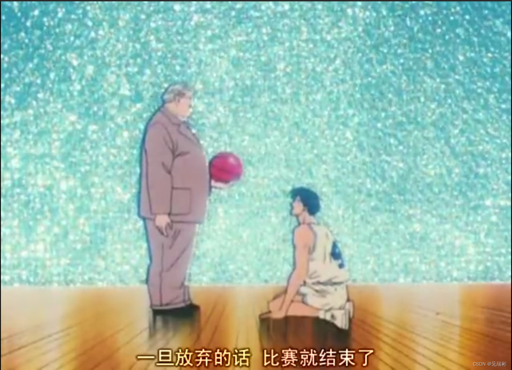

<!DOCTYPE html>
<html>
<head>
<meta charset="utf-8">
</head>
<body>

    <a class="xuanfu2 xuanfubutton" style="color:#fff" href="javascript:scrollToTop()">&#9650;</a>
    <a class="xuanfu xuanfubutton" style="color:#fff" href="https://sakura-jikage.github.io/notebook/#/外语/日语/动漫学日语">&#9664;</a>

</body>
</html>

# 第27集 浪子回头

## 001 教练我想打篮球(18分左右)

<ruby>安西先生<rp>(</rp><rt>あんざいせんせい</rt><rp>)</rp>：最<rp>(</rp><rt>さい</rt><rp>)</rp>後<rp>(</rp><rt>ご</rt><rp>)</rp>まで、<rp>(</rp><rt></rt><rp>)</rp>希<rp>(</rp><rt>き</rt><rp>)</rp>望<rp>(</rp><rt>ぼう</rt><rp>)</rp>を<rp>(</rp><rt></rt><rp>)</rp>捨<rp>(</rp><rt>す</rt><rp>)</rp>てちゃいかん。</ruby>`知道最后一刻也不能放弃希望。`

<ruby>安西先生<rp>(</rp><rt>あんざいせんせい</rt><rp>)</rp>：<rp>(</rp><rt></rt><rp>)</rp>諦<rp>(</rp><rt>あきら</rt><rp>)</rp>めたら　そこで<rp>(</rp><rt></rt><rp>)</rp>試<rp>(</rp><rt>し</rt><rp>)</rp>合<rp>(</rp><rt>あい</rt><rp>)</rp>終<rp>(</rp><rt></rt>しゅう<rp>)</rp>了<rp>(</rp><rt>りょう</rt><rp>)</rp>だよ</ruby>。`一旦放弃的话，比赛就结束了。`

