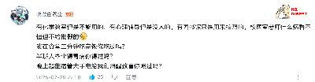

### 离谱规定

### 1.垃圾桶里不能有垃圾

### 2.阳台不能晒衣服

### 3.头发不能超过3毫米

### 4.电脑桌不让带电脑

### 5. 梳洗台是不能放洗澡用品

### 6.水池里不能有水渍

### 7.挂衣服间距还需要一致

### 8.裤子衣服内裤袜子分开挂

### 9.滴水的不能挂出来，必须放在里面滴干了才能放出来

### 10.检查内务的时候，里面又不能挂衣服

### 11.床上不能躺人

### 12.被子是要叠豆腐块的

### 13.课桌不能放书

### 14.床上不能有毯子和被子

### 15.书架上不能有书

### 16.地上不能有鞋子

### 17.窗户上不能有窗帘

### 18.午休晩上厕所是不能上厕所的

### 19.羽毛球馆里不能打羽毛球

### 20.足球场不准踢足球

### 21.空调是用来看的

### 22.食堂饭菜是用来抢购的

### 23.外卖是不让点的

### 24.厕所是不能有味道的

### 25.大冬天的必须把校服穿在外面

### 26.安静的朗读

### 27.床上不能有人

### 28.不得带任何课外书和与学习无关的卡片、卡贴、首饰等小玩意。

携带这些怎么了？带这些就影响学习了？影响到学习的话，也是学生自己对自己负责。

### 29.学生不得将内衣、内裤穿进学校，一旦发现，一概没收

不知道这个规定是针对小学、初中还是高中大学，无论哪个阶段，都不理解，这有什么问题？难道是男生携带女士内衣内裤，而不是穿自己的内衣裤？如果是这样，请说全话，那么大人了，连说全话都不会了吗？

## 问题

### 1.不能因为晚上睡觉拍肚子声音大，而记”重大违纪“

### 2.学校里任何人都没有权力关学生禁闭

>上高中那会儿，有个特别有意思的哥们，晚上睡觉的时候觉得肚子不舒服拍了拍，被记了个“大声拍肚子”的重大违纪，禁闭三天
>
>
>
>

### 3.不能因为看别人吸烟，而记”大过“

### 4.不能因为不能辨清是非，就采取连坐惩罚方式

>&emsp;&emsp;其他舍友在厕所吸烟，那个人在床上睡觉，当时抓的一个寝室，那个人一直说他没有吸，然后就被判了个看别人吸烟，虽然他连看都没有看
>
>
>
>
>
>

### 5.不能私自处置、遗弃学生物品

### 6.宿管不能辱骂学生

### 7.学校内便利店的售卖价格不能高于周边市场价格

### 8.不能禁止学生从校外带零食进入校园、宿舍

如果考虑到学生的饮食卫生问题，应该追究售卖给学生的便利店、超市等的责任，而不是禁止学生去购买。

### 9.宿管不能管学生午睡是否脱衣服

### 10.被子无须处于叠好的状态

### 11.早中晚、要保证充分的吃饭时间

### 12.宿管要温柔对待每一个学生，不能采取强光手电照学生等不温柔的行为。

### 13.校领导要给学生充分的时间。

校领导要知道学生一天的作息时间，给充分的时间去完成早中晚各个时间段的洗漱、吃饭、上厕所。晚自习下课后也要有充分时间写作业、学习、洗漱、上厕所，甚至要给学生聊天放松的空间，不能过度压抑。

