# 《你的名字》

## 001 前言

【宫水三叶】：朝、目が醒めると`早上醒来的时候`

【宫水三叶】：なぜか泣いてる`不知为什么自己在哭`

【宫水三叶】：そういうことが、時々ある`这样的事时不时就会发生`

【立花泷】：見ていたはずの夢は、いつも思い出せない`明明做过的梦，却总是想不起来`

【立花泷】：ただ`只是`

【宫水三叶】：ただ`只是`

【宫水三叶】：何かが消えてしまったという感覚だけが`只是觉得有什么消失了`

【宫水三叶】：目覚めてからも長く残る`这种感觉，即使在在醒来后也久久挥之不去`

【立花泷】：ずっと何かを、誰かを探している`一直在寻找着什么，寻找着谁`

【宫水三叶】：そういう気持ちに取り憑かれたのは、多分あの日から`我开始被这种感觉所困扰，大概是从那一天开始的`

【立花泷】：あの日、星が降った日`那天，星辰划过天际`

【立花泷】：それはまるでー`那就像`

【宫水三叶】：まるでー`那就像是`

【宫水三叶】：夢の景色ように`梦中的景色一样`

【宫水三叶】：ただひたすらに`只是纯粹觉得`

【宫水三叶&立花泷】：美しい眺めだった`美到极致的风景`

## 002 起床

（宫水三叶起床）

【宫水三叶】：（梦境里的呼唤）滝くん`龙君`

【宫水三叶】：（梦境里的呼唤）滝くん`龙君`

【宫水三叶】：（梦境里的呼唤）覚えてない`你还记得我吗？`

【宫水三叶】：（梦境里的呼唤）名前は`我的名字是`

【宫水三叶】：（梦境里的呼唤）みつは`三叶`

【宫水四叶】：（回归现实）お姉ちゃん、何しとるの？`姐姐，你在干什么呢？`

【宫水三叶（立花泷）】：いや、すげえ本物っぽいなあって`我在想这玩意还真够真的`

【宫水三叶（立花泷）】：え？お姉ちゃん？`哎？姐姐？`

【宫水四叶】：何寝ぼけとるの？ご！は！ん！`说什么梦话？吃早饭啦！`

【宫水四叶】：早く来ない！`快点！`

【宫水三叶（立花泷）】：え？`哎？`

【宫水三叶（立花泷）】：えぇぇぇ！！！`哎？？！`

## 003 早餐

【宫水四叶】：おばあちゃん、昨日の魚出す？`外婆，昨天剩的鱼要端出来吗？`

【宫水一叶】：あんたが食べや`你们吃吧。`

【宫水三叶】：おはよう`早上好。`

【宫水一叶】：おはよう`早上好。`

【宫水四叶】：お姉ちゃん、遅い`姐姐，你太慢了！`

【宫水三叶】：明日は私が作るでね`明天早上我来做早饭好了吧`

（宫水三叶盛饭）

【宫水三叶】：食べすぎかな`会不会太多了？`

【宫水三叶】：まあいいか！`算了`

【宫水一叶】：今日は普通やな！`今天倒是很正常的啊`

【宫水四叶】：昨日はヤバかったもんな`昨天真是太糟糕了`

【宫水三叶】：え、ちょっと、何`等等，你们在说什么啊？`

（广播响起）

【广播站】：皆さま、おはようございます`大家早上好`

【广播站】：町役場から朝の知らせです。`这里是镇广播站，向您播报今早的要闻。`

【广播站】：来月20日に行われる糸守町町長選挙について、町の選挙管...`下个月20日将举行系守镇镇长选举活动，镇选举...`

（外婆一把把广播的插头拔掉了）

【电视播报】：1200年に一度という彗星の来訪がいよいよ一月後に迫っています`1200年一度的彗星，终于将在一个月后到来`

【电视播报】：彗星は数日間にわたって肉眼でも観測できると見られる通り`彗星将在几天之内都能被肉眼观测到...`

【宫水四叶】：いい加減、仲直りしないよ`赶紧和他和好吧`

【宫水三叶】：大人の問題`那是大人们的问题`

【电视播报】：世界中の研究機関は観測のための準備に追われています`...世界各地的研究机构都已经做好了观测准备`

## 004 上学

【三叶和四叶】：行ってきます`我出门了`

【宫水四叶】：それでお婆ちゃんでな、お米屋さんのお兄ちゃん…`然后外婆说，卖米的哥哥`

【宫水四叶】：しっかり勉強しといで`好好学习哦`

【早耶香】：みつは`三叶`

【宫水三叶】：おはよう、サヤチ、テッシ`早上好，早耶香，敕使`

【早耶香】：おはよう`早上好`

【敕使】：お前、早く降りろ`你快下来`

【早耶香】：いいにん、ケチ`为什么`

【敕使】：重いやさ`你太重了`

【早耶香】：失礼やな`真没礼貌`

【宫水三叶】：あんたたち、仲良いな`你们关系真好啊`

【早耶香和敕使】：良くないわ`一点也不好`

【早耶香】：みつは、今日は髪ちゃんとしとるね`三叶你今天倒是扎好了头发呢`

【宫水三叶】：え、何`什么？`

【敕使】：そうや、ちゃんとおばあちゃんにお祓いしもらったんか`对啊！昨天让外婆给你驱邪了吗？`

【宫水三叶】：お祓い`驱邪？`

【敕使】：アレや絶対狐憑きやな！`你肯定是狐狸上身了`

【早耶香】：なんでもオカルトにしんの！`你别什么都扯到鬼怪上面啦`

【早耶香】：きっとみつははストレス溜まっとるの。なあ？`三叶肯定是压力太大了 对吧`

【宫水三叶】：ちょ、ちょっと`等……等等`

【宫水三叶】：なんの話`你们在说什么啊？`

【敕使】：何ってお前`你忘了吗？`

## 005 宣讲

【宫水俊树（三叶的父亲）】：そして何よりも`最重要的是`

【宫水俊树】：集落再生事業の継続`为了我们镇的振兴事业`

【宫水俊树】：そのための町の財政健全が`必须要实现健全财政机制`

【宫水俊树】：そらが実現して初めて`只有这样`

【宫水俊树】：安全安心な町づくりができるのです`才能创造一个安全、安心的小镇`

【宫水俊树】：現職として`作为现役镇长`

【路人1】：どうせ今期も宮水さんで決まりやろう`反正这次也肯定是宫水当选吧`

【路人2】：だいぶ前とるしな、ここだけの話`听说他已经在到处拉票了 也只是在这说说`

【男同学】：おう、宮水`哦、宫水啊`

【宫水三叶】：おはよう`早上好`

【男同学】：町長と土建屋は、その子供も仲ええなあ`镇长和土木建筑公司社长 他们的孩子关系也很好呢`

【女同学A（中分直发）/女同学B（单侧马尾）】：ふふ/やばい`真糟糕`

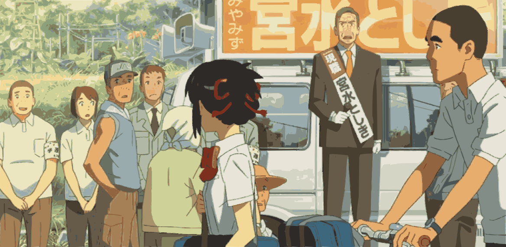

（这时镇长发现了路过的三叶）

【宫水俊树】：みつは`三叶`

【宫水俊树】：胸を張って歩かんか`走路的时候抬头挺胸`

【路人1】：身内にも厳しいなあ`对家人也很严厉呢`

【路人2】：さすが町長やわ`不愧是镇长`

【女同学1】：恥ずかしい`真难堪`

【女同学2】：ちょっとかわいそう`有点可怜`

【早耶香】：みつは`三叶`

【宫水三叶】：こんな時ばっかり`总是在这种时候`

## 006 课堂

（宫水三叶翻开笔记，里面写着：お前は誰だ`你是谁？`）

【语文老师】：「誰そ彼」、それが「黄昏時」の語源ね`“他是谁” 就是“黄昏”的语源`

【语文老师】：「黄昏時」は分かるでしょう？`“黄昏之时”大家都知道吧`

【语文老师】：夕方、昼でも夜でもない時間`傍晚 既不是白天也不是夜晚的那段时间`

【语文老师】：世界の輪郭がばやげて`世界的轮廓开始模糊`

【语文老师】：人ならざるものに出会うかもしれない時間`可能看到非人之物的时段`

【语文老师】：もっと古くは、「彼誰そ時」とか`更久以前还被叫做“谁那是”`

【语文老师】：「彼は誰時」も言ったそうです`或者“那是谁”`

【学生A提问】：質問！「カタワレ時」やなくて？`请问！不是叫“谁他是”吗？`

【语文老师】：「カタワレ時」？それはこの辺りの方言じゃない？`“谁他是”？应该是这里的方言吧`

【语文老师】：糸守のお年寄りには前言葉が残っていると聞くし`我听说系守镇的老人们似乎还会使用一些古语`

【学生A】：ど田舎だもんな`穷乡下嘛`

（大家一阵欢笑，只有三叶还在盯着笔记本上的“你是谁？”疑惑不解）

【语文老师】：じゃ、次、宮水さん`那么下一个 宫水同学`

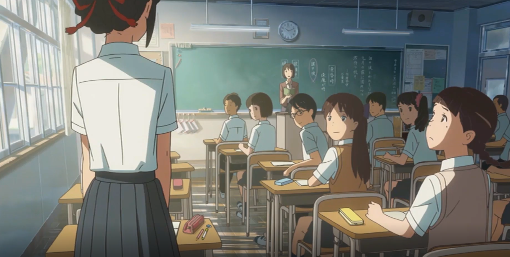

【宫水三叶】：あ、はい`是`

【语文老师】：あら、今日は自分の名前を覚えているよね`哎呀 看来今天倒是记得自己的名字呢`

（大家又是一阵欢笑）

## 007 午休

【早耶香】：覚えとらんの？`你不记得了吗？`

（三叶“嗯”了一声）

【早耶香】：あんただって昨日は自分の机もロッカーも忘れたって言って`你昨天可是连自己的桌子和鞋柜都不记得在哪了哦`

【早耶香】：髪は寝癖着いたし、りぼんはしとらんかったし`头发也乱七八糟的 连发带都没绑`

【宫水三叶】：へえ！？嘘、本当！？`哎？？不会吧！真的吗？`

【早耶香】：なんか記憶喪失みたいやったよ`看起来像失忆了一样呢`

【宫水三叶】：そういえば、ずっと変な夢をみとったような気がするんやけど`说起来 我感觉我一直在做一个奇怪的梦`

【宫水三叶】：なんか、別の人の人生の、夢？`好像是变成另外一个人的梦？`

【宫水三叶】：よく覚えとらんなあ`记不太清楚了`

【敕使】：分かった`我知道了`

【敕使】：それって`那就是……`

【敕使】：前世の記憶！`前世的记忆！`

【敕使】：もしくはエブェレットの解釈に基づくマルチバースに無意識が接続したっちゅう
`或是根据埃弗雷特多世界诠释 你无意间连接上了另一重宇宙`

【早耶香】：あんたは黙っとって`你闭嘴啦！`

【宫水三叶】：あー、テッシ、もしかしてあんたがわたしのノートにー`啊！敕使 该不会是你在我的本子上……？`

（敕使：嗯？）

【宫水三叶】：何でもない`没什么`

【早耶香】：でもみつは、昨日はマジでしょっと変やったよ`不过三叶 昨天你真的好奇怪哟`

【早耶香】：あんか体調悪いやない？`是不是身体不舒服啊？`

【宫水三叶】：ん....おかしいなあ、元気やけどなあ`好奇怪啊 我感觉没什么问题啊`

【早耶香】：ストレスとかやない？ほら、例の儀式ももう直ぐやろう`是不是压力太大了？你看 那个仪式快要来了吧`

【宫水三叶】：ああ、言わんといで！`啊啊 不要提这个！`

【宫水三叶】：もうワラシはこんな町嫌やあ`我真是受够这个镇子了`

## 008 放学

【宫水三叶】：狭すぎるし濃いすぎるし、早速卒業して早く東京行きたいわ`又小又挤得 好想赶快毕业去东京`

【早耶香】：まあ、なあ。本当に何もないもんな、この町`也是啊 这里真的是什么都没有啊`

【早耶香】：電車なんか２時間に１本やし`电车2小时只有一趟`

【宫水三叶】：コンビニは９時に閉まるし`便利店9点就关门了`

【早耶香】：本屋ないし、歯医者ないしなあ`没有书店 也没有牙医`

【宫水三叶】：そのくせスナックは二軒もあるし`酒吧倒是有两家`

【早耶香】：雇用はないし`没有兼职`

【宫水三叶】：嫁は来ないし`没人愿意嫁过来`

【早耶香】：日照時間は短いし`日照时间又短`

【敕使】：ん…！お前らなあ！`我说你们`

【宫水三叶和早耶香】：何よ`怎么了`

【敕使】：そんあことより`别说这些了`

【敕使】：カフェにでも寄ってかんか`不如去咖啡馆吧`

【宫水三叶和早耶香】：へえ、あるの？/へえ、カフェ？`咖啡馆？真的吗？`

【宫水三叶和早耶香】：どこ！？`在哪里啊？`

## 009 将来

【路过的大妈】：こんにちは`你好`

【早耶香】：こんにちは`你好`

【早耶香】：何がカフェやさあ`这算哪门子咖啡馆？`

【敕使】：こんな町に、そんなあるか`镇子上怎么可能有`

【早耶香】：みつは、帰っちゃったやよ`三叶都回去了`

【早耶香】：あの子も本当大変やよねえ`她也真是不容易`

【敕使】：まあ、みつはは主役やからなあ`毕竟她是主角啊`

【早耶香】：せやなあ`是啊`

（敕使开始和旁边的小狗狗玩闹了起来）

【早耶香】：ねえ、テッシ`我说敕使`

（敕使：嗯？）

【早耶香】：高校卒業したら、どうするの？`高中毕业后你有什么打算？`

【敕使】：何やさあ、急に、将来とかの話`怎么突然问起这个？你想跟我商讨未来吗？`

（早耶香：嗯）

【敕使】：別に`也没什么`

【敕使】：普通にずっとこの町で暮らして行くんやと思うよ、俺は`就在这里 平凡的生活下去`

## 010 结绳

【宫水四叶（妹妹）】：ん…私もそっちがいいわ`我也想做那个啦`

【宫水一叶（外婆）】：よつはには、まだ早いわ`四叶还太小了`

【宫水一叶】：糸の声を聞いてみない`要仔细倾听线的声音`

【宫水一叶】：そうやってずっと糸を巻いとるとな、時期に人と糸との間に感情が流れ出すで`只要一直缠线 人与线之间就会产生感情`

【宫水四叶】：糸は喋らんもん`线又不会说话`

【宫水三叶】：集中しろってことやよ`外婆的意思是让你专心啦`

【宫水一叶】：わしらの組紐にはなあ`我们编织的结绳--组纽啊`

【宫水一叶】：糸守千年の歴史が刻めてとる`可是有着系守镇千年的历史呢`

【宫水一叶】：ええか`听好了`

【宫水一叶】：遡ること200年前`距今200年前`

【宫水三叶】：始まった`开始了`

【宫水一叶】：草履屋の山崎繭五郎の風呂場から火が出て`开草鞋的山崎关五郎家浴室着火了`

【宫水一叶】：この辺は丸焼けなってまった`将这附近烧毁殆尽`

【宫水一叶】：お宮も古文書も皆焼け`神社和古籍付之一炬`

【宫水一叶】：これが俗に言うー`这就是所谓的……`

【宫水三叶】：「繭五郎の大火」`关五郎大火`

【宫水四叶】：へえ！？名前付いとるの？`哎？给火灾起名字！`

【宫水四叶】：繭五郎さん、かわいそう`关五郎先生好可怜`

【宫水一叶】：おかけで、祭りの意味もわからんくなってまって`结果我们祭典的内涵也无从得知了`

【宫水一叶】：残ったのは形だけ`流传下来的只有形式`

【宫水一叶】：せやけど、文字は消えても、伝統は消しちゃんいかん`但即使文字消失了 传统也不能消失`

【宫水一叶】：それはわしら宮水神社、大切なお役目`这就是我们宫水神社的重要使命`

【宫水一叶】：せやのに、あのバカ息子は！`但是那个蠢货女婿……`

【宫水一叶】：神職を捨て、家を出て行くだけじゃ飽き足らんと`不仅舍弃自己的神职 离开这个家`

【宫水一叶】：政治とはどうもならん…`还搞什么政治`

## 011 酒桌

（宫水俊树：三叶的爸爸）

【宫水俊树】：社長、ほら、もう一杯`社长，来，再喝一杯`

【宫水俊树】：今回も社長にはお世話になるで`这回多亏了社长`

【敕使的爸爸】：任せとってください`放心 交给我`

【敕使的爸爸】：風入と坂上あたりの票は間違いなうですわ`风入和坂上那边的票肯定是你的`

（旁边的人在互相闲聊）

【酒桌旁边的人1】：お前、あの子とどう`你跟那妹子怎么样了？`

【酒桌旁边的人2】：そんな簡単にいかん`哪儿有那么容易啊`

（一边单独一桌的敕使，边看着大人门的酒桌，边说）

【敕使】：腐敗の匂いがするなあ`腐败的味道啊`

（敕使的妈妈端过来一盘菜）

【敕使的妈妈】：何言っとるの`说什么呢`

【敕使的爸爸】：おい、もう2、3本つけてくれ`喂 再拿几瓶酒来`

【敕使的妈妈】：はい、はい`好好`

【敕使的爸爸】：克彦、週末は現場手伝い`克彦，周末来现场帮忙`

【敕使的爸爸】：発破使うでな、勉強や`要使用炸药，学着点`

【敕使】：ん…`嗯`

【敕使的爸爸】：返事は！！`太小声啦！`

【敕使】：はっ！`知道啦！`

（敕使望向远方正在表演的三叶的位置）

【敕使】：堪らんな、お互い`我们都很难熬啊`

## 012 表演

【台下男观众】：あらやよつはちゃんか、大きくなったなあ`那不是四叶吗？长大了呢！`

【台下女观众】：二人ともお母さんにの別嬪さんやない`她们两个都很像她妈妈呢`

【敕使】：よう`哟`

【早耶香】：よう`哟`

【敕使】：世界最古の酒やなで`听说是世界上最古老的酒`

【敕使】：米を噛んで、吐き出して放置しとくなけりゃ`把米放进嘴里嚼，然后吐出来`

【敕使】：自然発酵してアルコールになるやさあ`让它自然发酵变成酒精`

【早耶香】：口噛み酒`口嚼酒`

【早耶香】：神様あ嬉しいんかなあ、あんなあ酒もらって`神明真的会喜欢吗？这种酒`

【敕使】：そうりゃ嬉しいやろう`当然会喜欢了`

【台下观众男同学】：ほれ、見てみ、宮水や`你们快看，是宫水`

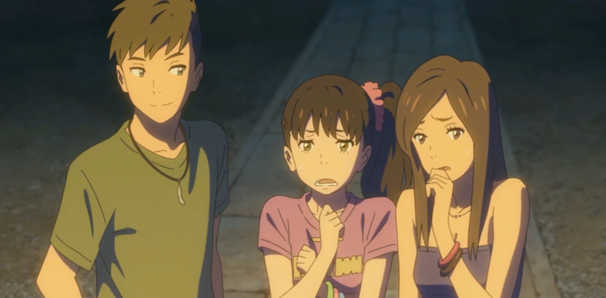

【女同学B】：え！私、絶対無理`哎！我绝对做不了`

【女同学A】：よく人前でやり得るような`真亏她好意思在人前做啊`

【女同学B】：信じられんわ`简直难以置信`

## 013 愿望

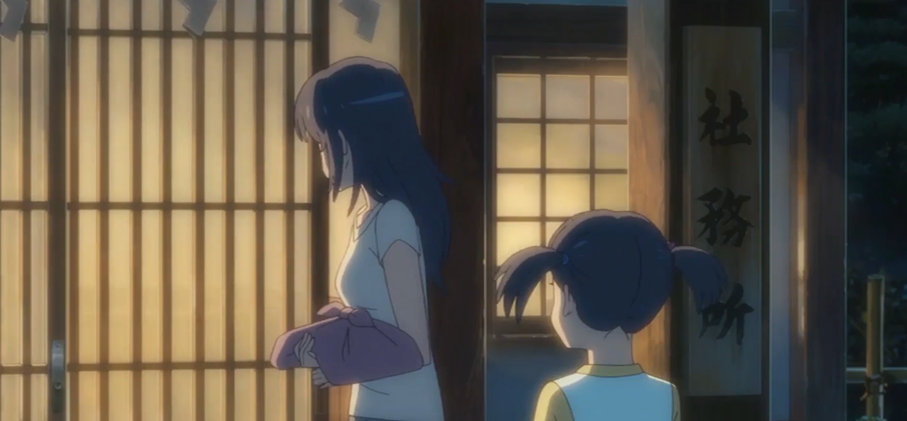

【宫水四叶】：お姉ちゃん、元気出しなよ`姐姐 振作点啦`

【宫水四叶】：いいにん、学校の人に見られたくらい`有什么嘛 不过是被同学看到而已`

【宫水三叶】：思春期前のお子様は気楽でええよな`青春期之前的小孩子真好啊 无忧无虑`

【宫水四叶】：そうや！いっそ口噛み酒を一杯作ってさ、東京に行きの資金にしたら`对了 干脆做多一些口嚼酒 卖掉作为去东京的资金怎么样`

【宫水三叶】：あんたって、すごい発想するなあ`你真能想啊`

【宫水四叶】：生写真とメーキング動画とかつけてさ`拍些照 制作流程视频`

【宫水四叶】：「巫女の口噛み酒」って名前とかつけてさ`冠上“巫女口嚼酒”的名头`

【宫水四叶】：きっと売れるわ`肯定能大卖`

【宫水三叶】：ダメ！酒税法違反！

【宫水四叶】：え？そういう問題なの？`重点是这个吗？`

【宫水三叶】：もうこんな町嫌や！`我受够这个镇子了`

【宫水三叶】：こんな人生嫌や！

【宫水三叶】：来世は、東京のイケメン男子にしてください！！`来世让我做个东京的帅哥吧！`

【宫水四叶】：阿呆な人やな`好傻啊`

## 014 转换

(从床上向地板上摸手机，没摸到，摔到了地板上)

【立花泷（宫水三叶）】：痛い！`好疼`

【立花泷（宫水三叶）】：あ、いった、た、た`疼疼疼`

（从床上掉下来的立花龙，面对着陌生的房间，充满了疑惑）

【立花泷（宫水三叶）】：どこ？`这是哪？`

【立花泷（宫水三叶）】：何や、ある！？`这好像有什么`

（站在洗手台前，摸着自己的贴着纱布受伤的左脸）

【立花泷（宫水三叶）】：痛い！`好疼`

【立花龙的爸爸】：滝！起きたか？`龙，你起来了吗`

【立花龙的爸爸】：お前、今日は飯当番だっただろう、寝坊じゃがって`今天轮到你做早饭吧 还睡懒觉`

【立花泷（宫水三叶）】：す、すみません`对不起`

【立花龙的爸爸】：俺先に出るからなあ`我先出门了`

【立花龙的爸爸】：味噌汁、飲んじゃていてくれ`味增汤 你全部喝完`

【立花泷（宫水三叶）】：ん`嗯`

【立花龙的爸爸】：遅刻でも、学校はちゃんと行けよ

【立花龙的爸爸】：じゃなあ`走了`

【立花泷（宫水三叶）】：いってらっしゃい`您慢走`

【立花泷（宫水三叶）】：変な夢`奇怪的梦`

（这时手机响了一下，是APP LINE来了一条消息）

【LINE - 藤井司的消息】：ツカサ：もしかしてまだ家か？走って来い！！`司：你不会还在家吧？赶紧过来！`

---

【立花泷（宫水三叶）】：え、なになに、司？誰？`哎，什么啊？司？谁啊？`

（立花龙看完手机后，准备穿上校服去学校，突然觉得想去厕所）

【立花泷（宫水三叶）】：トイレ行きたい`想去厕所`

（立花龙上完厕所，出了门，感叹到）

【立花泷（宫水三叶）】：はあ…リアルすぎ`真实过头了`

（这时站在走廊，看到远处东京都繁华的城市建设后，惊住了）

【立花泷（宫水三叶）】：東京や`是东京啊`

## 015 神宫

（学生们的聊天1）

【女学生1】：これ、どこで買ったの？`这个你是在哪里买的？`

【女学生2回复】：代官山の`代官山`

（学生们的聊天2）

【男学生】：次のライブは全宅さあ`下一场演出的暖场啊`

（学生们的聊天3）

【女学生】：ね、今日部活保ってさあ…`今天翘了社团活动去看电影吧（这里日语还有台词，只是声音小点，但视频没给，自己听不懂）`

（正式剧情）

【藤井司】：滝！`泷!`

【藤井司】：まさか昼からとはね`居然这时候到`

【藤井司】：飯行こうぜ`去吃午饭了`

【藤井司】：メール、無視しゃがって`居然敢不回我短信`

【立花泷（宫水三叶）】：あ！司、君？`啊 司同学？`

【藤井司】：君付け？反省の表明？`名字后面加同学 这是在反省吗？`

【藤井司】：迷った！？`迷路了？`

【立花泷（宫水三叶）】：ん`嗯`

【藤井司】：お前さあ、どうやったら通学で道に迷えんだよ`你啊 是怎么做到在上学路上迷路的啊？`

【立花泷（宫水三叶）】：ああ、えっと、わたし`啊……这个……人家……`

【藤井司】：わたし`人家？`

【立花泷（宫水三叶）】：あ、わたくし！`本人！`

【立花泷（宫水三叶）】：ぼく`俺？`

【立花泷（宫水三叶）】：おれ？`我？`

【立花泷（宫水三叶）】：はあ――俺、楽しかったんやよ。なんか、毎日お祭りみたい、東京って`我玩得很开心啦 感觉东京每天都像过节似的`

【藤井司】：なんか、お前、なまってない？`总觉得你好像有方言口音啊？`

【立花泷（宫水三叶）】：え！？`哎？`

【高木真太】：滝、弁当は？`泷 你的便当呢？`

【立花泷（宫水三叶）】：えぇぇ！？`哎？`

【藤井司】：まったく、寝ぼけてんのか`服了 睡迷糊了啊你`

【高木真太】：なんかあるか`你那里有什么吃的？`

【藤井司】：卵コロッケサンドにしようぜ`给你现做一个鸡蛋肉饼三明治吧`

【立花泷（宫水三叶）】：あ`啊……`

【立花泷（宫水三叶）】：ありがとう`谢谢`

【藤井司】：放課後、カフェ行かねえ`放学后去和咖啡吧`

【高木真太】：まあ、例の？いいね。滝は？`之前的那个？好啊。泷来吗？`

【立花泷（宫水三叶）】：え、ええ！！えええ！！！`哎？哎？哎？`

【立花泷（宫水三叶）】：カフェ！？`咖啡！`

## 016 咖啡

【藤井司】：天井の木組みがいいね`天花板弄得不错啊`

【藤井司】：あ、手が掛かってなあ`细节做得挺好呢`

【高木真太】：滝、決まった？`泷，点好了没？`

【立花泷（宫水三叶）】：え！？こ、このパンケーキ代で、俺はーヶ月で暮らせる`一个蛋糕的价格都够我吃一个月了`

【高木真太】：いつの時代の人だよ、お前は`你是哪个时代的人类啊`

【立花泷（宫水三叶）】：まあ、いいか！夢やし`不管了，反正是梦`

【立花泷（宫水三叶）】：あ、いい夢`这梦真美`

（这时候手机响了，泷拿起了手机）

【立花泷（宫水三叶）】：ええ！どうしよう？俺、バイト遅刻だって？``

【藤井司】：お前のシフトは今日か`今天是你的班？`

【高木真太】：早く行ったら`快去吧`

【立花泷（宫水三叶）】：あのう…`额，那个`

【立花泷（宫水三叶）】：俺のバイト先って、どこやっけ？`我打工的地方……在哪儿来着`

【藤井司】：蛤？（中文）

## 017 打工

（后厨女服务生流利的报着顾客的点单）

【女服务生】：6番、7番、10番様、オーダー待ちです`6号7号10号桌 等着上菜`

【厨师】：12番テーブル、滝！`12号桌的好了！泷！`

【立花泷（宫水三叶）】：はい`好的`

【立花泷（宫水三叶）】：お待たせ致しました`让您久等了`

（泷在接受一个顾客点菜时一边记一边念叨）

【立花泷（宫水三叶）】：えっと、ズッキニとトマトとサラダと`呃 西葫芦和番茄和沙拉和`

（泷给另一个顾客送错了菜）

【顾客】：頼んでませんけど`我们没点这个啊？`

（画面又切换到后厨）

【厨师】：滝、トリップは下請けだって言ったろう`泷！橄榄油不能放太多 我说过多少次了！/B站：泷 不是跟你说了松露没货了吗`

【厨师】：滝、声が小さいよ！`泷，声音太小了`

【厨师】：滝！

（泷端着双手端着两盘菜，从楼上走下来，抱怨道）

【立花泷（宫水三叶）】：ああ、この夢いつ覚めるやさあ！`这个梦什么时候才会醒啊？`

## 018 挑事

（电影中快节奏的音乐戛然而止，突然就静了下来）

【顾客】：ちょっと！ちょっと、お兄さん！`等一下，那边的小哥`

【立花泷（宫水三叶）】：あ、はい`啊 是`

【棕头男人】：ピザにさあ、楊枝が入ってたんけど`披萨上扎着根牙签啊`

【棕头男人】：これ、食っちゃったら、危ないよね`这个不小心吃下去可是很危险的`

【棕头男子】：俺は気ついたって良かったけどさ`还好我提前发现了`

【棕头男子】：どうすんの？`你说要怎么办？`

【立花泷（宫水三叶）】：え、えっと、あのう`呃 啊 这个……`

【立花泷（宫水三叶）】：でも、イタリヤの厨房で楊枝が入るなんてこと`可是 意大利餐厅的厨房里是没有牙签的。`

（棕头男子听到后生气的砸了下桌子，坐在他对面的黑色卡尺头男子，自始至终都在自顾自吃喝）

【棕头男子】：はあ！？`啊？`

（这时前辈出场来解围了）

【奥寺前辈】：お客様`这位客人`

【奥寺前辈】：どうかなさいましか`请问有什么事吗？`

（奥寺前辈悄悄告诉泷，这里交给她了）

【奥寺前辈】：ここはいいから`这边由我来吧`

【某男服务生】：（把泷拉到一旁）お前、今日はおかしいぞ`你今天好奇怪啊`

【奥寺前辈】：（深深鞠了一躬）大変失礼致しました！お代は結構ですので`非常抱歉 这次就给您免单了`

【棕头男子】：（男子获得了想要的结果，得意的回道）へえ、そう？`哎？是吗？`

【奥寺前辈】：お怪我はございませんでしたか`您没有受伤吧？`

（棕头男子，偷偷伸出了刀去割奥寺的裙子）

## 019 刀割

（餐厅终于打烊了，大家正在打扫着各个位置）

【立花泷（宫水三叶）】：（向着奥寺前辈的方向）あのう`那个`

【立花泷（宫水三叶）】：奥寺…さん`奥寺小姐`

【同事】：（轻轻锤了下泷的后脑勺）先輩だろう`要叫前辈`

【立花泷（宫水三叶）】：あ！奥寺、先輩。先はー`奥寺前辈 刚才`

【奥寺前辈】：今日は災難だったね`今天真是灾难啊`

【立花泷（宫水三叶）】：いいえ、あのう`啊不 那个`

【奥寺前辈】：あいつら絶対言いがかりだよ`那些家伙一定是故意找茬的`

【奥寺前辈】：マニュアル通り、ただにしてやったけどさ`按照规定 给他免费了`

【女服务生】：（路过的女服务生发现了裙子的问题）奥寺さん、そのスカート！`奥、奥寺姐，你的裙子`

【女服务生】：（发现问题的女服务生进一步靠近）大丈夫ですか`没事吧`

【男服务生】：（从远处闻讯赶来）おい、どうした？`怎么了？`

【女服务生】：（拎着被割到的裙子的缺口）切られてるみたい`好像被人割烂了`

【男服务生】：わ、ひどい`真过分呐`

【奥寺前辈】：あいつら！`那混蛋！`

【女服务生】：どうしましょう？顔、覚えてますか？`怎么办？记得他们的长相吗？`

【男服务生】：いいや`不记得`

## 020 裙子

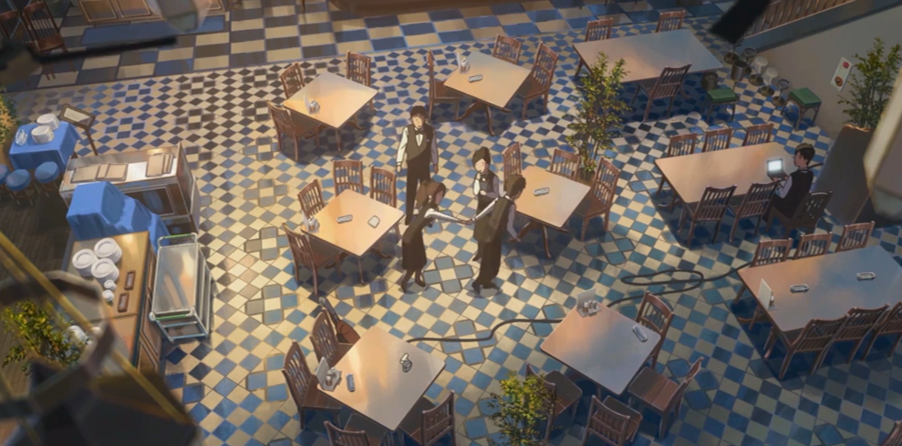

【立花泷（宫水三叶）】：（拉起奥寺前辈的手，往工作人员的房间走）先輩、ちょっと…`前辈 过来一下`

【奥寺前辈】：おい、滝！`喂 泷`

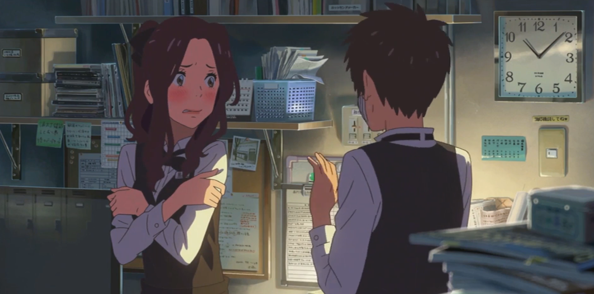

【立花泷（宫水三叶）】：（关上房间的门）スカート祓いてください！`请把裙子脱下来！`

【奥寺前辈】：え！？`哎！？`

【奥寺前辈】：あ、む、向こう向いてますから！`啊啊！我转过身去不会看的！`

（泷开始缝起了奥寺前辈的裙子）

【立花泷（宫水三叶）】：すぐに済みますから`马上就缝好了`

【立花泷（宫水三叶）】：出来ました！`完成了`

【奥寺前辈】：滝君、すごい！`泷，好厉害啊`

【奥寺前辈】：前よりも可愛い！`比之前还要可爱`

【立花泷（宫水三叶）】：今日は、助けていただいて、ありがとうございました`谢谢您今天帮我解围`

【奥寺前辈】：本当はさ、今日、ちょっと心配だったのよ`说真的 我今天还有点担心来着`

【奥寺前辈】：滝君弱いくせに、喧嘩っ早いから`泷明明那么弱 却老是跟别人打架`

【奥寺前辈】：今日の君のほうがいいよ`今天的你比较好啦`

【奥寺前辈】：女子力高いんだね　滝君`女子力真高啊 泷`

## 021 下班

（下班后，实际还是三叶的泷，拿着泷的手机，翻看了起来）

手机显示的内容：

一本前　一本後`「いっぽんまえ　いっぽんご」上一页 下一页`

所要時間17分　￥165　乗換1回`「しょようじかん　じゅうななふん　えんひゃくろくじゅうご　のりかえいちかい」全程约17分钟 165日元 换乘一次`

２２：２０発　恵比寿`「にじゅうに　さんじゅうに　はつ　えびす」惠比寿 - 代代木 约7分钟`

７分　ＪＲ山手線外回り`「はちふん　ＪＲやまのてせん　そとまわり」JR山手外环线`

（３駅目）　渋谷・新宿方面`「さん駅目　しぶや　しんじゅく　ほうめん」涉谷、新宿方向`

２２：２７着　代々木`「にじゅうに　よんじゅう　ちゃく」`

２２：３１発`はつ`

６分　ＪＲ総武線`ろくふん　そうぶせん`

（３駅目）千葉行き`さんえきめ　せんよういき`

【立花泷（宫水三叶）】：よく出来た夢やな、我ながら`好真是的梦啊 我都有点佩服自己了`

【立花泷（宫水三叶）】：あ！この子、日記つけとる`啊 这个人还会记日记`

【立花泷（宫水三叶）】：マメやな`真是井井有条呢`

【立花泷（宫水三叶）】：（翻看着泷的手机相册）いいな、東京生活`东京的生活真好啊`

【立花泷（宫水三叶）】：（一下子翻到了奥寺前辈的照片）あ！あの人や！`啊！是她啊`

【立花泷（宫水三叶）】：片思いかな？ふふふ`在暗恋她吗`

（看到这里，突然从躺在床上，翻起了身子，用手机敲了一篇日记）

## 022 日记

お友達は優しい`朋友们都很温柔`

自分自身もちょっとイケメンだし。`我自己也算是个帅哥。`

レストランでのバイト経験は驚いたけど`虽然在餐厅打工的时候被吓到了`

映画の世界みたいでわくわくした！:satisfied: `但是在电影一样的世界里让我非常兴奋！`

私の失敗のおかげで`拜我的失败所赐`

超美女:heart:奥寺センパイと仲良くなれたしバイト帰り`和大美女奥寺前辈的关系反倒拉近了`

駅までの道を奥寺センパイと一緒に帰りました。:sparkles: `下班后还和她一起走到了车站呢`

私の女子力のおかげ:heart: `这都多亏了我的女生魅力啊`

（日记写完，突然想起来真正的泷在自己的笔记本上写的“お前は誰だ？”，于是在自己的手掌心写上了自己的名字 -- “みつは”`三叶`）

（到这里，夜深了，就睡了）

## 023 惊讶

（真正的泷，看着手上的字）

【立花泷】：なんだ、これ？`这是什么啊？`

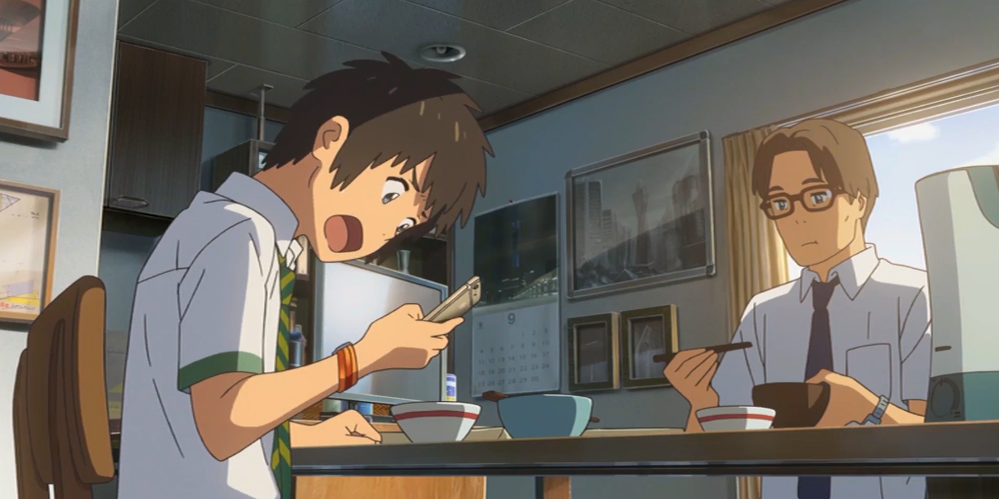

【立花泷】：な！な！なんだこれ！`这什么啊？`

【藤井司】：（东京高中的操场上）今日もカフェ行かねえ`今天也去喝咖啡吧`

【立花泷】：あ、悪い、俺、今日これからバイト。`啊 抱歉 我今天要去打工`

【高木真太】：行き先は分かるのか`知道怎么去吗？`

【立花泷】：はあ？はあ！`啊？啊！`

【立花泷】：司、もしかしてお前か`司 不会是你吧`

【立花泷】：俺の携帯勝手に`乱动我的手机`

【藤井司】：はあ？`嗯?`

【立花泷】：あ、やっぱいいや。じゃなあ`啊……算了没事儿……再见`

【藤井司】：あいつ、今日は普通だな`那家伙今天倒挺正常吗`

【高木真太】：昨日はなんか`他昨天`

【高木真太】：可愛かった`挺可爱的`

【藤井司】：はあ？`哈？`

## 024 奥寺

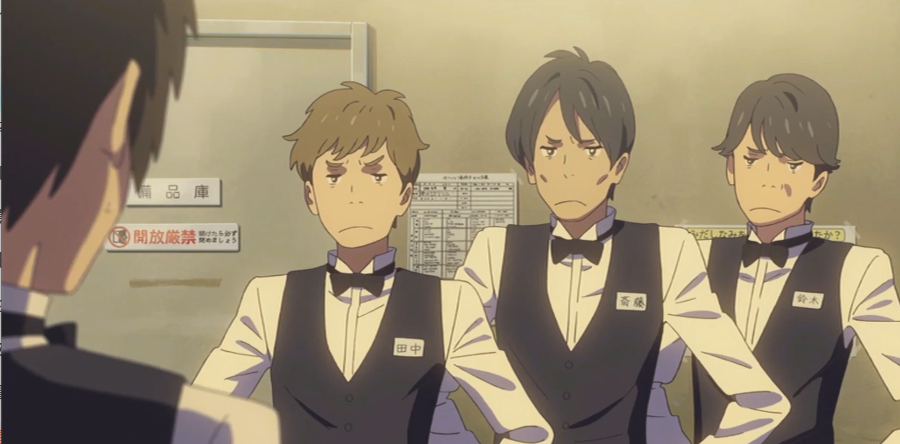

（意大利餐厅更衣室，泷换完衣服，从更衣室出来，顺手把门关上了，这时门前的同事站成一排看着他）

【立花泷】：な、なんっすか`怎么了`

【同事1】：テメ滝、抜け掛けじゃがって`泷，你这家伙，竟然抢在我们前面`

【同事2】：昨日お前ら一緒に帰っただろう`昨天你们一起回去的吧`

【立花泷】：え、え、え、まさかマジで、奥寺先輩と？`该不会是真的吧？我跟奥寺前辈？`

【同事123】：あれからどうなった！？`后来怎么样了？`

【立花泷】：あ、あのう……よく覚えてないっすんよ、俺`那，那个……我不记得了`

【同事1】：巫山戯んなよ、コラ！`你在耍我们吗？`

【奥寺】：奥寺、入ります`奥寺前来报到`

【奥寺】：お疲れ様`大家辛苦了`

【大家】：チワッス！`你好`

【奥寺】：あ、今日もよろしくね`今天也请多关照哦`

【奥寺】：ねえ、滝君`对吧，泷`

 ## 025 窃语

【宫水四叶】：お姉ちゃん、今日はおっぱい触っとらんの？`姐姐，今天不摸自己的胸了啊`

【宫水四叶】：ご！は！ん！早く来なさい！`吃早饭啦！快点起来！`

【宫水三叶】：おっぱい！？`摸胸？`

【宫水三叶】：おはよう`早上好`

【宫水三叶】：なん、なんか、視線を感じるやけど`怎么好像都在看我？`

【早耶香】：昨日のあれは目立だったもんな`因为你昨天太引人注目了呀`

（宫水三叶一脸不相信的惊讶表情）

【宫水三叶】：はあ？`哈`

（又到了午休时间，宫水三叶和早耶香、敕使三人又聚集在操场一侧吃午餐。早耶香向宫水三叶讲述着，前一天9月12日星期四的美术教室里，宫水三叶身上发生的故事）

（画面翻转到了前一天）

【女同学B】：ポスター、見た？町長選の`如何如何 看到了吗？镇长竞选海报`

【男同学】：誰がやるなんて同じやよ、助生金をどう配るだけよ`谁当选都一样啦 还不是就看他怎么花竞选资金`

【女同学A】：生活しできる子もおるんやけど`嘘！某人的生活费就全指着这个呢`

（一阵悄悄的笑声,听到这一切的宫水三叶（立花泷），一脚踢翻了面前的桌子）

【宫水三叶（立花泷）】：彼って、私のことだよね`那是在说我 对吧`

【早耶香】：え、ん`啊。。嗯`

【早耶香】：ちょっ、みつは！`喂，三叶！`

（早耶香讲完，画面切回操场，宫水三叶听完惊讶不已）

【宫水三叶】：な…`这……`

【宫水三叶】：な…`这……`

【宫水三叶】：何よ、それ`这都是什么啊`

## 026 交换

（宫水三叶推门而入，又快速消失了，妹妹不是很确定进屋来的是不是姐姐）

【宫水四叶】：お姉ちゃん？`姐姐？`

（一冲而入的宫水三叶，什么都顾不上了，立马翻开自己的笔记本，笔记本上记满了立花泷的疑问，和他知道的信息）

【宫水三叶】：これって…これってもしかして`这是……该不会是……`

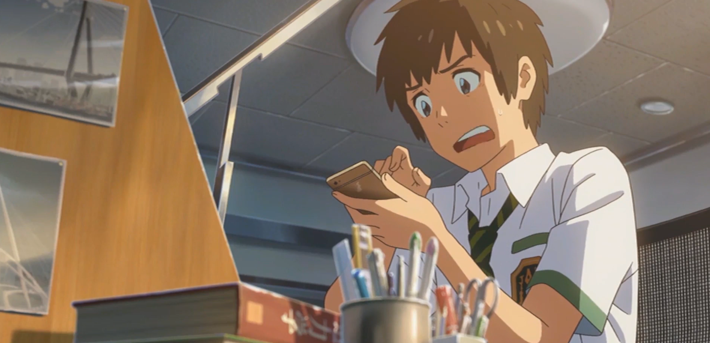

（另一边东京，同样惊讶的立花泷，也在翻找着，查看着自己的手机APP上的日记）

【立花泷】：これって、もしかして本当に`这该不会真的是……`

【宫水三叶】：私は夢の中であの男の子と―`我在梦里跟那个男生……`

【立花泷】：俺は夢の中であの女と―`我在梦里跟那个女生……`

【宫水三叶/立花泷】：入れ替わっとる？！`交换身体了？！`

【宫水三叶】：何か起こっているのか、だんだん分かってきた`我渐渐明白过来发生了什么`

【宫水三叶】：滝くんは、東京に住む同い歳の高校生で`泷是生活在东京的与我年龄相仿的高中生`

【立花泷】：ど田舎暮らしのみつはとの入れ替わりは不定期で`我跟一个叫三叶的乡下女孩`

【立花泷】：週に二、三度、不意に訪れる`每周会有2到3次 互相交换身体`

【立花泷】：トリガーは眠ること、原因は不明`交换方式是做梦 原因不明`

【宫水三叶】：入れ替わっていた時の記憶は、目覚めると、だんだん不鮮明になってしまう`交换时的记忆在醒来后就会渐渐消退`

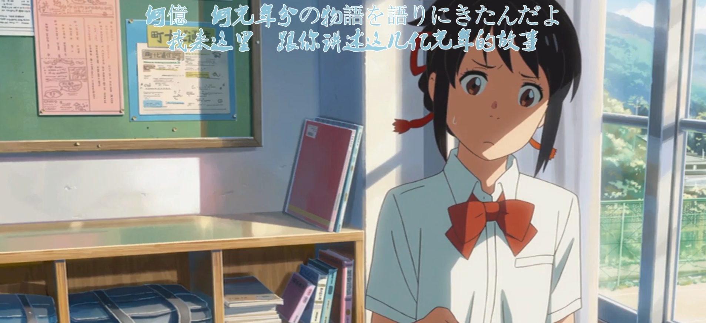

【立花泷】：それでも、俺たちは確かに入れ替わっている`但我们的确是交换过了`

【立花泷】：周囲の反応がそれを証明している、だから`周围人的反应足以证明这一点 所以`

【宫水三叶】：だから、私たちはお互いの生活を守るため、ルールを決めた`所以 我们为了不破坏彼此的生活定下了规则`

【宫水三叶】：入れ替わってしまっている時の注意点や、守るべき禁止事項`交换身体时的注意事项 必须遵守的和不得违反的`

---

【规则1】：お風呂ぜっっったい禁止:exclamation::exclamation::exclamation::exclamation::exclamation::exclamation::exclamation:`绝----对禁止洗澡！`

【规则2】：体は見ない！/触らない:grey_exclamation::grey_exclamation::bomb:`不要乱看身体！也不要乱摸！`

【规则3】：脚をひらくな！:heavy_exclamation_mark:`不要张着腿！`

【规则4】：男子に触るな！:anger:`不能碰男生！`

【规则5】：女子にも触るな！:rage:`女生更不行！`

等等……

【规则1】：無駄づかい禁止！:rage:`禁止浪费钱！`

【规则2】：訛り禁止！:angry:`禁止说方言！`

【规则3】：遅刻するな！:sparkles:`不准迟到！`

【规则4】：女言葉NG!:anger::anger:`不要用女性口气说话！`

【规则5】：奥寺先輩と馴れ馴れしくするな！`不要总去缠着奥寺前辈！`

【规则6】：司とべたべたするな！`不要老去粘着司！`

等等……

---

【立花泷】：それから、入れ替わった日のできことを携帯に残すこと`还有就是把交换身体时发生的事情记录在手机里`

【宫水三叶】：この謎現象をとにかくも乗り切るために`在解决这个神秘现象之前`

【宫水三叶】：協力し合うこと`我们定好要互相帮助`

## 027 乡下

---

## 028 生活

【宫水三叶】：それなのに`可是`

【立花泷】：それなのに`可是`

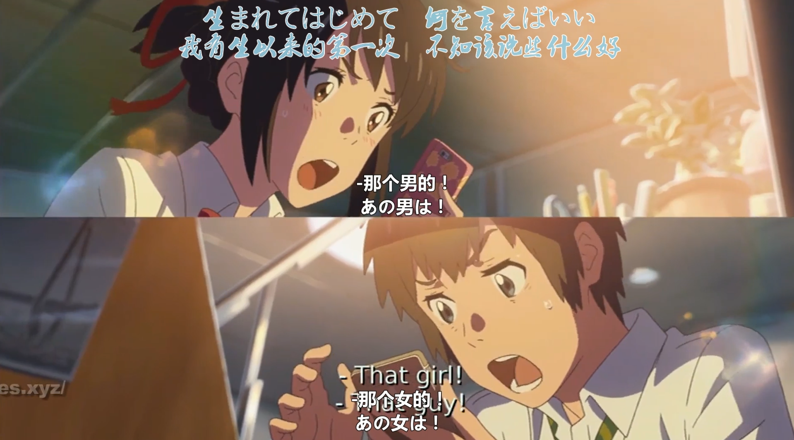

【宫水三叶】：あの男は！`那个男的！`

【立花泷】：あの女は！`那个女的！`

---

【早耶香】：男子の視線`男生都在盯着哎！`

【早耶香】：スカート注意！`注意一下裙子啊!`

【早耶香】：人生の基本でしょう？！`这是人类的基本常识吧！`

---

【立花泷】：人の金を無駄遣いにするな！`不要乱花别人的钱啊！`

【宫水三叶】：食べているのは君の体`吃的可是你自己的身体`

【宫水三叶】：私だってバイトしてるし`而且我也有在工作啊`

【立花泷】：組紐とか、これ無理だろう`编组纽这活儿我干不来的！`

【宫水三叶】：貴方バイト入れすぎ`你打的工也太多了`

【立花泷】：お前の無駄遣いのせいだろう！`还不是因为你花的多！`

---

【宫水三叶】：今日は帰り道に奥寺先輩とお茶`今天回家的路上跟奥寺前辈去喝茶了`

【宫水三叶】：君達の仲は順調だよ`你们两个发展的很顺利哟`

【立花泷】：テメみつは、俺の人間関係を変えるなよ！`三叶你这家伙！别乱搅合我的人际关系啊！`

【宫水三叶】：ちょっと、滝くん！なんで女子に告白されてんの？`我说泷啊 为什么会有女生跟我告白啊？`

【立花泷】：お前、俺に人生を預けた方かモテるんじゃねぇ？`我觉得 你吧 你的人生给我过会更好些吧`

【宫水三叶】：自惚れんといでよね、彼女もおらんくせに`别自恋了！明明连女朋友都没有`

【立花泷】：お前だっていねえじゃねえか！`你也没有男朋友的好吗！`

【宫水三叶】：私は`人家……`

【立花泷】：俺は`我可……`

【立花泷/宫水三叶】：いないんじゃなくて作らないの！/いないんじゃなくて作らねえよ！`不是没有！只是不想谈而已`

## 029  神体

【宫水三叶（立花泷）】：あいつに悪いか`这样有点对不起她`

【宫水四叶】：本当に自分のおっぱい好きやな`你还真是喜欢自己的胸部啊`

【宫水四叶】：い！く！よ！早く準備しない！`该出发了！快做准备吧！`

【电视】：数日前から、肉眼でも見え始めたティアマト彗星`近日来已经可以用肉眼观测到迪亚马特彗星了`

【电视】：いつ、どこに見えるんでしょうか`那么到底何时在哪里观看呢`

【电视】：ディアマト彗星は、太陽を追うようにして、東から西の空に移動して見えています`提亚马特彗星跟随着太阳 自东向西移动`

【电视】：ですから日没直後...`因此在日落之后……`

【宫水四叶】：なんで制服きとんの？`你穿制服干什么？`

【宫水三叶（立花泷）】：え？`哎？`

---

【宫水四叶】おばあちゃん、なんでうちの御神体はこんなに遠いの`外婆 为什么我们的神体要在这么远的地方啊？`

【宫水一叶】：繭五郎のせいで、わしにも分からん`因为关五郎的关系 我也没办法知道了`

【宫水三叶（立花泷）】：誰だっけ？`谁来着？`

【宫水四叶】：えい、有名やよ`唉？很有名哟`

【宫水三叶（立花泷）】：ねえ、おばあちゃん`外婆上来吧`

【宫水四叶】：（看到姐姐背上外婆后，差点没站稳）ちょっ！お姉ちゃん…`喂喂 姐姐`

## 030 产灵

【宫水一叶】：みつは、よつは、「ムスビ」ってしとるか`三叶 四叶 你们知道“结(产灵)”么?`

【宫水三叶（立花泷）】：ムスビ？`结(产灵)？`

【宫水一叶】：土地の氏神様をな、古い言葉で「産霊」って呼ぶんやさ`这一带的土地神啊 在古语里就是叫做“结(产灵)”的`

【宫水一叶】：この言葉には、深い意味がある`这个词可是有很深的意义的`

【宫水一叶】：糸を繋げることもムスビ`连接绳线是“结(产灵)”`

【宫水一叶】：人を繋げるもムスビ`人与人之间的关系是“结(产灵)”`

【宫水一叶】：時間が流れることもムスビ`时间的流逝也叫做“结(产灵)”`

【宫水一叶】：全部、神様の力や`这都是神的力量啊`

【宫水一叶】：わしらの作る組紐もせやから、神様の技`我们所做的结绳（组纽）也是来自神的技术`

【宫水一叶】：時間の流れそのものを顕しとる`代表的正是流淌的时间本身`

【宫水一叶】：寄り集まって形を作り`聚集、成形`

【宫水一叶】：捻れて絡まって`扭曲、缠绕`

【宫水一叶】：時には戻って、途切れ、また繋がり`时而绕回、断开、再接上`

【宫水一叶】：それがムスビ、それが時間`这既是“结(产灵)” 也是时间`

## 031 供奉

## 032 黄昏

## 033 约会

## 003 一切都是梦吗(55分02秒)

> 滝君：**全部（ぜんぶ）、ただの夢（ゆめ）で** -- 一切都只是梦
> 滝君：**景色（けしき）に見覚え（もおぼえ）があったのは、三年前のニュースを、無意識（むいしき）に覚えたから** - - 之所以记得那些景色 是因为记住了3年前的相关报道
> 滝君：**そうじゃなければ、幽霊（ゆうれい）** - - 如果不是这样，难道是幽灵？
> 滝君： **いいや、全部、俺の、夢想（むそう）** - - 不，或者都是我的妄想？
> 滝君：**あいつの名前、何だっけ？** - - 她的名字，是什么来着？
> 奥寺：**司（つかさ）君、お風呂（おふろ）行ってくるって** - -  司说他去泡澡了
> 滝君：**あ、先輩、あのう、俺** - - 啊，前辈，那个，我
> 滝君：**なんか、可笑しいなことばっか言ってて。今日一日、すみません。** 一直在说些奇怪的话，今天一天辛苦你们了。
> 奥寺：**うんん** - - 没事的
> 奥寺：**組紐（くみひも）だね、綺麗（きれい）** - - 是结绳啊，好漂亮
> 奥寺：**滝君のそれも、もしかして組紐？** - - 泷的那个，该不会是结绳吧？
> 滝君：**あ！これは確か（たしか）**- - 这个啊
> 滝君：**ずっと前に人（ひと）からもらって** - - 我记得是很久之前别人给我的
> 滝君：**何と無く（なく）お守り（おまもり）側（がく）に時々（ときどき）に着けて（つけて）て** - - 总觉得是个护身符，所以我经常带着。
> 滝君：**誰から？** - - 谁给的？
> 奥寺：**お風呂、滝君も入ってきたら** - - 泷页去泡个澡吧。
> 滝君：**はい……いいえ** - - 好，不了

**【おかしい】** 形容词/い形容词
1，可疑
素振り（そぶり）りがおかしい - - 举止可疑
おかしい素振りをする - - 举止可疑
2，奇怪，反常
胃（い）の調子（ちょうし）がおかしい。 - - 胃里不太舒服

**【何と無く】**副词
1，（不知为什么）总觉得，不由得，无意中

