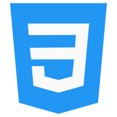
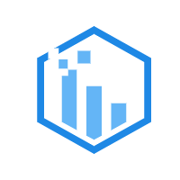
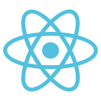

# 实用范例

## 0001_Tab选项卡

**实现效果**


[参照的网址：https://www.bilibili.com/video/BV1uK411A7S6](https://www.bilibili.com/video/BV1uK411A7S6)

[参照的源代码地址：https://github.com/bilibili-ayang/HTML-CSS-case](https://github.com/bilibili-ayang/HTML-CSS-case)

[演示页面](编程\html\实例\0001_Tab选项卡/index.html)

**index.html**

```html
<!DOCTYPE html>
<html lang="en">
	<head>
		<meta charset="UTF-8" />
		<meta http-equiv="X-UA-Compatible" content="IE=edge" />
		<meta name="viewport" content="width=device-width, initial-scale=1.0" />
		<link rel="stylesheet" href="css/index.css" />
		<title>0001_Tab选项卡</title>
	</head>

	<body>
		<div class="tab">
			<input type="radio" name="tab" id="tab1" checked />
			<input type="radio" name="tab" id="tab2" />
			<input type="radio" name="tab" id="tab3" />
			<input type="radio" name="tab" id="tab4" />
			<input type="radio" name="tab" id="tab5" />
			<label for="tab1"> HTML</label>
			<label for="tab2"> CSS</label>
			<label for="tab3">
				JAVASCRIPT
			</label>
			<label for="tab4"> VUE</label>
			<label for="tab5"> React</label>
			<ul>
				<li>
					
					<h2>HTML</h2>
					<p>
						HTML的英文全称是 Hyper Text Markup
						Language，即超文本标记语言。HTML是由Web的发明者 Tim
						Berners-Lee和同事 Daniel W.
						Connolly于1990年创立的一种标记语言，它是标准通用化标记语言SGML的应用。用HTML编写的超文本文档称为HTML文档，它能独立于各种操作系统平台(如UNIX，
						Windows等)。使用HTML，将所需要表达的信息按某种规则写成HTML文件，通过专用的浏览器来识别，并将这些HTML文件“翻译”成可以识别的信息，即现在所见到的网页。
					</p>
				</li>
				<li>
					
					<h2>CSS</h2>
					<p>
						层叠样式表(英文全称：Cascading Style
						Sheets)是一种用来表现HTML（标准通用标记语言的一个应用）或XML（标准通用标记语言的一个子集）等文件样式的计算机语言。CSS不仅可以静态地修饰网页，还可以配合各种脚本语言动态地对网页各元素进行格式化。
					</p>
				</li>
				<li>
					
					<h2>JAVASCRIPT</h2>
					<p>
						JavaScript（简称“JS”）
						是一种具有函数优先的轻量级，解释型或即时编译型的编程语言。虽然它是作为开发Web页面的脚本语言而出名，但是它也被用到了很多非浏览器环境中，JavaScript
						基于原型编程、多范式的动态脚本语言，并且支持面向对象、命令式、声明式、函数式编程范式。
					</p>
				</li>
				<li>
					
					<h2>VUE</h2>
					<p>
						VUE 是 iOS 和 Android 平台上的一款 Vlog
						社区与编辑工具，允许用户通过简单的操作实现 Vlog
						的拍摄、剪辑、细调、和发布，记录与分享生活。 [1]
						还可以在社区直接浏览他人发布的 Vlog，与 Vloggers 互动。
					</p>
				</li>
				<li>
					
					<h2>React</h2>
					<p>
						由于
						React的设计思想极其独特，属于革命性创新，性能出众，代码逻辑却非常简单。所以，越来越多的人开始关注和使用，认为它可能是将来
						Web 开发的主流工具。
						这个项目本身也越滚越大，从最早的UI引擎变成了一整套前后端通吃的
						Web App 解决方案。衍生的 React Native
						项目，目标更是宏伟，希望用写 Web App 的方式去写 Native
						App。如果能够实现，整个互联网行业都会被颠覆，因为同一组人只需要写一次UI
						，就能同时运行在服务器、浏览器和手机
					</p>
				</li>
			</ul>
		</div>
	</body>
</html>

```

**index.css**

```css
* {
	padding: 0;
	margin: 0;
	/*盒子模型*/
	box-sizing: border-box;
}
body {
	/* 居中对齐弹性盒的各项 <div> 元素： */
	display: flex;
	/*center元素位于容器的中心。*/
	/*弹性盒子元素在该行的侧轴（纵轴）上居中放置。*/
	/*（如果该行的尺寸小于弹性盒子元素的尺寸，*/
	/*则会向两个方向溢出相同的长度）。*/
	align-items: center;
	justify-content: center;
	/*vh就是当前屏幕可见高度的1%*/
	/*height:100vh，该元素会被撑开屏幕高度一致。*/
	height: 100vh;
	background-color: #282c34;
}

.tab {
	width: 700px;
	height: 250px;
	color: #607291;
	background-color: #fff;
	overflow: hidden;
}

input {
	/*隐藏单选按钮*/
	display: none;
}

/* tab页样式 */
label {
	float: left;
	width: 140px;
	height: 40px;
	line-height: 40px;
	text-align: center;
	font-size: 14px;
	font-weight: 700;
	transition: all 0.3s;
	background-color: #e5e9ea;
}

/* tab页选中状态 */
label:hover {
	background-color: #fff;
}

/* tab页里的图片样式 */
label img {
	width: 20px;
	height: 20px;
	vertical-align: middle;
	margin-top: -5px;
	margin-right: 5px;
}

ul {
	clear: both;
	width: 3500px;
	height: 210px;
	/* 进场动画 */
	transition: all 0.5s;
}

ul li {
	float: left;
	list-style: none;
	width: 700px;
	height: 210px;
	padding: 40px;
}

/* tab页内容的图片 */
ul li img {
	float: left;
	width: 130px;
	height: 130px;
	margin-right: 20px;
}

ul li p {
	text-indent: 2em;
	/* 伸缩盒子模型 */
	/* 把tab页里的图片下面的文字移到右侧 */
	display: -webkit-box;
	/* 在伸缩盒子里让子元素垂直排列 */
	-webkit-box-orient: vertical;
	/* 非css标准，只显示三行 */
	-webkit-line-clamp: 3;
	/* 三行以外溢出文字 隐藏 */
	overflow: hidden;
	/* 溢出文字 以省略号表示 */
	text-overflow: ellipsis;
	margin-top: 20px;
}

#tab1:checked ~ ul {
	margin-left: 0px;
}

#tab2:checked ~ ul {
	margin-left: -700px;
}

#tab3:checked ~ ul {
	margin-left: -1400px;
}

#tab4:checked ~ ul {
	margin-left: -2100px;
}

#tab5:checked ~ ul {
	margin-left: -2800px;
}

/* tab页选中后 背景变白色 */
#tabl:checked ~ label[for='tab1'] {
	background-color: #fff;
}
#tab2:checked ~ label[for='tab2'] {
	background-color: #fff;
}
#tab3:checked ~ label[for='tab3'] {
	background-color: #fff;
}
#tab4:checked ~ label[for='tab4'] {
	background-color: #fff;
}
#tab5:checked ~ label[for='tab5'] {
	background-color: #fff;
}
```

**素材图片**

/0001_Tab选项卡/images/1.png


/0001_Tab选项卡/images/2.png



/0001_Tab选项卡/images/3.png



/0001_Tab选项卡/images/4.png


/0001_Tab选项卡/images/5.png



## 0002_幽灵漂浮

**实现效果**


[参照的网址：https://www.bilibili.com/video/BV1ut4y1B7xP](https://www.bilibili.com/video/BV1ut4y1B7xP)

[参照的源代码地址：https://github.com/bilibili-ayang/HTML-CSS-case](https://github.com/bilibili-ayang/HTML-CSS-case)

[演示页面](编程\html\实例\0002_幽灵漂浮/index.html)

**index.html**

```html
<!DOCTYPE html>
<html lang="en">
<head>
    <meta charset="UTF-8">
    <meta http-equiv="X-UA-Compatible" content="IE=edge">
    <meta name="viewport" content="width=device-width, initial-scale=1.0">
    <link rel="stylesheet" href="css/index.css">
    <title>0002_幽灵漂浮</title>
</head>
<body>
    <div class="container">
        <div class="ghost">
            <div class="ghostEyes"></div>
            <div class="ghostDimples"></div>
            <div class="ghostFeet">
                <div class="ghostFoot"></div>
                <div class="ghostFoot"></div>
                <div class="ghostFoot"></div>
                <div class="ghostFoot"></div>
            </div>
        </div>
        <div class="shadow"></div>
    </div>
</body>
</html>
```

**/css/index.css**

```css
*{
    padding: 0;
    margin: 0;
}

body{
    /* 垂直水平居中 */
    display: flex;
    justify-content: center;
    align-items: center;
    /* 屏幕占浏览器可视范围内的高度 */
    height: 100vh;
    background-color: #00034b;
}

.container .ghost{
    position: relative;
    width: 150px;
    height: 225px;
    border-radius: 75px 75px 0 0;
    background-color: #fff;
    /* inset 内阴影设定 */
    /* 外散光设定 */
    box-shadow: -17px 0 0 #dbdbdb inset,0 0 50px #5939db;
    animation: ghost 2s infinite;
}

/* 眼睛区域 */
.container .ghost .ghostEyes{
    display: flex;
    /* 水平分散对齐 */
    justify-content: space-around;
    width: 90px;
    padding-top: 70px;
    /* 水平居中 */
    margin: 0 auto;
}

/* 伪元素 画幽灵眼睛 */
.container .ghost .ghostEyes::before,
.container .ghost .ghostEyes::after{
    content: "";
    width: 15px;
    height: 25px;
    background-color: #00034b;
    border-radius: 50%;
}

.container .ghost .ghostDimples{
    display: flex;
    justify-content: space-around;
    width: 130px;
    padding-top: 15px;
    margin: 0 auto;
}

.container .ghost .ghostDimples::before,
.container .ghost .ghostDimples::after{
    content: "";
    width: 15px;
    height: 15px;
    background-color: #ffbeff;
    border-radius: 50%;
}

.container .ghost .ghostFeet{
    display: flex;
    position: absolute;
    bottom: -13px;
    width: 100%;
}

.container .ghost .ghostFeet .ghostFoot{
    content: "";
    width: 25%;
    height: 25px;
    background-color: #fff;
    border-radius: 50% ;
}

.container .ghost .ghostFeet .ghostFoot:last-child{
    /* 背景渐变色实现，to right 指的是从左到右 */
    background-image: linear-gradient(to right,#fff 55%, #dbdbdb 45%);
}

.container .shadow{
    width: 150px;
    height: 40px;
    margin-top: 50px;
    background-color: #000232;
    border-radius: 50%;
    /* 动画 名称 时长 infinite无限次播放*/
    animation: shadow 2s infinite;
}

/* 幽灵漂浮的动画 */
@keyframes ghost{
    0%,
    100%{
        transform: translateY(0);
    }
    50%{
        /* 2D位移 -15向上走 */
        transform: translateY(-15px);
    }
}

@keyframes shadow{
    0%,
    100%{
        transform: scale(1);
    }
    50%{
        /* 缩放 9比1小一点 */
        transform: scale(0.9);
    }
}
```

## 0003_日升loading

**实现效果**


[参照的网址：https://www.bilibili.com/video/BV1nZ4y1r7yR](https://www.bilibili.com/video/BV1nZ4y1r7yR)

[参照的源代码地址：https://github.com/bilibili-ayang/HTML-CSS-case](https://github.com/bilibili-ayang/HTML-CSS-case)

[演示页面](编程\html\实例\0003_日升loading/index.html)

**index.html**

```html
<!DOCTYPE html>
<html lang="en">
<head>
    <meta charset="UTF-8">
    <meta http-equiv="X-UA-Compatible" content="IE=edge">
    <meta name="viewport" content="width=device-width, initial-scale=1.0">
    <link rel="stylesheet" href="css/index.css">
    <title>0003_日升loading</title>
</head>
<body>
    <div class="container">
        <div class="sun">
            <div class="sun-body">
                <div class="line" style="--i:1"></div>
                <div class="line" style="--i:2"></div>
                <div class="line" style="--i:3"></div>
                <div class="line" style="--i:4"></div>
                <div class="line" style="--i:5"></div>
                <div class="line" style="--i:6"></div>
                <div class="line" style="--i:7"></div>
                <div class="line" style="--i:8"></div>
            </div>
            <div class="eye"></div>
        </div>
        <div class="horizon"></div>
    </div>
</body>
</html>
```

**/css/index.css**

```css
/* 定义字体 */
 @font-face {
    font-family: HarmonyOS;
    src: url();
} 

/* 定义全局变量 */
:root{
    --light-color:#f4c042;
    --dark-color:#7a5600;  
}


/* 所有元素伪元素内外边距清除，应用盒子模型 */
*,*::before,*::after{
    padding: 0;
    margin: 0;
    box-sizing: border-box;
}

body{
    display: flex;
    justify-content: center;
    align-items: center;
    height: 100vh;
    font-family: HarmonyOS;
    background-color: var(--light-color);
}

.container{
    /* 相对定位，为了内部的太阳可以绝对定位 */
    position: relative;
    width: 300px;
    height: 300px;
    /*临时*/
    /* border: 1px solid #000; */
}

.container .sun{
    position: absolute;
    top: 135px;
    /* 这里计算calc要加空格隔开各个数值 */
    left: calc(50% - 136px / 2);
    width: 136px;
    height: 136px;
    /* border: 1px solid #fff; */
    animation: sun 2.7s linear infinite;
}

/* 太阳身体 圆圈 */
.container .sun .sun-body{
    position: absolute;
    top: 17px;
    /*如果left:18px，则实测是左28px，右24px，不居中*/
    left: 17px;
    width: 100px;
    height: 100px;
    /* 画圆形身体 */
    border-radius: 50%;
    border: 6px solid var(--dark-color);/*实测边框宽度9px*/
    /* 设定动画，命名sun-body 时间2.7s一个循环 infinite指的是速度最快 */
    animation: sun-body 2.7s linear infinite;
}

/* 太阳光线 */
.container .sun .sun-body .line{
    position: absolute;
    top: -24px;
    left: calc(50% - 3px);
    width: 6px;
    height: 12px;
    background-color: var(--dark-color);
    border-radius: 6px;
    /* 8个类名为line的元素，设置了变量i，可以通过自定计算旋转角度 */
    transform: rotate(calc(var(--i) * 45deg));
    /* 设定旋转的中心 */
    transform-origin: center 68px;
}

/* 太阳眼镜 */
.container .sun .eye{
    position: absolute;
    top: 60px;
    left: 40px;
    width: 6px;
    height: 6px;
    border-radius: 50%;
    background-color: var(--dark-color);
    /* 阴影复制另一个眼睛 */
    box-shadow: 16px 0 var(--dark-color);
    animation: eye 2.7s linear infinite;

}

/* 地平线 */
.container .horizon{
    position: absolute;
    bottom: 0;
    width: 100%;
    height: 115px;
    /* 同背景色一致的颜色，起到隐藏水平线一下的太阳身体的作用 */
    background-color: var(--light-color);
}
.container .horizon::before{
    position: absolute;
    content: "";
    left: 5%;
    width: 90%;
    height: 6px;
    border-radius: 6px;
    background-color: var(--dark-color);
}

/* loading字样 */
.container .horizon::after{
    content: "loading...";
    position: absolute;
    top: 30px;

    /* 居中 */
    width: 100%;
    text-align: center;

    font-family: HarmonyOS;
    font-size: 25px;
    color: var(--dark-color);
    animation: loading 2.7s linear infinite;
}

/* 动画效果 */
@keyframes sun{
    10%{
        /* 输入这里的时候vscode没有提示 */
        transform: translate(0);
    }
    40%,
    70%{
        transform: translateY(-40px);
    }

}

@keyframes sun-body{
    40%{
        transform: rotate(0);
    }
    50%,
    100%{
        transform: rotate(45deg);
    }

}

@keyframes eye{
    50%,60%{
        transform: scale(1);
    }
    55%{
        transform: scaleY(0.1);
    }
    70%,100%{
        transform: translateX(34px);
    }

}


@keyframes loading{
    40%{
        opacity: 1;
    }
    60%{
        opacity: 0;
    }

}
```

## 0004_超炫酷的Web3d特效

**实现效果**


[参照的网址：https://www.bilibili.com/video/BV14J411r72t](https://www.bilibili.com/video/BV14J411r72t)

[演示页面](编程\html\实例\0004_超炫酷的Web3d特效/index.html)

**index.html**

```html
<!DOCTYPE html>
<html lang='en' onselectstart='return false'>

<head>
    <meta charset='utf-8' />
    <style>
        li,
        ul,
        div,
        html,
        body {
            margin: 0;
            padding: 0;
        }

        html,
        body {
            height: 100%
        }

        li {
            list-style-type: none
        }

        .wrap {
            height: 100%;
            overflow: hidden;
            perspective: 800px;
        }

        #box {
            top: 50%;
            left: 50%;
            width: 0;
            height: 0;
            position: relative;
            transform-style: preserve-3d;
            transform: translateZ(-1600px);
            z-index: 1;
        }

        #box li {
            top: -80px;
            left: -60px;
            width: 120px;
            height: 160px;
            position: absolute;
            text-align: center;
            line-height: 160px;
            background-color: rgba(5, 100, 80, 0.2);
            border: 1px solid rgba(125, 255, 255, 0.25);
            box-shadow: 0 0 15px rgba(0, 255, 255, 0.5);
            cursor: pointer;
        }

        #box li span {
            font-size: 28px;
            font-weight: blod;
            text-shadow: 2px 2px 5px black;
            color: #efebef;
        }

        .mask {
            width: 100%;
            height: 100%;
            background: url('bg_mask.jpg') no-repeat center;
            background-size: cover;
            filter: blur(5px);
        }

        .mask>.bg-mask {
            width: 100%;
            height: 100%;
            background: #000;
            opacity: 0.25;
        }
    </style>
</head>

<body>
    <div class="wrap">
        <ul id="box"></ul>

        <div class="mask">
            <div class="bg-mask"></div>
        </div>
    </div>
    <script src='jquery-2.2.4.js'></script>
    <script>
        // 开启一个独立的空间避免全局变量污染
        (function () {
            let
                idx,
                timer,
                // 存放li 元素
                liElem,
                // 存放span 元素
                spanElem,
                // 记录布局类型
                currentStyle,
                // 鼠标X、Y坐标值
                oldCoordX,
                oldCoordY,
                nowCoordX,
                nowCoordY,
                // li 元素水平、垂直、纵深方向偏移位
                offsetStepX,
                offsetStepY,
                offsetStepZ,
                // li 元素的坐标
                liElemCoordX,
                liElemCoordY,
                liElemCoordZ,
                // 鼠标X、Y差值
                minusX = 0,
                minusY = 0,
                // X、Y偏移度数
                liElemDegX = 0,
                liElemDegY = 0,
                // li 元素的最大个数
                liElemMaxNum = 162,
                // li 元素 水平、垂直铺放的最大个数
                liElemRowMaxNum = 5,
                liElemColMaxNum = 5,
                // li 元素水平、垂直、纵深方向的最大间隔距离
                liElemOffsetX = 350,
                liElemOffsetY = 350,
                liElemOffsetZ = 350,
                // li 元素默认景深
                liElemDepDefault = -1000,
                // 避免覆盖默认景深值
                depDefault = liElemDepDefault - 600;
            // 避免第一次拖动发生错位
            liElemDepZ = liElemDepDefault - 600,
                // 单个方阵中 li 元素的总个数
                aScreenNum = liElemRowMaxNum * liElemColMaxNum,
                // li 元素纵深方向的最在间隔距离
                liElemDepMaxDist = parseInt(liElemMaxNum / aScreenNum),
                // 计算第一个li 元素的坐标点
                liElemFristSiteX = parseInt('-' + liElemRowMaxNum / 2) * liElemOffsetX,
                liElemFristSiteY = parseInt('-' + liElemColMaxNum / 2) * liElemOffsetY,
                liElemFristSiteZ = parseInt('-' + liElemDepMaxDist / 2) * liElemOffsetZ,
                // 文本内容
                data = ['Grid', 'Helix', 'Chaotic', 'Sphere', 'Three', 'Geome', 'Curve', 'Random'];
            // 指定一个区间，获取一个随机数
            randomFrom = (lowerValue, upperValue) => {
                return Math.floor(Math.random() * (upperValue - lowerValue + 1) + lowerValue);
            }
            // 方阵
            gridLayout = _ => {
                let arr = [...Array(liElemMaxNum).keys()];
                $('#box li').each(i => {
                    // 数组的索引
                    let idx = randomFrom(0, arr.length - 1);

                    // 计算li 元素 水平、垂直、纵深方向的偏移位
                    offsetStepX = ((i % aScreenNum) % liElemRowMaxNum) * liElemOffsetX;
                    offsetStepY = parseInt((i % aScreenNum) / liElemColMaxNum) * liElemOffsetY;
                    offsetStepZ = parseInt(i / aScreenNum) * liElemOffsetZ;
                    // 计算当前li 元素的坐标值
                    liElemCoordX = liElemFristSiteX + offsetStepX;
                    liElemCoordY = liElemFristSiteY + offsetStepY;
                    liElemCoordZ = liElemFristSiteZ + offsetStepZ;

                    $('#box li').eq(arr[idx]).css({
                        "transform": `translate3d(${liElemCoordX}px,${liElemCoordY}px,${liElemCoordZ}px)`,
                        "transition": "4s ease-in-out"
                    })
                    // 删除数组中的值
                    arr.splice(idx, 1);
                }); currentStyle = gridLayout;
            }
            // 螺旋
            helixLayout = _ => {
                let arr = [...Array(liElemMaxNum).keys()];
                $('#box li').each(i => {
                    let idx = randomFrom(0, arr.length - 1);
                    let liElemDegY = 10 * i;
                    let liElemDepY = -10 * parseInt(liElemMaxNum / 2) + 10 * i;
                    $('#box li').eq(arr[idx]).css({
                        "transform": `rotateY(${liElemDegY}deg) translateY(${liElemDepY}px) translateZ(${Math.abs(liElemDepDefault)}px)`,
                        "transition": "4s ease-in-out"
                    })
                    // 删除数组中的值
                    arr.splice(idx, 1)
                }); currentStyle = helixLayout;
            }
            // 球形
            sphereLayout = _ => {
                let arr = [...Array(liElemMaxNum).keys()];
                $('#box li').each(i => {
                    let idx = randomFrom(0, arr.length - 1);
                    let liElemDegY = 3 * i;
                    let liElemDegX = 30 * i;
                    $('#box li').eq(arr[idx]).css({
                        "transform": `rotateY(${liElemDegY}deg) rotateX(${liElemDegX}deg) translateZ(${Math.abs(liElemDepDefault)}px)`,
                        "transition": "4s ease-in-out"
                    })
                    // 删除数组中的值
                    arr.splice(idx, 1)
                }); currentStyle = sphereLayout;
            }
            // 三体
            threeLayout = _ => {
                let arr = [...Array(liElemMaxNum).keys()];
                $('#box li').each(i => {
                    let idx = randomFrom(0, arr.length - 1);
                    let liElemDegY = 3 * i;
                    let liElemDegX = 60 * i;
                    $('#box li').eq(arr[idx]).css({
                        "transform": `rotateY(${liElemDegY}deg) rotateX(${liElemDegX}deg) translateZ(${Math.abs(liElemDepDefault)}px)`,
                        "transition": "4s ease-in-out"
                    })
                    // 删除数组中的值
                    arr.splice(idx, 1)
                }); currentStyle = threeLayout;
            }
            // 几何
            geomeLayout = _ => {
                let arr = [...Array(liElemMaxNum).keys()];
                $('#box li').each(i => {
                    let idx = randomFrom(0, arr.length - 1);
                    let liElemDegY = 8.9 * i;
                    let liElemDegX = 2.9 * i;
                    $('#box li').eq(arr[idx]).css({
                        "transform": `rotateY(${liElemDegY}deg) rotateX(${liElemDegX}deg) translateZ(${Math.abs(liElemDepDefault)}px)`,
                        "transition": "4s ease-in-out"
                    })
                    // 删除数组中的值
                    arr.splice(idx, 1)
                }); currentStyle = geomeLayout;
            }
            // 曲线
            curveLayout = _ => {
                let arr = [...Array(liElemMaxNum).keys()];
                $('#box li').each(i => {
                    let idx = randomFrom(0, arr.length - 1);
                    let liElemDegY = 1 * i;
                    let liElemDegX = 2 * i;
                    $('#box li').eq(arr[idx]).css({
                        "transform": `rotateY(${liElemDegY}deg) rotateX(${liElemDegX}deg) translateZ(${liElemDepDefault}px)`,
                        "transition": "4s ease-in-out"
                    })
                    // 删除数组中的值
                    arr.splice(idx, 1)
                }); currentStyle = curveLayout;
            }
            // 随机
            chaoticLayout = _ => {
                $('#box li').each(function (i) {
                    // 随机生成li 元素的坐标点
                    liElemCoordX = (Math.random() - 0.5) * 3000;
                    liElemCoordY = (Math.random() - 0.5) * 3000;
                    liElemCoordZ = (Math.random() - 0.5) * 3000;
                    $(this).css({
                        "transform": `translate3d(${liElemCoordX}px,${liElemCoordY}px,${liElemCoordZ}px)`,
                        "transition": "4s ease-in-out"
                    })
                }); currentStyle = chaoticLayout;
            }
            function main() {
                $([...Array(liElemMaxNum).keys()]).each(i => {
                    // 创建一个li 元素
                    liElem = $('<li></li>');
                    let idx = randomFrom(0, data.length - 1);
                    // 创建一个span 元素
                    spanElem = $(`<span>${data[idx]}</span>`);
                    liElem.append(spanElem);
                    // 设置span 中的文本颜色
                    spanElem.css('color', `rgb(${randomFrom(100, 255)},${randomFrom(100, 255)},${randomFrom(100, 255)})`);
                    // 将已创建的li 元素添加至容器中
                    $('#box').append(liElem);
                })
                // 布局类型
                layoutStyle = [gridLayout, helixLayout, chaoticLayout, sphereLayout,
                    threeLayout, geomeLayout, curveLayout];
                // 鼠标移入移出效果
                $('#box li').hover(function () {
                    $(this).css('border', '1px solid rgba(125,255,255,0.75)');
                    $(this).css('boxShadow', '0 0 15px rgba(0,255,255,0.75)');
                    $(this).css('transition', '0s');
                }, function () {
                    $(this).css('border', '1px solid rgba(125,255,255,0.25)');
                    $(this).css('boxShadow', '0 0 15px rgba(0,255,255,0.5)');
                    $(this).css('transition', '0s');
                })
                // 鼠标点击，切换布局
                $('#box li').click(function () {
                    switch ($(this).text()) {
                        case 'Grid': gridLayout(); break;
                        case 'Helix': helixLayout(); break;
                        case 'Three': threeLayout(); break;
                        case 'Geome': geomeLayout(); break;
                        case 'Curve': curveLayout(); break;
                        case 'Sphere': sphereLayout(); break;
                        case 'Chaotic': chaoticLayout(); break;
                        default:
                            while (true) {
                                idx = randomFrom(0, layoutStyle.length - 1);
                                if (layoutStyle[idx] != currentStyle) {
                                    return layoutStyle[idx]();
                                }
                            }
                            break;
                    }
                })
                // 鼠标拖动与滚轮效果
                $(document).mousedown(function (event) {
                    event = event || window.event;
                    // 上一个点的X、Y坐标
                    oldCoordX = event.clientX;
                    oldCoordY = event.clientY;
                    $(this).on('mousemove', event => {
                        event = event || window.event;
                        // 若上一个定时器存在，则将其删除
                        timer && clearInterval(timer);
                        // 当前点的X、Y坐标
                        nowCoordX = event.clientX;
                        nowCoordY = event.clientY;
                        // 计算机X、Y差值
                        minusX = nowCoordX - oldCoordX;
                        minusY = nowCoordY - oldCoordY;
                        // 更新上一个点的X、Y坐标值
                        oldCoordX = nowCoordX;
                        oldCoordY = nowCoordY;
                        // 计算X、Y轴的移动度数
                        liElemDegX -= minusY * 0.1;
                        liElemDegY += minusX * 0.1;
                        $('#box').css({
                            "transform": `translateZ(${liElemDepZ}px) rotateX(${liElemDegX}deg) rotateY(${liElemDegY}deg)`
                        })
                    }).mouseup(_ => {
                        // 当鼠标弹起解除移动
                        $(document).off('mousemove');
                        // 若上一个定时器存在，则将其删除
                        timer && clearInterval(timer);

                        // 鼠标弹起后有缓动效果
                        timer = setInterval(_ => {
                            // 缓动差值 
                            minusX *= 0.95;
                            minusY *= 0.95;
                            // 计算X、Y轴的移动度数
                            liElemDegX -= minusY * 0.1;
                            liElemDegY += minusX * 0.1;
                            // 当差值超出指定范围时，则清除定时器
                            Math.abs(minusX) < 0.05
                                && Math.abs(minusY) < 0.05
                                && clearInterval(timer);
                            $('#box').css({
                                "transform": `translateZ(${liElemDepZ}px) rotateX(${liElemDegX}deg) rotateY(${liElemDegY}deg)`
                            })
                        }, 12);
                    })
                }).on('mousewheel DOMMouseScroll', e => {
                    // 若上一个定时器存在，则将其删除
                    timer && clearInterval(timer);
                    // 获取鼠标滚动方向
                    let step = (e.originalEvent.wheelDelta
                        && (e.originalEvent.wheelDelta > 0 ? 1 : -1))
                        || (e.originalEvent.detail && (e.originalEvent.detail > 0 ? -1 : 1));
                    // 计算滚轮滚动时Z 轴景深的步长
                    liElemDepZ = depDefault += step * 90;
                    $('#box').css({
                        "transform": `translateZ(${liElemDepZ}px) rotateX(${liElemDegX}deg) rotateY(${liElemDegY}deg)`
                    })
                    // 设置缓动效果
                    timer = setInterval(_ => {
                        // 缓动步长
                        step *= 0.6;
                        liElemDepZ += step * 80;
                        Math.abs(step) < 0.000005
                            && clearInterval(timer);
                        $('#box').css({
                            "transform": `translateZ(${liElemDepZ}px) rotateX(${liElemDegX}deg) rotateY(${liElemDegY}deg)`
                        })
                    }, 12);
                })
                // 加载布局
                setTimeout(gridLayout, 1000);
            }
            main();
        })();
    </script>
</body>

</html>
```

**素材图片**

bg_mask.jpg

